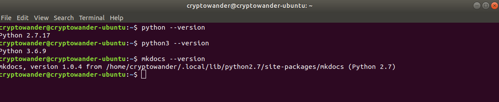

# Welcome to the SFH Foundation

The goal of this archive is to provide a rich source of information about what we consider to be the optimum way of being. We use accessible language and the symbolism developed by Shaykh Fadlalla Haeri in order to present timeless prophetic teachings and relate them to the modern world.

Our intention is to open source knowledge that has previously not been available to the wider public. You can follow the website link above to access it, or run it yourself.

## Contributing

Follow these simple steps to get the website running locally so that you can start contributing to the way our teachings are presented.

**Dependencies**:

1. Python 2. I currently run version `2.7.17`
2. [Mkdocs](https://www.mkdocs.org/). I currently run version `1.0.4`
3. [mkdocs-minify-plugin](https://github.com/byrnereese/mkdocs-minify-plugin)
4. [mkdocs-material](https://github.com/squidfunk/mkdocs-material)

_There can be some confusion setting up your environment given the mess that is Python 2 and 3. I have both installed on my machine and simply use `python` for Python 2 and `python3` for Python 3._

**Steps to run locally**:

1. `git clone https://github.com/SFH-Foundation/sfhfoundation.git`
2. `cd sfhfoundation`
3. `mkdocs serve`

You can run `mkdocs build` to build the production site, but that shouldn't be necessary for contributions as you can simply use `serve` to check that your changes work before submitting a PR.

