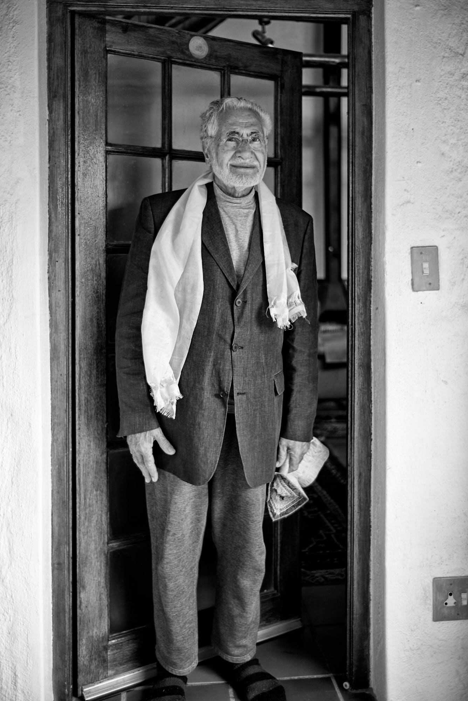

This website is the result of several years of sharing a way of life in our uncertain world with people from diverse backgrounds and cultures. This way reduces fear, suffering, and darkness and enables us to face difficulty with equanimity and grace. It has its foundation in awareness of – and constant calibration with – the eternal light of the soul within us, which is the source of all life. Awareness of eternal cosmic light will dispel much human discontent and provide hope that is beyond the limitations of birth and death. Our way goes beyond temporary notions of good and bad to reveal and revel in glorious divine presence – the purpose of human life.

The ultimate human reference and duty in life is to respect and have reverence for all life and every manifestation of it. 

