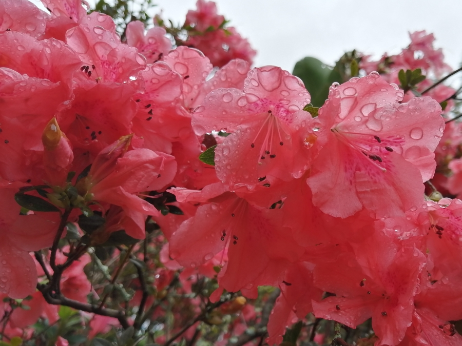

title: Journey 11 - Balance

# Journey 11 - Balance

"Consciously and subconsciously, we are balanced between life forces interacting within time and space."  

"Sleep puts an end to our wakeful state and transcendence of mind takes us to the doorway of the infinite, eternal Light. One state ends for the other to begin."  

"Every beginning connects to its end."  

"Whatever is wrong will not move in the natural flow of life – whatever is right just fits well."  

"The present contains all the past and points to the future."  

"You have two wings which give you a balanced flight.  The first wing is that of reason and earthly wisdom and the other is your spiritual awakening. With your earthly wing alone, you remain earthbound and unfulfilled."  

"Our drive to overcome obstacles and difficulties in life reflects our desirable destination - perfect and perpetual ease." 