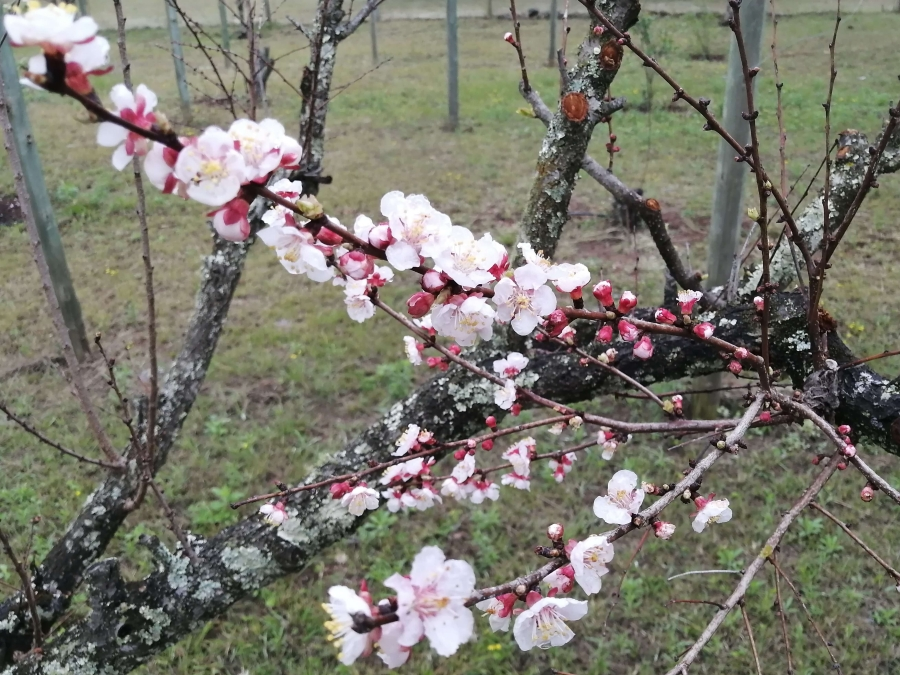

title: Journey 15 - Happiness and Content

# Journey 15 - Happiness and Content

  

"We strive for happiness through plans, efforts and desires - all of which preclude and exclude it."  

"No one is really happy with where they are. Happiness cannot be bound to a situation for it is the child of total freedom."  

"You are either in happiness and thus oblivious to everything else, or you remember and relate to that state."  

"Happiness implies mindfulness and loss of sense of time and place."  

"Happiness is a state of sheer being and not becoming. It doesn’t relate to past or future - it is totally in the **now**."