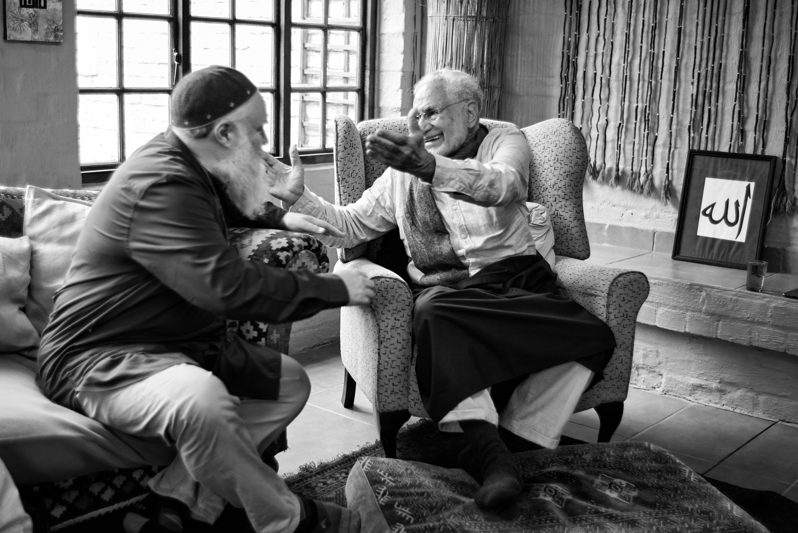

title: Consciousness - An Overview

description: A selection of excertps from various books by Shaykh Fadhlalla on the critical concept and experience of consciousness.

# Consciousness - An Overview

The question of what really constitues consciousness has been addressed in many different ways, and multiple different formats by Shaykh Fadhlalla over the years. For instance, you can find talks on this topic across our archives, like:

1. [Human Consciousness](../../audios/single-talks/#human-consciousness) which covers consciousness as we experience it in day-to-day life.
2. [Abstention & Fasting](../../audios/series/abstention-fasting) which is a two-part series that goes into detail about how such practices can lead to experiencing higher consciousness.
3. [Descriptive & Prescriptive Qur'an](../../audios/series/descriptive-prescriptive-quran) which is a four-part series that deals, in part, with Qur'anic descriptions of the phenomena and prescriptions for aligning with it optimally.

There are also many videos we have provided on this broad topic, the most directly relevant of which is the two part series [From Darkness to Light](../../videos/quran/darkness-to-light/) which discusses both the two zones of consciousness that form a major tenet within the Shaykh's teaching, as well as a full-length talk offering invaluable keys to an awakened life.

In the selection below, we offer you various excerpts from some of Shaykh Fadhlalla's books produced over the years to lead you in considering for yourself what you make of this most important phenomena and experience.

## Who Is In Control?

As long as anything moves, its destiny and existence are uncertain. Nature provided a suitable environment for life and consciousness to emerge within the confines of the womb of space and time - that is the history of life on earth. However that limited cosnciousness is charged by permanent consciousness, by sacred beingness. From this emerges a short-lived human life dependent always on eternal life. All is under Soul-control, but we are veiled by the ability to move and change. You can close the door or leave it open. You can leave this place or not. Speak or be silent. Limited, limited, limited. We are given a tiny opening to visualize the infinite, self-propelled universe, which is under perfect governance at all times. Human life is like a waiting room before we perceive the reality of perfect control, by One who permeates it all.

## Calibration

Frustrations arise out of the disparity between our higher Soul consciousness and the shadow self. How can we refer and calibrate our perceived experience with the constancy of the soul? It is helpful to have a role model, and more helpful to have a trusted teacher who reflects higher consciousness. 

The zone of higher consciousness is infinite and beyond all descriptions like joy, bliss or happiness. A good example of how to move to higher consciousness is riding a bicycle. You are put on the saddle and somebody pushes you. After a while you learn to balance and you feel you can repeat it on your own. Similarly, you first need a map of Reality, and you then follow the path that may lead to your destination. 

## Continuity

We often experience disappointment. We also too often feel trapped, confused or lost. Why are we constantly faced with these challenges? This is due to the limitations of conditioned consciousness and ego. Between birth and death, we play roles in this shadow theatre of life, as we evolve towards our origin. However, while birth and death form another complimentary pair of opposites, something withis us knows that life continues forever. The Soul, or _ruh_, is not subject to space and time, nor beginnings and endings which exist within it.

Determination and grace are required to awaken to your Soul. It is when you experience that ever-present Reality, you know that your old self was merely a shadow, of the Real. When you transcend your tyrannical or feral self, you perceive that its role was to cause that suffering and thereby act as a prelude for awakening. Your lower self leads you to your real self – the divine spirit within. Life on earth is a struggle because it is a realm of experience between limitations and limitless Reality. You need help and a guiding hand. You need a reference. You need Grace and perception of the sacred presence. 

## The Nature of Existence   

The Universe emerged from a mysterious singularity which is incomprehensible to us. Whatever is known and unknown was at origin an intense togetherness, connectedness, inseparability and oneness.  

With the emergence of space and time, every type of form and energy emerged in pairs and pluralities. Whatever we discern has its complementary opposite, inseparable from it. Two’s are disguised expressions of the One.          

Oneness is beyond all values and differentiation, whereas in duality there cannot be any goodness without the seed of badness. Personal life is accompanied by death and light is discerned due to darkness.  

All dualities have their root in the original Oneness to which they return — the Perpetual One.    

## Dreams  

From ancient times the idea of what is real and what is not has challenged human thought. There are different zones of consciousness, as there are different realities. During our wakeful state, we consider most sharable experiences as real, but what is real about a dream?  

A healthy working relationship between our senses, mind and heart develop to reconcile the ever-changing evolving self and the constant soul. We link physics and metaphysics, our sensory reality and Reality.  

Dreams and sleep are essential for human health – to reorder, fit and connect day-to-day experiences and past memory, and enable our temporary life to be nourished by the soul’s light.  

The enlightened being regards  
all normal experiences as a  
dream. Common dreams are  
merely dreams within a dream.   

## Sleepwalkers    

The herd mentality, collective consciousness and love of tradition are common conditions of most people. Old cultures and ingrained bonds, including religion, language and life habits, are barriers to change. So are self-concern and the obsession with survival. This renders most people tunnel-visioned, acting as sleepwalkers. Minds are occupied, bodies act like robots and hearts are dark.
The people of Rome were surrounded by fire and most did not feel the urgency to evacuate. The unfortunate voyagers on the Titanic believed in the unsinkable ship and the orchestra continued playing. The love for continuity can override signals and signs of dangers. Sleepwalkers, like zombies, do not read signs or messages.
No human being is spared from nature’s generosity and from the shocks in life to wake us up to a higher level of consciousness and soul awareness.

