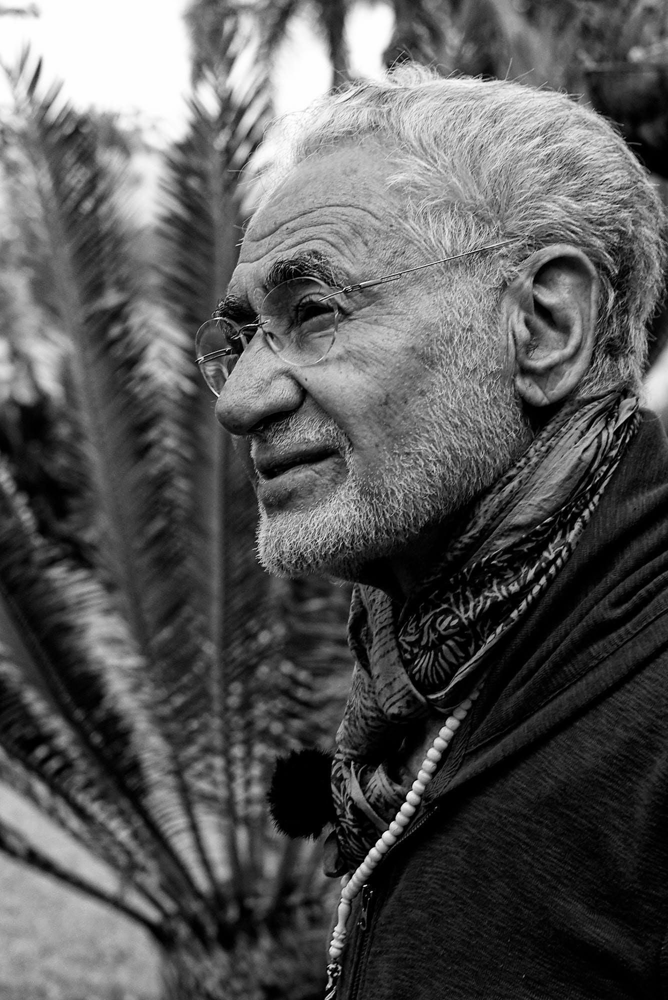

# Decree, Destiny and Enlightenment

_By Shaykh Fadhlalla Haeri, from the book "[Decree & Destiny – Free Will and Determinism](https://zahrapublications.pub/book-DecreeAndDestiny-Revised.php#bookTitle)"_. 

Decrees are the rules which define life’s experiences on earth. Most of these rules are describable or measurable, especially those dealing with the visible realities. The rules that govern all aspects of physical (visible and experiential) existence combine with those that control the unseen forces to form a network that will result in, for example, the laws of physics. We can describe the phenomenon of light, for instance, as both a wave and a particle called a photon. The rules somehow emerge from an unknown domain into describable, measurable, physical laws. So the decrees can be seen as a series of multitudinous models by means of which the creation, seen and unseen, is held together.

Destiny is the final occurrence that is experienced by the individual through the passage of time, when these laws are enacted. It is when a describable event has already passed through time.

The concept of destiny is also parallel in Arabic to another term _’ajal_, which signifies ‘appointed time, date, deadline, instant of death, respite, delay’. If we say a business partnership has an _‘ajal_ of five years, it means that at the end of this period it will have reached its full destiny, which is dissolution.

The final destiny of every man is his awakening to his permanent, non-time reality, from which he has emerged. We are given the experience of this life, with all its decrees, for us to know them, accept them and become one with them so that we can see our destiny within them, and our destiny beyond them, when time stops at the point of death.

Through the discipline of meditative practices, time can be experienced as coming to a stop. Whilst we fear death we love and are dependent on deep sleep, which is the nearest experience to death. If we are able to experience the mini-death of inner contemplation, we stand a good chance of realizing that our true reality, the Source of the cause behind existence, is eternal and ever present. It is only the body that dies, while the soul or spirit continues into perpetuity.

As we are all programmed to dislike fear, the universal fear of death betrays the true meaning of death. It is only an experiential barrier that demarcates a natural discrimination by returning the body to where it belongs, and by returning the soul to whence it originally emanated from in the zone of eternal consciousness. So the fact that we do not like death reveals a certain measure of its falsehood as a termination of life. It is in fact a process of segregation. The confusion is due to identifying with the body and mind rather than the soul within. It is only the body that dies; for it has been the vehicle for the development of the self, whose proper schooling lies in the melting pot of the world of duality, whilst yearning for the knowledge of the One from whom it emanated in the first place.

The human destiny is potentially the highest of known creations – as was our beginning. We start life with a basic level of existence and are driven to reach the highest levels of consciousness and experiences.

Enlightenment is to know the perfection and reliability of God’s plan; with reflection and wisdom we realize that human will is a very small factor in contentment and sustained happiness. Spiritual wisdom leads to witnessing the utter perfection of the instant and abandonment to the moment. Then we come to understand the truth that abundance is available at all times to everyone. This is the final awakening to the state of Oneness. We are brought into time in order that we may face the incredible, unfathomable, never-ending non-time. So we are already predestined to face eternity. This is the intended perfect destiny and anything else is incomplete.

