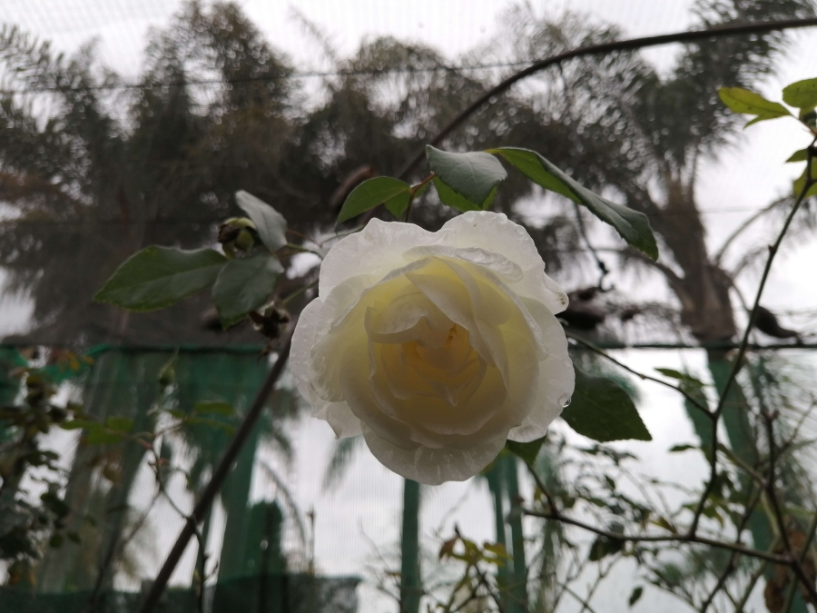

# Articles

**Less is More**

Before reaching spiritual maturity Sufi literature can encourage fantasy or act as a placebo with uncertain outcome. In the material realm more is sought, in the spiritual realm the reverse is true.

[Read More](./less-is-more)

**Pointers to Truth**

Human needs, desires and questions never end. We always hope to discover answers to our day-to-day questions as well as the big questions in life. How did life begin? How and when will life end? Who am I really?

[Read More](./pointers-to-truth)

**Natural Illusions**

A brief excerpt from _101 Helpful Illusions_ which explores consciousness, light, and the various levels of discernable and unseen dimensions at work in the world, and beyond it.

[Read More](./natural-illusions)

**The Thread of Truth**

The revitalised interest in Islam and Sufism, as well as Sufi Shaykhs are signs that our scientific and material development is reaching a point that needs the revitalization of the heart and awakening to the inner light of the soul.

[Read More](./thread-of-truth)

**The Shock of Awakening**

Succour for those experience inner realities which make them question their sanity in the context of an outer world and society which largely denies the existence of such states of consciousness.

[Read More](./shock-awakening)

**To Be Alive**

A brief explanantion of the two kinds of being alive and the essential differences between them, especially in terms of limited conditionality.

[Read More](./to-be-alive)

**The Cycles of Life and Reality**

A collection of excerpts on the topic of the Cycles of Life and Reality through which we all must travel on our life journey.

[Read More](./cycles-life-reality)

**Consciousness**

A selection of Shaykh Fadhlalla's insights into this critical concept, phenomena, and experience.

[Read More](./consciousness)

**Sufism and the Sufi**

Sufism has maintained a clear line of direct transmission of wisdom back to original Islam. The key to Sufism is that of inner awakening, freedom and joy through recognition of outer restriction by choice and discrimination.

[Read More](./sufism-sufi)

**Remembrance, Discrimination, Yearning**

A basic introduction to three critical and interrelated aspects of The Path: remembrance, discrimination, and the energy that arises from yearning.

[Read More](./remembrance-discrimination-yearning)

**The Parable of the Spider's House**

One’s attachments, phobias and habits are as secure as the wisp of thought that repeatedly brings them about. The ultimate refuge is with Allah.

[Read More](./parable-spider)

**The Journey of Transformation**

The world around us makes perfect sense only if we look at it through the eyes of Unity (_tawhīd_). No matter what we look at in existence, we find that it can always be traced back to its one original source, Allah.

[Read More](./journey-transformation)

**Decree, Destiny and Enlightenment**

The final destiny of every man is his awakening to his permanent, non-time reality, from which he has emerged. We are given the experience of this life, with all its decrees, for us to know them, accept them and become one with them...

[Read More](./decree-destiny-enlightenment)

**Eid - The Return**

This article is an extract from an Eid Talk given by Shaykh Fadhalla in South Africa.

[Read More](./eid)

