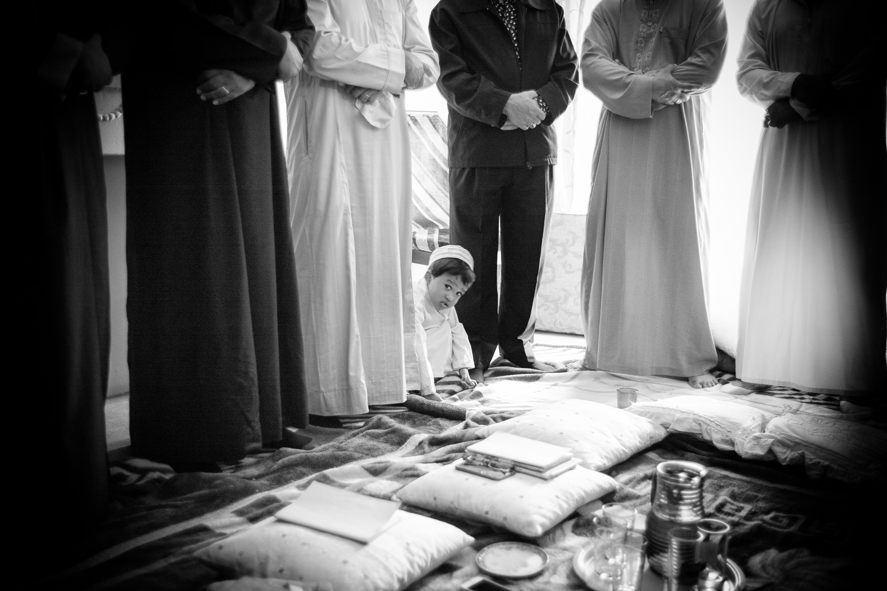

# THe Journey of Transformation

_By Shaykh Fadhlalla Haeri, from the book “[Cosmology of the Self](../../books/practices-teachings/cosmology-self)”_

The world around us makes perfect sense only if we look at it through the eyes of Unity (_tawhīd_). No matter what we look at in existence, we find that it can always be traced back to its one original source, Allah. Recognising the One Existent Creator while we live in this world of multiple forms is essential for our well-being. Without such a unitive recognition and awareness, we tend to fluctuate between being disturbed and tranquil.

Like the pilgrimage to Makka, journey of transformation requires letting go all of one’s assumptions. All links with the past must be cut, irrespective of culture and identity.

We cannot deny that the past has happened; its benefits could continue to unfold in innumerable ways. However, if we succeed in letting go, of not making comparisons or clinging to what we imagine will give us happiness, our minds will be more alert to the moment. Our hearts will also be empty of negative feelings such as fear, greed and jealousy. Then we will be transformed.

People often say that they find it hard to give up their attachments. Those who hang on to their material possessions, habits, and ideas must stop to think: what is it that they feel they have to give up? What promises were they given in the womb? Nothing belongs to us. We merely borrow certain minerals and other matter that constitute the body from the earth, in order for us to journey from the unseen, interact with creation, and to return to the unseen with the light of knowledge that Allah has provided for us. Created to reside for a short while in the darkness in the womb, we emerge, encompassed by the Light that enables us to see sunlight, as well as the darkness of numerous shadows. This is the path of discovery. Without embarking on this journey we have no hope of entering the city of knowledge that lies unconquered within us from before time.

Transformation is possible if the prescription is correct and applied with care. Here we enter an altogether new state which, if maintained, leads to a station of being that encompasses and transcends our humanity. Allah says in the Qur’an that He will not change people unless they change themselves. This applies to each individual and to society. Indeed, if we start by changing the individual, we will end up with a changed society. Only when we arrive at the true knowledge of our origin can we hope to serve society. Attempting to serve others before having arrived at such knowledge will only project our inner confusion onto others. If, however, we return to our original station of fusion, of being completely integrated in our knowledge of the outer and the inner, the seen and the unseen, then we may be of some use to the rest of mankind.

Once we arrive at the real knowledge that is already contained within us, we find that we are constantly circling the inner Ka’ba that symbolises the believer’s heart, and which is seen to be the seat of all truth. This perpetual, spontaneous awareness puts us in a constant state of jihād (striving) and purifies our intentions. We learn to face ourselves with honesty and question whether we are serving others with expectation of reward or praise. Do we recognise that what we are giving to others, in terms of material wealth or a service, is from the very Source of giving, mercy and generosity? Or is it instead an act that will merely gratify our egos, based on enhancing our reputations or our society, or to impose the glitter of our knowledge on others?

The ability to do this is a great blessing. It is a remarkable gift to be able to give to others what does not, in any case, belong to us. We only have it on loan from our Creator. If we make ourselves completely neutral by giving up the past and our attachments while keeping ourselves open to inspiration, coupled with willingness to undertake appropriate work, then we are true wayfarers on the path of unity.

This is positive action. It is not the occurrence of some fantastic or miraculous event; the miracle is life itself. The prophet ‘Isa (Jesus) came at a time when people were fascinated by healing and so Allah gave him the ultimate power of healing – that of raising the dead. Our age, however, has moved past the phenomenological, to a time when cognition and incisive intellect dominate. The time of Buddha was a time of only ḥaqīqa, of light, but now we need boundaries to deal with the darkness of modernism, with its enslavement by monetarism. We cannot resurrect the past. We need instead to dig inside ourselves to discover the origin of human consciousness, the inner cosmos, and so discover the complete prophetic teaching …

There is only one journey, and every prophet from Adam, through the hundreds whose names are not known, to Prophet Muhammad, bore the same message of Islām, which means submission to this all-encompassing reality. Each one was the true reflector of the divine spark within themselves, and we are the recipients of that incredible heritage. There is nothing new in the path of arrival.

