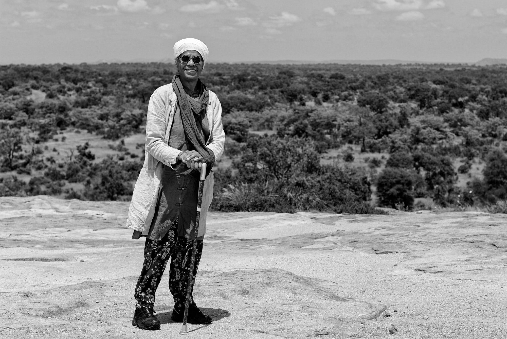
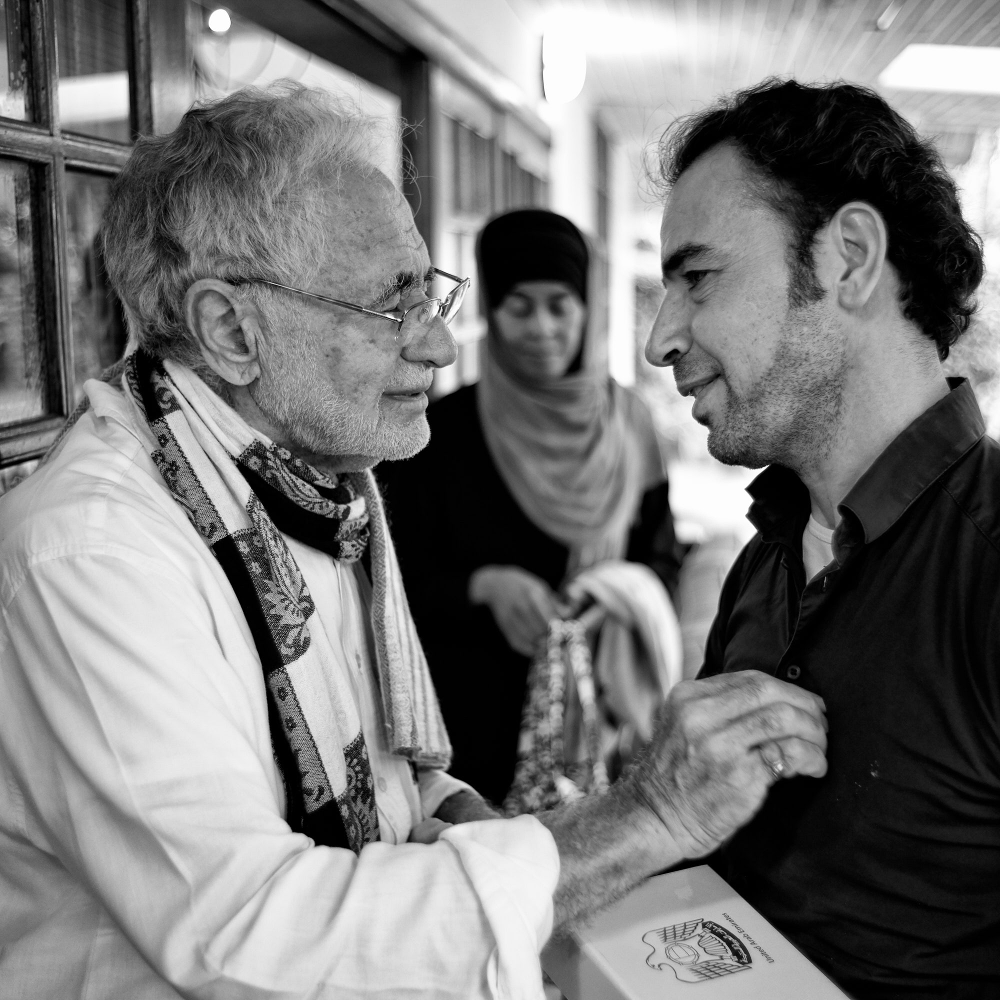

title: The Different Levels of Pilgrimage

description: An overview of the different kinds of pilgrimage it is possible to undertake in Islam

# The Different Level of Pilgrimage

Many of the key words used in this article are explained in full detail in [this section of our glossary](../../glossary/journey-words)

## The Pilgrimage of Revealed Law

The pilgrimage at this first level is to go to the Ka\`bah, or Sacred House of Allah, to carry out the prescribed rituals which are to be performed at specific times. Pilgrimage consists of both obligatory actions and voluntary actions.

The Obligatory Actions are of two types: absolute and restricted (to certain circumstances. The absolute is that the pilgrimage should be the Pilgrimage of Islam, which is fulfilled when the following conditions are met: 

1. Maturity 
2. Sound mind
3. Freedom
4. Health
5. Easy availability of provisions and means of transport
6. Sufficient funds and the existence of a means of obtaining one’s livelihood
7. The emptying of the innermost distractions (great fears, attachments etc.)
8. The possibility of making the journey.

Other basic conditions for _Hajj_ are Islam, maturity of mind, and the power of reasoning. If these requirements are met then one must perform the pilgrimage once within one’s lifetime. With regards to obligations that are restricted in their scope, they are obligatory only if there is a cause which makes them binding (i.e. oaths or contracts).

There are three types of Pilgrimage: _tamattu\`_, _qaran_ and _ifrad_. The _tamattu\`_ pilgrimage is obligatory for whomever does not have his family living in the vicinity of the Ka\`bah. The _qaran_ and the _ifrad_ are obligatory upon those who have come to the Ka\`bah from a distance of 12 miles (or more) in any direction from the House of Allah.

The actions of pilgrimage are of two types: obligatory and non‑obligatory (preferred voluntary actions). Furthermore the obligatory actions are also of two types: _rukn_, an action which if omitted nullifies the pilgrimage, and _non‑rukn_, obligatory actions which, if mistakenly omitted, will not nullify the entire pilgrimage.

### Important Pillars

Of the three types of pilgrimage mentioned above, the pillars of the _tamattu\`_ pilgrimage are eight in number; four of them are restricted to the _\`umrah_ and four to the pilgrimage. The pillars of the _`umrah_ are:

1. Intention (_niyyah_).
2. Assuming the state of ihrām, including donning the garment at the "Station for Commencing the Pilgrimage" (_miqāt_) at the proper time.
3. The _tawāf_ of the _`umrah_.
4. The Hastening (_sa`y_) between Safa and Marwa.

Those which are relevant to _Hajj_ are:

1. The Intention for the Pilgrimage.
2. The Pause at `Arafat.
3. The Pause at Muzdalifah.
4. The Hastening of the Pilgrimage.

There are eight actions which are obligatory but not considered to be Pillars: The uttering of the four phrases of Labayk (if one is able to; if not, whatever is said in its place); the two _rak\`āt_ of the Tawāf of the _\`umrah_; the joined prayers after the Hastening; the uttering of the words _"Labayk"_ at the time of assuming the state of _ihrām_ for the pilgrimage (or whatever is done in its place); the sacrifice or that which takes its place in the way of fasting if one is unable to perform it; the two _rak\`āt_ of the _Tawāf_ of the pilgrimage; and the _tawāf al‑nisā’_ and its two _rak`āt_.

The Pillars of the _qaran_ and the _ifrad_ are five in number:

1. The Ihrām
2. The Pause at `Arafat.
3. The Pause at Muzdalifah.
4. The Circumambulation of the Ziyārah.
5. The Hastening.

The actions which are considered to be non-rukn are four in number:

1. The uttering of the words _"Labayka"_ or what is done in its place.
2. The two _rak`āt_ of the _Tawāf_ of the Ziyārah.
3. The _tawāf al‑nisā’_.
4. The two _rak`āt_ of the _tawāf‑al‑nisā’_.

The _qaran_ is distinguished from the _ifrad_ by the performance of the sacrifice. It is preferable (_mustahabb_) to utter the "Labayka" at the beginning of each circumambulation for both of them.

There are many actions that are considered to be voluntary, preferable actions. One should refer to the books which specifically deal with the pilgrimage for details concerning them. This, then, is the pilgrimage of the people of shari`ah according to the way of the House of the Prophet.

## The Pilgrimage of the Adepts

At the next level the advanced pilgrim will visit the House of Allah – the Spiritual Ka`bah. This sacred House can be considered from two viewpoints: from that of the ‘Horizons’ (i.e. the macrocosm) and from that of the self (i.e. the microcosm). With regard to the ‘Horizons’, this refers to the original human (_insān_) heart, also called the ‘Universal Self’, "the Visited House" (Qur'an, 52:4) and the "Preserved Tablet" (Qur'an, 85:22". The ‘self’ as used here refers to the heart of lesser man which is referred to as the "heart, the breast, or the articulating self."

The former of these two, that is, the ‘Horizons’, are the _Qiblah_ of the people of _haqiqah_ and the latter is the Qiblah of the people of _tariqah_. The way the people of _tariqah_ go to and turn towards their Qiblah rests upon what has come to us in the tradition that the first House which extended over the water and appeared upon the face of the water was the Ka`bah. This was before the existence of the earth and whatever was made upon it, according to the Prophet’s words:

> "The Ka`bah was the first House which appeared upon the face of the water at the time of the creation of the Heavens. He created it … before the creation of the earth."

Allah said:

> "Surely the first House which was established for the people was the one in Bakkah (Makkah), as a blessing and as a guidance for the worlds. In it are clear signs, the station of Abraham, and whoever enters it is secure, and Allah has obliged the people to make the pilgrimage to the House for whoever can make his way to it, and as for him who defies the commandment, Allah is independent from all of the worlds." Qur'an, 3:96‑97

The tradition and the verse demonstrate that there is both a physical Ka\`bah and a spiritual Ka\`bah and each of them has two aspects. One of its aspects is the physical masjid which is called _al‑Masjid ul‑Harām_ (The Sacred Mosque). The other division is the physical heart, which is also called _al‑Masjid ul‑Harām_. Another aspect is the Greater Heart of Man, which is referred to as the ‘Universal Soul’, and the other division is the Lesser Heart of Man, which is referred to as the ‘Differentiated Articulating Self’.

The first Reality which manifested within the spiritual realm from the Greater Soul was the Soul of Man, of which it is said that the first thing that Allah created was the soul or reasoning, and it was the Qiblah of haqiqah which was called the Universal Soul; as Allah has said:

> "O people fear your Lord Who created you from one soul." Qur'an, 4:1

Similarly, the first form which manifested within the physical realm, which is referred to as the ‘earth’, was the form of the physical Ka`bah; as Allah has said:

> "Surely the first House established for the people was the one in Bakkah (Makkah), as a blessing and a guidance for the worlds…" Qur'an, 3:96

The first Reality which manifested within the spiritual realm from the Lesser Soul of Man, referred to in His words:

> "…and when I formed it and blew into it by way of My Soul," Qur'an, 15:29

was the Qiblah of _haqiqah_, which is referred to in the words of the _hadith qudsi_:

> "My earth and My heavens cannot contain Me, but the heart of My slave who has faith contains Me."

The first form which manifested within the physical realm, that is the ‘body’, was the form of the physical heart, referred to as the ‘breast’, of which Allah has said:

> "Have We not expanded your breast?" Qur'an, 94:1

Thus, just as the spiritual Ka\`bah may be understood from the physical Ka`bah, the existence of the spiritual heart, which is the lesser Heart of Man, may be understood from the existence of the physical heart, by virtue of:

> "We shall show them Our signs on the horizons and in their souls so that the Truth will become clear to them." Qur'an, 41:53

It may also be understood from the verse:

> "It is He Who created the heavens and the earth in six days and His Throne was upon the water." Qur'an, 11:7

The Throne (the structural blueprint) existed before the creation of the physical heavens and earth and is built upon the foundation of the spiritual essences consisting of reasoning and souls. ‘Throne’ here means the spiritual throne which is the Primal Reasoning. If the meaning of the word ‘Throne’ refers to the physical Throne, which is the greater cycle of the heavens, then the meaning of the term ‘water’ signifies physical water. It has also been said that the term ‘water’ here signifies divine knowledge which is the foundation of all phenomena. Distinguishing it by placing the Throne over it is to signify its vastness and greatness.

If we suppose the water upon which the Throne rests is a drop from the Greater Man (the Macrocosm), from the standpoint of form as it is determined to be among the Men of Allah, then the water represents physical water and its manifestation signifies its relationship to the drop from which all forms in the world spring. It is also thus with regard to the Lesser Soul of Man (i.e. the microcosm) which is derived from a drop of sperm. The microcosm is identical to the Macrocosm in all aspects of meaning.

## The Pilgrimage of the Gnostic

This consists of spiritually turning in the direction of the greater Heart of Man, which is the Supreme House of Allah and which is referred to as the ‘Visited House’, the ‘Sacred Presence’ and the ‘Universal Soul’. This is in contrast to the Pilgrimage of the people of _tariqah_ which is directed to the Lesser Heart of Humankind.

The authority over the differential (individual) soul, which is the soul of the Lesser Man, cannot exist anywhere but within the mind. Likewise the authority over the Universal Soul which is the soul of the Greater Man, and which is referred to as the universe, cannot exist anywhere but within the Throne (similar, in this instance, to the mind). Furthermore, in the same way that it initially manifests within the Lesser Man as the physical heart, which is the fountainhead of life, so too it is that its initial manifestation within the Greater Man is the Fourth Celestial Sphere, which is the celestial sphere of the sun, the fountainhead of life in the world. Thus it is like the breast of the Greater Man with the sun being like the physical heart within it. The heart of _haqiqah_ is the Universal Soul, which is also called the ‘Preserved Tablet’, the ‘Clear Book’ and ‘Adam of the Haqiqah’. Allah alludes to it in the verse:

> "O people, fear your Lord Who created you from One Soul and He created its mate from it." Qur'an, 4:1

The Soul of the Fourth Celestial Sphere is like the animal soul which is in the heart. All parts of the body receive life from it. It is the well-known ‘Visited House’ of the _shari`ah_, the Fourth Heaven, and it is by it that Allah makes an oath in the verse:

> "By the Mountain and inscribed Book on a fine outstretched parchment and the Visited House and elevated canopy and the overflowing sea." Qur'an, 52:1‑6

The ‘mountain’ represents the Throne, and the ‘inscribed Book’ represents the Universal Soul which is the heart of the universe. The ‘fine outstretched parchment’ represents the Eighth Celestial Sphere, which is its manifestation. The ‘elevated canopy’ may be the Throne or it may represent the earthly sky. The ‘Visited House’ may represent the Fourth Celestial Sphere and it may represent the Universal Soul. The ‘overflowing sea’ is filled with forms and may represent the Realm of the Barrier, or interspace or barrier (_barzakh_), which lies between the two worlds of the spiritual and physical, and is referred to as the shadow realm and is filled with the form of everything in creation.

The Ka`bah represents the Universal Soul which is called the Supreme House of Allah; its appearance on the water is an allusion to the spiritual realms which originate from it before the physical realms.

> "It is He Who created the heavens and the earth in six days and His Throne was upon the water." Qur'an, 11:7

This could mean that before the creation of the physical heavens and earth the Throne was upon their two spiritual counterparts, reasoning and the self, if by the term ‘Throne’ we mean the spiritual Throne which is the Primal Reasoning. It is possible that the water is an allusion to the basic matter from which the universe was created. Furthermore, it is possible that this was before ‘the splitting asunder’ during the time of unity when all primordial matter was in one state, when reasoning, the soul, and the Throne were one Reality.

The ‘First House’ which has been alluded to is the Universal Soul and the word ‘Bakkah’, is an allusion to the Eighth Celestial Sphere, which is termed the Dais (kursiy) and as ‘Blessed’ – an allusion to the blessing of knowledge and truth which surround it and which descend from it to the rest of creation below it. ‘A guidance for the world’ is an allusion to its overflowing grace and illumination for all of the worlds.

‘The station of Abraham’ is an allusion to the arrival of the spiritual traveler, by means of it, to the station of the all‑inclusive oneness of the haqiqah of Abraham. Allah says the following concerning this:

> "And in this way We show Abraham the dominion of the heavens and the earth so that he may be among the certain." Qur'an, 6:75

> "…and whoever has entered it is secure." Qur'an, 3:97

These words indicate that whoever enters the House in the manner mentioned above will be secure from all suspicion and doubt regarding the cosmic Divine sanctity. He will be secure from the two forms of associating others with Allah, i.e. openly and secretly.

> "…And Allah has obliged the people to make the Pilgrimage to the House…" Qur'an, 3:97

That is to say, from the standpoint of spiritual knowledge, of witnessing, unveiling, and viewing an obligation rests upon the people who are ready for this station to go to that House in this manner. The verse

> "…whoever is able to make his way to it," Qur'an, 3:97

is an indication of His having distinguished a particular group of people who are able to do it by virtue of their appropriate knowledge and good action.

Useful knowledge is attained in two ways. Either directly from Allah without any human intermediary, referred to as revelation, inspiration and unveiling, or through the medium of the men of knowledge, like His Prophets and Messengers. They are alluded to in:

> "Read: And your Lord is the Most Generous, He who taught with the pen," Qur'an, 96:3‑4

and:

> "…and when Allah made a covenant with those who were given the Book: You shall certainly make it known to men and you shall not hide it. And they cast it behind their backs and took a small price for it; so wretched is that which they have purchased." Qur'an, 3:187

Good actions also have two aspects: One relates to the people of shari`ah and tariqah, and refers to good and purifying actions, with no trace of doubt or suspicion and which is performed purely and sincerely for Allah. The other aspect is distinctly for the people of haqiqah and the people of attainment, and this is not known or witnessed by anyone in existence except by Allah:

> "So whoever wants to meet his Lord, let him perform a good action and not associate anyone in the worship of his Lord." Qur'an, 18:110

### Stations of the Self

Thus, whoever desires to go on the Pilgrimage of the gnostics must assume the state of _ihrām_ from witnessing the realms of the senses completely, by forbidding (i.e. making harām) his self from witnessing the physical universe and those worldly pleasures which are connected with it. Then he should direct his attention to the spiritual realm, which is the Sanctuary, Makkah or Bakkah, so that in fact he may attain it and become adorned with the Attributes of this spiritual realm and obtain its knowledge. Then he should direct his attention to the Ka`bah of Haqiqah, which is the Universal Soul and its knowledge and truths, and make seven _tawāfs_ around it.

The seven stations of the self are:

1. The Commanding Self (_nafs al‑ammārah_)
2. The Critical Self (_nafs al‑lawwāmah_)
3. The Inspirational Self (_nafs al‑mulhamah_)
4. The Tranquil Self (_nafs al‑mutma’innah_)
5. The Contented Self (_nafs al‑radiyah_)
6. The Self which is the object of Allah’s contentment (_nafs al‑mardiyah_)
7. The Perfected Self (_nafs al‑kāmilah_)

The levels of knowledge of the physical realm correspond to what has been called the ‘Seven Levels of Qur’anic Knowledge’, of which there are numerous subdivisions, and have been indicated by the Prophet when he said:

> "Indeed the Qur’an possesses both an outward and an inward and its inward possesses an inward continuing to seven levels."

Then the attention is turned to the station of Abraham, which is the station of Unity, and the Presence of Oneness, known as the Primal Reasoning and the Supreme Soul. There he performs a prayer of two _rak\`āt_ in thanksgiving for having arrived at that Presence. The two rak`āt represent the annihilation from both the outer and the inner realms and whatever they contain of existence and creation, including himself.

Then he hastens between Safa and Marwa (outer and inner worlds), to observe them once again with his effort and struggle in order to discontinue looking upon multiplicity by carefully examining the One Existence which lies behind it, and to become firmly established in the station of unity or gatheredness, which is his desired destination. Then he directs his attention to the Ka`bah once again in order to witness the Universal Soul and to observe its truths. He takes the _ihrām_ of the Pilgrimage from it, which is beyond rationality, in the prescribed manner.

Then he turns his attention to \`Arafat (the station of the self). Turning one’s attention to the \`Arafat of the self is to turn the attention to the station of knowledge of haqiqah and there is no Presence after this Presence except the presence of the Essence, which no one can reach, for it has preceded and reached all before creation. In this station the arrival at the Unity of true gatheredness is attained, which is referred to as ‘Muhammadi Unity’.

It is here that a man becomes a human (_insān_) where the perfected being is perfected, and where the Master becomes a Master. For this reason they are obliged to return to the task of bringing others to perfection by returning to the realm of multiplicity, as Allah has said:

> "…and to warn their people when they return to them." Qur'an 9:122

When Shaykh Junayd was asked about the end destination, he replied:

> "(It is) the return to the starting point."

This is the secret of the return of the pilgrim from \`Arafat to Mina, because it symbolizes the return to the realm of multiplicity. Then he occupies himself with the performance of the rituals of Mina, that is, the business of the outward world viz. the stoning, the sacrifice and the shaving of the head. He casts the stone of `Aqabah, which represents the world and its provision, casting it away without the possibility of returning, now that he lives the life of _haqiqah_ (the real life):

> "Do not reckon that those who have been killed in the way of Allah are dead; on the contrary, they are alive sustained with their Lord." Qur'an, 3:169

And:

> "…or is the one who has been dead and to whom We have restored life and made a light for him with which he walks among the people like the one who is within darkness from which he does not escape?" Qur'an, 6:122

He then shaves his head, that is, he cuts the head of his self from the love of the world and its provision, thereby symbolizing that he will never allow his self to return again. Then he returns to the station of eternity, which is the ongoingness after annihilation, and he goes around the Ka`bah again in order to examine it once more from seven aspects in accordance with the state of his own creation, which is in seven stages; as Allah has said:

> "…He created you in stages" Qur'an, 71:14

so that he may glimpse or experience the light of truth by way of that free movement within the seven regions of the earth and the seven celestial regions, which are referred to as Spiritual Regions and the Realm of Power respectively.

Then he performs _salāt_ at the station of Abraham, the Unity of Haqiqah, performing the two _rak`āt_ prayer of the Feast (Feast of the Sacrifice and Feast of the Fast Breaking), because of having become annihilated from every feast and because of his remaining eternally in a constant state of feasting in divine light, in the station of the Unity of Haqiqah.

Finally he returns to Mina, to the world of multiplicity and the three stages which are mineral, plant and animal and stays there for three days of the Days of Allah, as Allah says:

> "…today I have completed for you your way of life (Islam) and I have perfected My Grace upon you and I am contented with Islam as a way of life for you." Qur'an, 5:3

