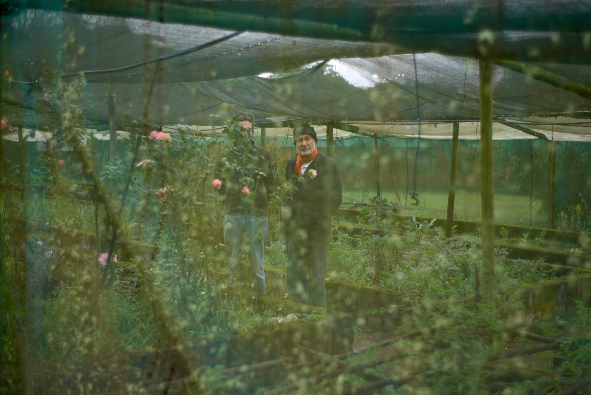

title: Natural Illusions

description:

# Natural Illusions

_By Shaykh Fadhlalla Haeri, from the book [“101 Helpful Illusions”](../../books/practices-teachings/101-helpful-illusions)_.

Nature can be deceptive in many ways and at different levels of subtlety or obviousness. Rainbow colours appear to reveal the vibrant components of light, yet there is a far boarder range of frequencies and wavelengths in light than we can visibly discern. The common assumption is that light is what enables us to see; the rest of the story eludes us. For example, birds have learned many ways to distract potential threats from their nests. Often the male bird acts as a decoy while the female lays still on the eggs, blending in with her surroundings; a trick which gives birds an advantage in order to survive. In fact, nature is full of deceptions and illusions.

Consciousness is the foundation of life that connects the unseen with the seen through light. Without light there would be neither energy nor the physical world. Our apparent world hides numerous levels of subtler forces, which are barely discernible or describable. Logic and causality are keys in describing what appears to us as real, but what is not apparent is of much greater magnitude, like the bulk of the hidden iceberg.

Consciousness is subtler than light and is at the root of existence and creation. There are countless ways of looking at consciousness and differentiating between its levels, spheres and spectrums. Two spheres stand out clearly, however. First is the basic level that makes human beings sentient and alive. This basic consciousness is the face behind the will to survive, grow, replicate, and so on. All living entities are energized by this consciousness. Human beings are distinct from other creatures due to a greater sphere of consciousness, which is higher consciousness, God-consciousness, supreme consciousness or soul consciousness. To this level belong all higher attributes and virtues such as mercy, generosity, forgiveness and others. Human ethics and morality evolve due to higher consciousness.

To be like an animal at first is quite natural, but not to evolve and realize higher consciousness signifies an unfulfilled life. Every creation reaches its appropriate destiny when its highest potential (in terms of consciousness) is accomplished. God is the essence of universal supreme consciousness.

For a child it is natural and normal to be selfish and concerned mostly with its own physical sensory needs. With maturity comes the quest for a sustainable fulfilled life. The lights of higher consciousness begin to supersede the early ‘survival’ consciousness. To remain mainly bound to conditioned consciousness is to be deprived of awakening to the one real potential of soul essence. Our animalistic state of existence reinforces itself through multiple delusions, veils and worldly distractions, which divert us from accessing soul-consciousness.

If we look closely at all these paradoxes and illusions, we see that they were in fact appropriate for us at a particular time or situation in this world, like the shell that protects the kernel of a nut. That is why it is said that there is goodness in everything that exists – if only we look with the eye of spiritual discernment. It is context and specific causality that needs to be viewed. A poison can kill and can cure. Egotism is essential in a child but out of season in a grown up and even detrimental.

Everything in nature reveals some aspects of itself and hides others. Everything earthly has also a heavenly aspect and every lie betrays an aspect of truth. To progress spiritually we need to witness naturally occurring illusions, assumptions and fallacies and break past them to the essence that is eternally constant and perfect.

