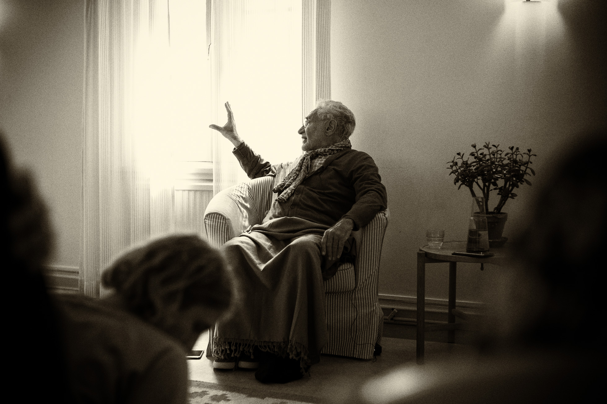
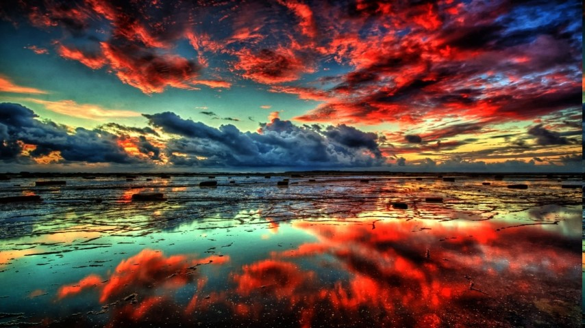

# Pointers to Haqq (Truth)

_Written by Shaykh Fadhlalla Haeri June 2018_

Human needs, desires and questions never end. We always hope to discover answers to our day-to-day questions as well as the big questions in life. How did life begin? How and when will life end? Who am I really? Who are you? What is the purpose of life? Philosophical people often answer that it is to know Truth or God. What is that? We are often told that we have duties and responsibilities in this life. What are these and what is their purpose? What is truth and where is it? What is real and constant? Will we ever know the truth in this life?

## Life, Death and Change

Several religions say that everyone will know the truth after death. In that case, where is God’s love and generosity in this world? At all times we seek to avoid pain, fear and sorrow, yet no one is ever spared these experiences in varying intensity and duration. We all want to live a fulfilled and happy life, yet we are unlikely to meet anyone who has successfully attained that state durably.

Why do we experience ever-changing feelings and moods? Much of life’s experiences can be pleasant and desirable yet there are numerous events that cause grief, pain and misery. How can we experience and enjoy the highest quality of life? How can we maintain a healthy balance in body, mind and heart? What is the purpose of religion and spiritual aspiration? Why is it that nothing ever gives us sustained contentment? What is it that we are really striving to achieve? What sort of life do we experience, if any, after death?

Life on earth is due to the interplay between energy and matter within space and time. Basic life began a few hundred million years ago, giving rise to human consciousness as we experience it now. There are two sides to human nature. One has evolved over millions of years and contains traces of all that exists on earth. The other side of our composition is a celestial bundle of lights and energies often named as spirit or soul. This celestial life source is our real nature which we long for – the God within.

The development of our personality and conditioned consciousness takes place in this dynamic of an animal self confined within space and time, and energised by the spirit. Religious practices are there to refine the animal self and enable it to be guided by the light, soul or spirit. Most world religions advocate respect for life and all living things, and for humans to exercise modesty, generosity and accountability in upholding higher values, ethics, virtuous conduct, selfless service to other beings and constant gratitude to God irrespective of outer circumstances. All of this is meaningful and possible to follow if you accept the premise that our journey on earth is to rise in consciousness from the lowest animal selfish tendencies to pure consciousness, cosmic governance, or divine prevalence. Islam highlights what so many earlier prophets and sages before Muhammad had emphasised and tried to inculcate in their people and cultures.

## Unity

The crucial issue is the unitive nature of truth and reality or God as the source of life and all creation, and this cosmic source is also the final destiny. Everything has emanated from that essence and returns to it. The teachings of the Qur’an and the way of Muhammad also highlight the purpose of human existence and its transient nature from the lower self to the divine soul itself, from birth to death, all of which is in preparation for the full unveiling of Truth after death – eternal cosmic connectedness.

Death is a most natural transfer from dualities and confinement within space and time to eternal oneness. The Qur’an reveals that real life is ever continuous and not subject to beginnings or ends, such as birth and death. We experience, in fact, two modes of birth and death. One birth is physical, biological and emotional, and the other one is awakening to the ultimate truth, which is the nature of our own soul. This spiritual birth is the essential drive within all human desires and hopes, the source of which can be accessed and touched upon through transcendence of all sensory experiences and conditioned consciousness. A preparation for this is meditation, contemplation, silence and solitude. The Qur’an and prophetic teachings emphasise the duty and purpose of human beings, which is to transcend the lower self to the divine soul in preparation for ongoingness in the hereafter. Real education and grooming evolves us to act as accountable and responsible earthly stewards – the master is the divine soul.

All our life experiences are practices towards higher infinite consciousness, and the many grades, scales, zones and domains that it encompasses. All of this will be experienced fully after a period of the rattling and shaking of purification after death, described by most world religions. The Abrahamic religions are clear about heaven, hell and purgatory. Others have similar teachings, including that of reincarnation – if you haven’t succeeded in transcending to higher consciousness then you will return. All world religions have some notion that if you have not progressed sufficiently towards higher consciousness before death then there is going to be a ’decompression’ so that whatever you have carried within yourself as traces and fantasies is eradicated. But if you have practiced eradication, like the Buddhist practice of death with its eight different stages, then it is a natural progression towards liberation from the illusion of separation.

## Practicing Surrender

Islam, like some other world religions, prescribes practices that elevate consciousness through reflecting upon day-to-day habits, which are otherwise performed without full attention or reflection. The human purpose on earth is to ascend in consciousness from a very basic survival level to illumined awakening and arrival. When self-awareness becomes a natural constant habit, then every moment becomes enriched with vibrancy and delight. Religious practices and rituals are the beginnings of alignment between self and soul and transcending the material world to higher consciousness. Formally, you pray five times a day (which also has an important social aspect to it) until, as the Qur’an describes, you are perpetually in that plugged-in state. The same applies to all other rituals. In a sense, you are at all times on pilgrimage. While with fasting, you are at all times aware of what you are putting in your mouth or what you are putting in your head. So let this month be different from other months, even if you cannot fast. Whatever you ingest, be aware of it, be more conscious of it. Marvel at how it is possible for you to lift your hand or even a finger. Enter the magic of this month so that all year round you will be aware of where you are sitting, why you are drinking, where you put your cup. Your whole life then becomes an act of worship.

Life has to flow. It has to be fun and we all seek and hope for that. Initially with a child there is a little bribery and corruption – ‘Do it for mummy’s sake’. But later on, by being in the dot of the now, by being present, you are already participating in the treasures of eternal life. If you are truly practicing silence and awareness of the moment and its immensity, then you know time and non-time; the eternal and the short, all lie in that moment. So you will know that the present moment, of which you are experiencing a little of its coming and its going, is perfect. You will know that the present moment contains within it eternity. You will know it is perfect.

Bring that to the social level and you will never ever lament the difficulties of today – the bad culture, people don’t listen, children are rebellious, etc. You must not regurgitate what you have been reiterating from the past. Read it. It will tell you. There is utter perfection in the moment; therefore, if you take today’s time, you will recognise it is much better than ten years ago and much much better than a hundred years ago. This is a touchstone of contentment. The present moment contains all that happened in the past and gives a clear indication of what will happen in the future. By denying the perfection of the moment we will lack contentment and happiness will remain elusive.

Divisions and differences between human beings are natural. So is our love for harmony and unity. Every one of us experiences constant change within space and time whilst we seek perspective and refer to higher consciousness with its boundless constancy. No two moments are the same for any living entity. Within each moment is the duality of what is attractive and what is not. Each and every living entity can act like a war machine with animosity and discord whilst wishing for peace and goodness, albeit in the distant future. How can we overcome enmity and discord, and accept differences in opinion, culture, or way of life, as natural occurrences just like the countless plants, flowers, flavors and colors? All humans are similar in many ways but also differ in other ways. No matter what we do, no matter what we say, every person and every people have a flavour. Reference to higher consciousness will put things in perspective and will show you the appropriate path.

## Lasting Contentment

Peace and prosperity can only become durable when inner peace and contentment is attained when the self becomes subservient to the soul, thereby accessing timeless joy. Peace and prosperity become socially durable and universal when personal inner peace and contentment is attained by a number of people who have an influence over the community and society, and their guidance becomes a touchstone for normal conduct and behaviour. In the past, religious people, saints, sages and others were regarded as the ultimate reference points and arbiters when there were serious differences and disputes between people and communities. In our day-to-day life today we need the wisdom of perspective, durable goodness and true accountability regarding intentions and actions.

The supreme treasure of all is the divine spirit within the heart, which is the ultimate guiding reference for fulfilled living. When a mature person is in constant attention, reflection and reference to the higher level of consciousness, then fulfillment is attained in the world of duality, change and uncertainty. This awakened being is constantly energised by permanent life and therefore regards death as a natural ascent to the liberated zone of eternal presence. Fears and sorrows become insignificant and the nature of death reveals itself to be a gift of liberation from the limitations of the earthly journey.

Our limited world of dualities drives us to understand the cause and effect, origin and destiny, of all that exists in preparation for the state beyond death, beyond self-identity and the illusion of independence or separation from sacred oneness. Most of what we experience in nature is complementary and symbiotic and even where there appears to be divergence, nature acts to regulate the natural flow of diversities in life. With the human urge to investigate, study and discover the nature of material objects as well as feelings and emotions, we reach the conclusion that the entire of existence is differentiated sameness. No two moments are the same but the nature of time and space remains the same. If you simply live totally in the now then you are directly energised by higher eternal consciousness. Now is forever and so is the inner soul or spirit. So hasten with patience. Wait, especially if you are in a rush.

## Celebrate!

It is human nature to be hopeful, cheerful and to celebrate goodness. Most people use any excuse to celebrate and leave behind sorrow, fear, or insecurity. We all love to celebrate – it is deep in the human psyche. Individually we celebrate within ourselves because that is our kingdom, and collectively with the wider kingdom. Celebration is victory, and victory is beyond success and failure. But we end up having pseudo-celebrations, like birthdays or the ‘independence’ of a country. We need to ask ourselves what is it that is worthy of celebration at all times and all occasions without any bitterness or regrets later on? Celebration is only going to be meaningful through Islam, Iman and Ihsan. Each is a zone of consciousness. Islam is that there is nothing in my hand; I didn’t know who I was, I didn’t know what was birth, I don’t know what death is, so I have to surrender into the vast unknown. Iman is that I trust that it has been going on for millions of years so there must be some stability, some referencing, some governorship. That is Iman; I have faith, I have trust, I can rely upon the perfection that emerges from the unseen, whether experienced or not. Ihsan is that there is no ‘me’ anymore – there is only perfection; so if I am truly basking in that perfection I cannot but transmit that with which I have been saturated. Life is glorious and we celebrate it perpetually.

