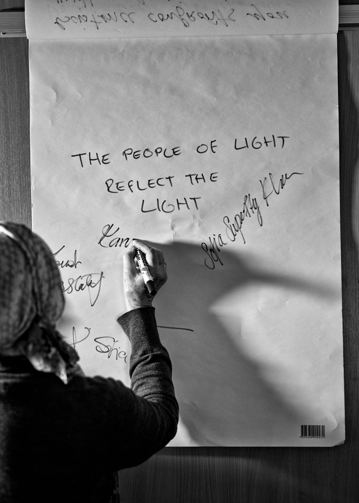

title: The Practice of Stillness

description:

# The Practice of Stillness

Generally there are three stages in the practice of stillness in body, mind, and heart.

## 1. Preparation and Intention

This preliminary stage is intended to help you overcome the natural mental noise that goes on in your head. Anything that exists seeks to perpetuate itself. All thoughts are froth from the neuron circuitry, so allow them to exhaust themselves and leave you.

Ensure that the possibilities for being interrupted are kept to a minimum and that your attention is not diverted to worldly needs. As you do your _wudu_ concentrate on the meaning of every movement, using each one as an opportunity to purify the decaying body (see [Transformative Worship](../../books/general-islam/transformative-worship) for more on this).

Sound is a powerful tool when used repetitively as a way of tricking the mind through self-hypnosis to reduce the circling of thoughts and bring them to one point. It is not so much the intensity of being mindful but the frequency and constancy. This approach incorporates any of a dozen methodologies or ways.

**Recitation of Qur’an** 
Sit quietly and follow a recitation or read aloud yourself. Repeat only a few ayat of your choice.

**Dhikr**
This is an opportunity to leave behind your identity, your biography, your worries. Choose a _dhikr_ that is effective for you.  Recite the Name ‘Allah’ in any fashion, or any other Divines Names.  For example, if you are ill ‘Ya Shāfī Ya Mu’āfī’ may be helpful;  if worried for provisions, ‘Ya Fattāh Ya Razzāq‘.

**Visualisation**
Visualize anything you are comfortable and familiar with, such as a divine name on the horizon, a colour, rainbows etc. Whatever you choose, concentrate on it. For example, take a rose in your hand and ask it permission to de-petal it. Your mind is a trickster; you have to outwit it.

**Breath**
Become aware of inhaling and exhaling, extending the period of exhalation.

## 2. Entering the Ocean

The moment you have made your intention you are on the shore wading in, in the hope that the sea will engulf you and that you will lose all self-consciousness, self-awareness and identity.

In Muslim cultures, certain terms were used to denote meditative retreats, such as _khalwa_ (which connotes a status and prestige that is quite misplaced and abused in this day and age), _i’tikāf_  (which has remained a tradition practised during the last 10 days of Ramadan) and _‘uzla_ (a more neutral term denoting setting oneself aside).

Whilst wading through the shallows, many aspects of the self will be revealed to you. Allow them to emerge, face them with courage, and allow them to exhaust themselves. When dealing with aspects of your shadow, it is useful to imagine that you are in the guesthouse described by Rumi, welcoming each without judgement, and then eventually watching them recede. Persist and be patient and do not judge your progress because this zone takes the bulk of energy and time.

## 3. Transcending Space and Time

As you are wading, there may be occasions when you slip or lose your foothold; do not panic but be patient. Now you are approaching the deep end: experiencing different qualities of silence. Flow with that state with trust but no fear. You are now entering a zone of higher consciousness that is at the edge of truth.

All these approaches will help move you along towards higher consciousness.

## The Origin

Ultimately, we're seeking the origin for everything. How did it come about? How did an insect evolve to become what it is? What is the origin of an idea? How did the notion of God come about? What is the origin of life? Who am I descended from? Maybe there was a great being or hero among my ancestors. Perhaps that is why I feel special!

We want to identify with power, honour and glory. This quest is within conditioned consciousness. What, however, is the origin of the seed of questing origin? That primal drive is inseparable from life, consciousness and the root and origin of the beginning of creation. We have evolved to be aware of awareness itself. Consider the four main substances: fire, water, air and earth. Fire and light are at the root of conscious life. Our nervous system depends upon electromagnetic actions upon neurons. Without air for a few minutes, the brain is dead. Without water and all the minerals, we cannot survive. Our origin is cosmic and we have within us all of the attributes of cosmic dust and lights. Over a hundred different elements. Our physical survival, depends upon other living creatures, animals and plants. We maintain ourselves by eating fruit and roots and vegetables whose origin is dust, water, air and sun. But human survival needs more than earth and water – our life is dependent on more basic forms of life.

Within conditioned consciousness, we question, reflect, share, and try to discover what the original cause is. Once we are at the point of neutrality, then the light of inner perception beams from the Soul, reflecting the divine spirit of the Origin. The question is replaced with a taste of Reality and the experience of Oneness – a glorious answer which ends all questions – your personal entity is now in inseparable connection with the Cosmic Reality.

