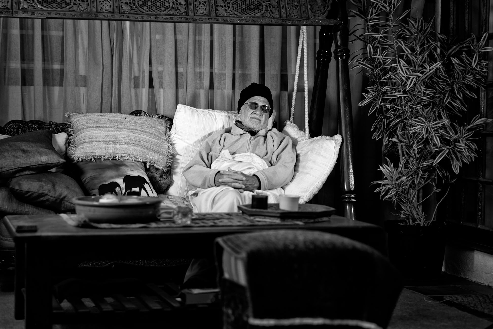

# Remembrance, Discrimination, Yearning

_By Shaykh Fadhlalla Haeri, from the book <a href="https://zahrapublications.pub/book-TheSufiWayToSelf-Unfoldment.php#bookTitle" target="_blank">“The Sufi Way to Self-Unfoldment”</a>.

The Path lies in _dhikr_, _fikr_ and _himmah_. _Dhikr_ is the remembrance of God, from whom I am separated by my self. It is this illusion that is caused by me that is the cause of this barrier, separation. So it is a process of elimination. If I overcome the self, if I remove all of these images, all of these goggles that I have erroneously put on, then I am bound to be less separated from that which is the source of all beingness.

So remembrance is necessary for us to begin to dissolve the self. If I remember God at the moment of agitation and disappointment, if I remember the Creator of the entire cosmos, from Whom this life is allotted for a few years, then my own little misery, my own problem, put in the large perspective, is bound to gain a measure of relief. It is bound to be a remedy for whatever situation I am in.

Remembrance begins as an outside activity. Then it belongs to the heart. How can I remember God when I am full of me? When the bucket is full of me, there is no room for anything else. It is a displacement process. A bucket of pure water with mud particles in suspension can be purified again if we place it under a tap which drips into it fresh clear water. In time, this bucket of mud begins to get cleaner and cleaner and begins to reflect more of its real nature of pure water. Our nature is that of purity. That is why we like purity – we are basically pure at source. So there is no room for personal guilt. Our heritage is purity and the simplicity of beingness. But, because of the activities which we undertake in the world, we begin to solidify the roles and images into a personality with apparently conflicting and often irreconcilable aspects.

It is by remembrance of God that I can begin to melt down the layers that I have created which are the source of my agitation, problems, and expectations. It is the most vital activity. A muslim prays five times a day, five formal and definable times for dhikr and salat (prayer). Five times to remember and submit to Allah, outwardly and inwardly.

_Fikr_ is that light which is shed on a scene in order to discriminate: what is good and what is bad, what is lasting and what is not, right and wrong, black and white. If we are in a state of real remembrance, then discrimination will operate spontaneously.

Suppose we stop the moving film of our actions and freeze a frame. _Dhikr_ freezes the ‘frame’ of action and _fikr_ shines the torch of discrimination on it. Subsequent correct action will result from this. The film shows that I disliked your presence here to such an extent that I proceeded to punch you, and all of a sudden I see myself in this childish act, in the frozen shot of this film. If I catch myself in that instant, I am bound to discriminate and immediately correct the course. But we are often slow, and leave it too late. After I have done it I plead for forgiveness and say, ‘It wasn’t me!’ What this means is that, after the event, I have had a replay of the act, because it was fresh in my memory, and in the light of discrimination.

Neither remembrance nor discrimination will occur unless there is _himmah_ – energy, yearning to be true, full, alive. The more we have this energy, the more it becomes available. It is like tapping a source: the more you clean the head of the spring, the more clear water will flow. But because we are accustomed to living in a manner that is totally incorrect and harmful, and which we try to persevere, we are scared of change and shut ourselves up in our private rooms. It is because we want to preserve habits. We are afraid of opening our hands to drop the thorns which we have clasped and made ours. But, when the pain is deep and real, then great yearning will enable us to act, drop the thorns and find the freedom that was there to begin with anyway. You may ask, ‘if it is so easy, then what are all these methods for?’ In a way, it is like picking up new thorns at will in order to get rid of the thorn that has been aching in you all these years – the old self.

So there must be a beginning. The extent of new speed of the raft, floating on the stream of the past, depends entirely on the extent of the new energy in you. The greater the yearning and burning, the greater the energy. The greater is your suffering, the more you are qualified to free yourself from it. When fear is mild, one can brush it aside. When it is vast, new basic treatment is necessary and final cure is more probable.

So the three basic requirements of the Path are entirely interrelated. Each of them reinforces the others, both in quantity and quality. If I have greater awareness, then more discrimination will constantly illuminate my actions. Therefore, more of my new actions will be such that they are not likely to enhance the self in me. Slowly, one observes the vanishing ‘I’-ness: arrogance, vanity, personality. So the outcome of the path towards self-knowledge is getting rid of the impermanent. Get rid of the ‘I’ and you will see the real self. It is a process of elimination. The embryonic seed of real knowledge is in everyone. But, in most cases, it has been tarnished or covered by the layers of the personality.

