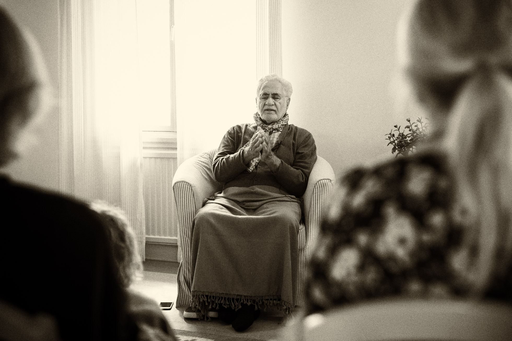

# The Shock of Awakening

_By Shaykh Fadhlalla Haeri from the book [“Beams of Illumination from the Divine Revelation – A Commentary on the Last Section of the Qur’an”](../../books/quran/keys/keys-5)_

By the time the first five ayat of _Surat-ul-‘Alaq_ were revealed to him, the Prophet, _ṣalla-llāhu ‘alayhi wa ālihi wa sallam_, had already been regularly spending days, weeks, and months in meditation in a cave in order to penetrate the layers of his _nafs_, thereby following the path of all those before him who followed the dictum: 

> “He who knows himself knows his Lord.” 

The path towards the knowledge of lordship, of sustainership, is by way of the recognition of what is closest to us, which is all the different selves, or aspects of ourselves.

Like other seekers before and after him, he went to solitary places for his periods of reflection. For the true seeker, this is not escapism, but a direct, positive attempt to find out where he comes from by reflecting upon what is closest to him, that is, his own self. Finally, he may reach a point of neutrality in which hardly any more of that self is left and it has been recognized in all its aspects by the seeker. He will have seen every angle of the so-called personality.

## The Black Stone of the Ka‘bah

When this has been seen, the seeker moves on single-pointedly to blacking out, symbolized by the Black Stone of the Ka‘bah. It's important to understand this symbol more deeply. We live in duality, and we seek to neutralize, but how do we neutralize? We neutralize our _nafs_ by [remaining silent](../../prescriptions/practice/stillness), genuinely and positively. In that silence we have direct knowledge of the meaning of the Black Stone which is set into the corner of the Ka‘bah in Mecca. Few Muslims know the meaning of the Black Stone, even though they perform the rite of circling it and kissing it during the Ḥajj (pilgrimage) every year. Black contains all the colors — it symbolizes death, from which comes life. Life cannot be understood unless one is willing to die.

Thus the Prophet, _ṣalla-llāhu ‘alayhi wa ālihi wa sallam_, moves toward a state of no attributes, reaching, as the Sufis say, close to the suns of essence, moving away from the stars of attributes. First, he quietens his actions. Next, he moves into a subtler realm of attributes, and from there he crosses the boundary of essence. From that point on, one is traversing another realm. This process is not directly discernable or describable; another set of rules begins to apply. It is a no-man’s land where no one can help anybody else, except by discussing its outer boundaries. It is an experiential state that everyone interprets differently. It is like an event which causes a great shock and which everybody tries to describe in a different language. It is a taste, a higher taste; it is a great opening. It is the explosive germination of the heart.

## Die Before You Die

This opening is, of course, devastating as we see from what happened to Sayyidna Musa, _‘alayhi-s-salām_. It is a shattering experience; it is not simply another experience of life, but rather of another realm. We can only go so far in understanding knowledge and information regarding our realm of consciousness which is in fact an aspect of a higher consciousness. It is like the story of a person who lives under water. He has a good consciousness of what is under water and he understands what goes on there. He may also have had quite a lot of glimpses of what is above water. But it is a different experience to actually be above water. No matter how much he may be prepared for it, it still is a shock, and when this occurred to the Prophet, _ṣalla-llāhu ‘alayhi wa ālihi wa sallam_, he was in such a state of shock that some people even said he had gone mad.

As a method for dealing with the views of others, the Prophet, _ṣalla-llāhu ‘alayhi wa ālihi wa sallam_, often emphasized the importance of remembrance of death and being prepared for it at all times. ‘Die before you die’ is a frequently quoted tradition. The general meaning of the teaching is to be ready to leave this world in submission to the will of the generous and just God with ease and peace of mind. This state is attained by having the least amount of attachments to, and love of, worldly belongings and relationships. A deeper meaning is to let the lower consciousness die (‘lower life’ is often quoted in the Qur’an) and to live for and by the higher (‘other’, ‘later’ or ‘lasting’ life), which relates to God consciousness. These teachings and Qur’anic verses become transformative when one reflects and meditates upon the purpose and meaning of life and the human freedom and responsibility. Islam is the path of grooming the lower self and purifying the heart and unifying the self and soul. This spiritual evolvement will lift the individual consciousness out of the ever-changing worldly uncertainties to the domain of insights and inner delights. Whatever we love in this world we shall lose, except the sacred soul which lives on.

When we remember that the end may come at any minute and we remember that we are suspended in air (one word related to _nafs_ is _nafas_, meaning breath), we become more human. The Prophet, _ṣalla-llāhu ‘alayhi wa ālihi wa sallam_, said, 

> “People are asleep, and when they die they wake up.” 

True seekers want to die while being awake — they want to enter a state of total silence. All the practices of the men of Allah from time immemorial lead man, the seeker, to inner death while still alive. If, while we are conscious, aware, and scintillating with life, we can enter a state of self-abandonment, then we will understand what inner death is. If we cannot reach this state, then we will remain in the turmoil of sa‘y, that is, running between [Ṣafā and Marwah](../../glossary/journey-words/#as-safa-and-al-marwah) in Mecca.

