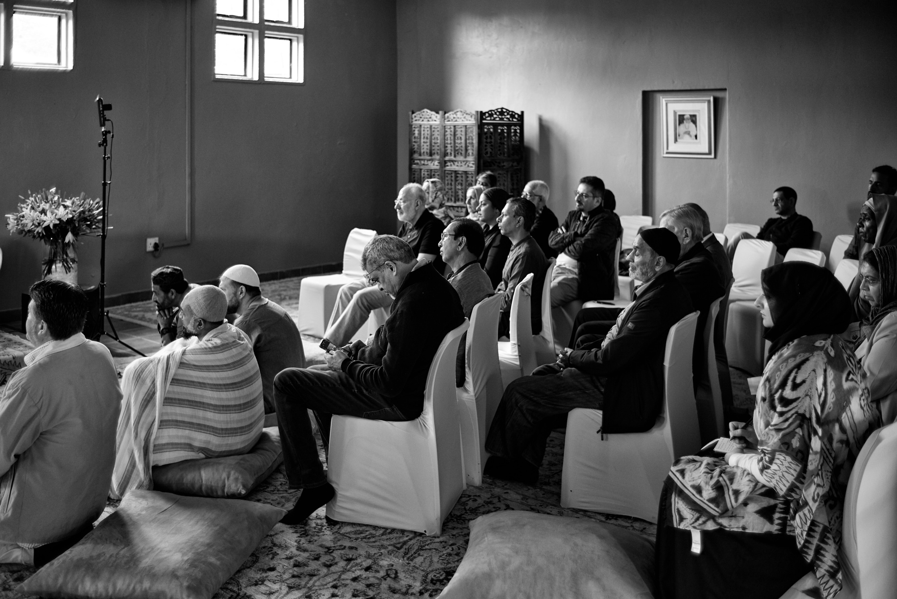

# Sufism and the Sufi

_By Shaykh Fadhlalla Haeri, from the book ["The Thoughtful Guide to Sufism"](../../books/sufism/thoughtful-guide-sufism)_.

What is relevant to us today about Sufism is that it has maintained a clear thread and line of direct transmission of wisdom back to original Islam. The key to Sufism is that of inner awakening, freedom and joy through recognition of outer restriction by choice and discrimination. …

The reason that the majority of current studies on Sufism are of little use in a practical sense is because of the nature of inner awakening itself, which is the core of Sufism. Writing books about inner awakening is only really possible if one has experienced it, just as understanding of such books is only really possible if one genuinely desires, or has already attained, such awakening. The Sufi is the locus of connecting the outer, physical reality with a timeless, spaceless dimension which is experienced within the self. The Sufi lives like the tip of the iceberg which is apparent in the seen world, while experiencing aspects of the hidden and veiled world which is the foundation of what is visible, and which forms the rest of its reality. He does his best to understand the causal, physical outer life while awakening to an immense inner Reality, which encompasses both the known and the unknown worlds, the unitive Reality of the seen and the unseen, of time and space and non-time-space.

It is for this reason that the inner life of the Sufi has no bounds, and yet he acknowledges and accepts the outer bounds with courtesy towards nature and the natural creation. The Sufi is totally content with the immeasurable bliss within. Yet he struggles outwardly towards a better quality of life on earth and does his best without being overly concerned about the ultimate results. Outer struggle and work are necessary companions to inner purification and contentment.

Genuine Sufis are essentially similar wherever they come from, in that they share an inner light and awakening, and an outer courtesy and service to humanity. Apparent differences between Sufis tend to relate to matters concerning spiritual practices or prescriptions for the purification of hearts. The sweet fruit of Sufism is the same. It is only the trees which may look different and which may flower in different seasons.

In this work, we have tried to show that those who claim that it is possible to have Sufism without Islam are only looking at one side of the story. Inner purity is generally attainable, but without its being contained outwardly, it will not result in any real flourishing of a spiritual culture or an enlightened environment. Inner light and joy may be sufficient for an individual living in a cave, but once we start interacting with others, we need to know where and what the bounds are for that social interaction to be able to take place, and this is where we find that the laws of Islam are necessary and inseparable from Sufism.

## Emptying Out, Sweetening, Purifying

The first step for a seeker to take is to witness, pure and simple. It is to be watchful, to be aware, to allow that which is higher in you to enable you to witness what goes on within you. In the state of watchfulness, at the beginning, there is usually a storm of thoughts. With guidance and perseverance, these bubbles of thoughts surface and vanish. This is the stage of emptying out. It is the cleaning of the mind-processor so that no psychological or emotional memories remain to contaminate the mind-computer.

Then begins the process of sweetening. In order to achieve the ability to connect with the inner central core of one’s self at any time and in any place, one needs to be sweetened. It is a process of displacement. It is like a bucket of muddy water which becomes purified by placing it under a running tap of sweet, clean water, until all the mud in the water has been displaced and the water in the bucket purified. The speed at which the tap flows depends on the size and capacity of the bucket. This is where a teacher is required for help.

If the seeker is ready, the teacher simply pushes him into the ocean of awakening, which is what happened with Shaykh Abu’l Hasan ash-Shadhili. When he reached his teacher, after having already mastered all the outer knowledges of Islam, he was simply asked to renew his ritual purification through washing. His spiritual master, Shaykh Abd as-Salam ibn Mashish, told him to descend the mountain and renew his ritual purification through washing and then to return, When Shaykh ash-Shadhili returned, it only took one look from his spiritual master for him to understand the meaning of all that had gone on before and after and the purpose of the meeting between the two of them. The seeker recognized the teacher and the teacher recognized the seeker instantaneously. However, there are those seekers who need continuous sweetening, encouragement and guidance before inward purification can occur.

So sweetening is a process which is followed by purification. In actual life these three processes – emptying out, sweetening and purification – are carried out and take place simultaneously. They are three dimensions of the same process as they reinforce each other, leading toward the desired end result. They all go hand in hand.

## Surrendering Attachment

Nothing is wrong with the world. There is nothing wrong with the creation. Everything is in a perfect form in its perfect place at the perfect time. It is my attitude towards it which causes me pain. The postman arrives and there is a letter for me informing me that a house in the countryside, which I love, has burned down and the roof has caved in. Those wonderful antique paintings are completely ruined. I am ruined!

The Sufi says:

> "You have to surrender. There is nothing wrong with the house provided that when it collapses, you do not collapse with it. It is the surrendering of the ownership/attachment aspect of it. The fact is, you can only carry out an activity efficiently if you are not attached to it. You can only run a business efficiently if you are not attached to it."

The seeds of all emotional attributes are in us inwardly, otherwise we could not comprehend them when we see them outwardly. The seed of fear is in us, thus we all know what fear is. We all understand what pain is. We all understand what anger is. We understand all these things because we are all from the same source. We are all creatures of God, we have come from God and to God we return. We have all been created in the same manner with the same consciousness. We are all sons and daughters of Adam. And, therefore, from that point of view, ‘I’ the individual, the microcosm, reflect and contain the characteristics of the macrocosm. This is my little world and that is the entire world. But in my little world are to be found the miniatures of the outside world, and, therefore, the secrets of the outside world. We say we are looking for self-fulfilment. So there is nothing other than your own self-fulfilment. And that can only come when your mind is quiet.

## Conclusion

The relevance of Sufism today is greater than it has been in any other age, for nowadays we can cross cultural and political boundaries much more easily, because of ease of access through communications, travel and closeness of the world. The message of Sufism is more urgent now, especially due to the fact that the world is increasingly becoming bound by materialism and consumerism. The awakening to the inner life of man is a necessary condition of his fulfillment as a human being. It comes as the pinnacle of his struggle with the elements and the fulfillment of his basic needs. Once our outer needs are met, then the inner must also be fulfilled. The two are so interlinked that those who are awakened to both the outer and inner realities see them as inseparable and continuous in the one creational, unific truth. The heart of an awakened being reflects the entire universe and such a being is described by the Sufi master, Ibn Arabi, in these words:

_My heart has become capable of every form:_
_It is a pasture for gazelles,_
_And a monastery for Christian monks,_
_And a temple for idols,_
_And the pilgrim’s Ka’bah,_
_And the tablets of the Torah,_
_And the Book of the Qur‘an._
_I follow the religion of Love:_
_Whatever way Love’s camel takes,_
_That is my religion and my faith._

