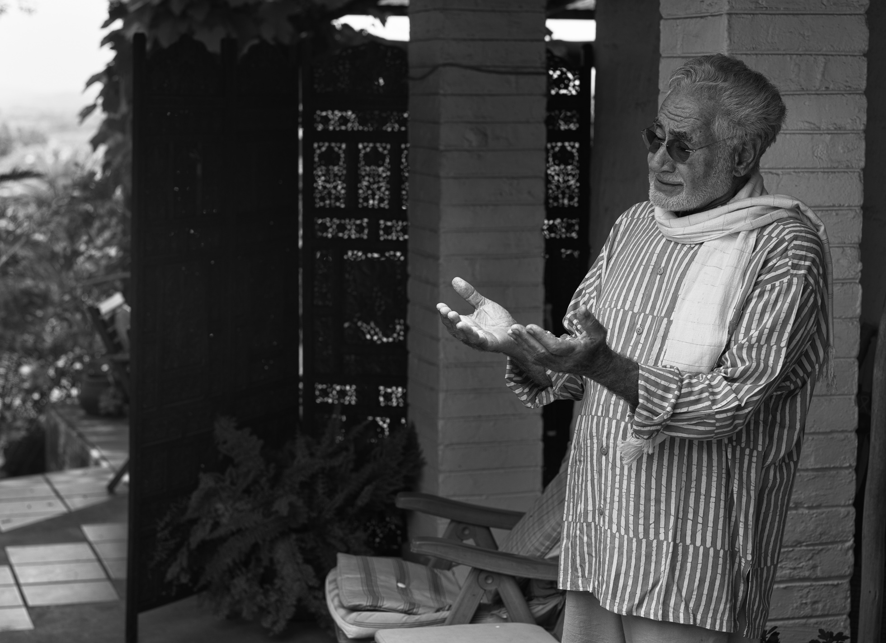

# The Thread of Truth

_By Shaykh Fadhlalla Haeri and Muneera Haeri, from the book "[Sufi Links – Illumined Encounters](../../books/biography/sufi-encounters)"_

A vast body of academic work including chronicles, biographies, treaties, translations on Islam and Sufism has arisen out of the interest in religion and spirituality over the recent past. The internet and other media makes this easily accessible to all, rather than being the preserve of the few. This has had a huge impact on understanding of Sufi tariqas, masters and their teachings.

The clear discipline and teachings of the great Sufi masters, such as Ibn ‘Ata’ Allah al- Iskandari, Abdullah Ansari, Ibn al-‘Arabi and Mulla Sadra, can help any serious spiritual seeker. Original Islam can now be practiced and lived by most people without fear of retribution from unjust and rigid authorities, who impose uniformity of thought in their fear of losing control over people’s minds and hearts. The rise of social networking and the internet has made access to this rich heritage easy, though one has to sift through the sites judiciously for authentic and transformative teachings.

During the past few decades research projects on the lives and teachings of numerous Sufi Shaykhs and spiritual masters have become popular. These studies have come out of European or American universities with a few from the east. Metaphysical poetry and spiritual songs have also been rediscovered and made public by literary and spiritually-oriented individuals and organizations. It is not an accident that Rumi has for many years been so frequently quoted and read in the West and is one of the best-selling poets in the States, probably in large part due to the interpretive translations of Coleman Barks and others.

These are all signs that our scientific and material development is reaching a point that needs the revitalization of the heart and awakening to the inner light of the soul. Normal human consciousness is beginning to be regarded as one of many strands of accessible consciousness, starting from the local and conditioned state to full and boundless light of the cosmic consciousness – Allah.

The golden thread amongst all of these works is the constant reference to an Essence or Reality that transcends all that is discerned by human senses and the mind. The idea of God being the preserve of a specific religion or people is being superseded by the durable idea of universal Oneness or supreme consciousness. Muslims, especially the Sufis, have constantly referred to the return to the truth that there is only one unique Essence (Allah, God) in creation and that everything else is simply an overflow of grace and manifestation of that primal light. Whatever there is in existence has a trace of its origin in it. Whatever is born will also die. This encourages the mind to reflect on what is eternally present and constant whilst also experiencing change and the dualities in creation.

Whenever I asked an enlightened teacher what my duties in life ought to be, I received the same answer: as long as your focus is upon reducing your personal concern or ‘separate identity’, you are on the right track of liberating yourself from your ‘lower’ self. The Prophet Musa was ordered to take off his sandals (symbolizing protection and separation) before the Burning Bush. When personal identity or the illusion of independence is lost to a higher consciousness, then every moment and every place is sacred. For those, who have the will and interest to transcend the limitations of body and mind, the opportunities exist today, as they have always done. Sacredness is what holds the universe and consciousness of life.

Humans are driven to realize the highest level of consciousness. Sufism is a natural human expression of the quest for knowledge of what connects and unifies the universe in all its diversity; the links of the seen and the unseen – the thread of Truth.

## Understanding Unity (Tawhid)

Allah says:

> "You are certainly on a clear path, a straight and direct way" Qur'an, 36:04 

The ‘straight path’ (_al-sirat al-mustaqim_) is the shortest distance between two points, between subject and object, between man and Allah. That is why it is direct, for it stretches from man to what he is always seeking, which is the All-Encompassing Reality. The understanding of unity (tawhid) is the straight path (al-sirat al-mustaqim), but it cannot be the subject of mere intellectual study. One must move along the path of submission (islam), through belief (iman) to sublime excellence (ihsan), until one begins to have glimpses of unity, through which one can then dive into the world of meaning.

If the goal of unity (_tawhid_) is not constantly present in the minds of the Muslims, their Islam becomes diluted and falls by the wayside. Mosques become either totally empty or only superficially full, because most of the people there are attending only as a matter of form. In many parts of the Muslim world this is what one finds, because the path is no longer about remembrance of Allah (_dhikru’llah_), nor about wanting knowledge of Allah. In many places Islam itself has been put on a pedestal and is being worshipped instead of Allah. Islam, however, is a means to the knowledge of Allah, not the object itself.

We all love what is timeless. We all love what is absolute. Does anyone not want to live forever, past this life and on into the next? This means that we all love the One Who is forever living. The love of Allah, therefore, is already in our hearts, but we become diverted, we rationalize: ‘Not now, tomorrow or next year, when I finish with this or that business.’ We blame other people for our lack of time and all our other problems as well. The truth is that we only have ourselves to blame.

