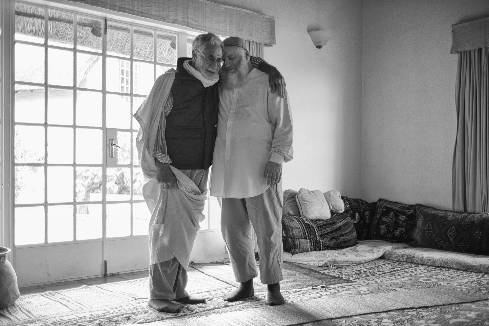

title: To Be Alive

description: A brief explanantion of the two kinds of being alive and the essential differences between them, especially in terms of limited conditionality.

# To Be Alive

Like everything else in life, whatever it may be, a thing, an entity, a particle, an idea or an energy, it comes in twos, and these twos can double up again and again. In a similar way, there are two versions of being alive.

The first version is the simple awareness of being a living, breathing human being; this is sentiency. We say, “I am alive because I am conscious and through that consciousness I can manipulate my hand or my movement”.

This is the definition and experience of conditioned consciousness. It is the idea of having your own life and asking, “What are you doing with your life?” It’s the idea that “life is precious” “time is precious” “everything will pass” “you only have one life to live”. This places us in a box where we remain anchored to our perception of what “our life” is. It is this box that causes the fear, anxiety and concern when reflecting on the inevitable cycle of birth and death.

The second version of being alive is when limited, conditioned life, is combined with Life itself. This is truly being alive.

To understand this better we first need to again consider the experience of limited consciousness and limited life. Rabbit consciousness, chimpanzee consciousness and intelligent philosopher consciousness are all limited, conditioned ‘consciousness’s’. Each is different in its own way, and each is constantly changing through every moment. In the same way, each person experiences their own life and consciousness as constantly changing. Within this field of constant change we also experience everything as good or bad. Yet, we may have fooled ourselves into thinking that anything can really ever be good or bad. Lets take bright light as an example. Bright light may be too hot and too bright and therefore be judged, in a particular moment, as bad. But it is not the light that is bad; it is the perception of the light that is bad. The light itself is beyond judgements of good or bad, it is simply light.

If the perception of light does not lead to the discovery of infinite light then I am not alive. And if I am not alive, then all the moments where I had joy are inconsequential because they have not lead me to the ultimate mine of joys that I can plug into. Only experience of the infinite light, beyond individual perception and judgement, will ever be good enough. In perceiving light, I have been given a small jewel that was brought from the mine of infinite light, and if I have no access to the mine, it is not good enough.

What we all really seek is that which is permanently continuous and permanently connected. We do not want anything that may abruptly end. With any apparent disconnection, with any break from the infinite light we feel sad, we feel depressed.

So human purpose, above the purpose of daily tasks and ambitions, is only to connect your life with Life itself. Connect your life with the Life from which your life is drawing its energy. If that is done, all is done. If that is not done, nothing is ever enough.

The formula for this process of accessing the infinite light is to do only with limited consciousness. It is the removal of all obstacles, and thereafter, higher consciousness remains. It is the process of saying “no, no, no” to everything else, but the infinite light. Then there is connection and continuity in perpetuity, outside of the limited box of personal consciousness.

My personal cycle of birth and death is the magical connector between the infinite and finite, between metaphysics and physics. We are ‘middle people’, caught in the middle. Experientially, through head and heart, I need to experience being in the middle and being the connector between the infinite and the finite. Once this is done, then all is done.

