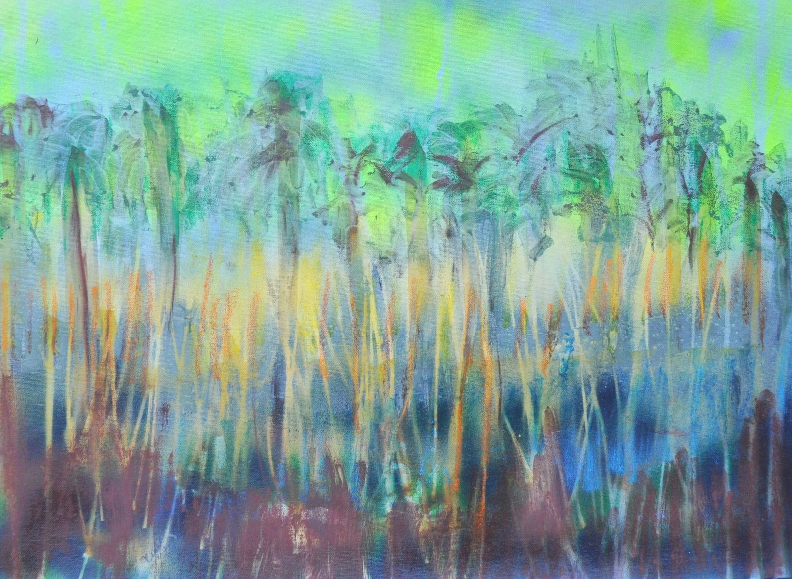

# New ASK

_Formerly The Academy of Self Knowledge_

## Cosmology of the Self: TOUCHING SUPREME CONSCIOUSNESS

Take an honest look at the challenging state of humanity and the world.  Where are we? How did we get here? What is now possible? Where are we going?  

Founded in 2003 by Shaykh Fadhlalla Haeri, the Cosmology of the Self: TOUCHING SUPREME CONSCIOUSNESS,  offers essential maps that have inspired countless seekers around the world to find themselves and to discover their true nature.  To help you discover and fulfil your purpose in life, the Maps chart a personal evolutionary arc of consciousness that point and lead to the experience of Presence.  

We are the meeting point of the earthly and the divine.  Realising our inmost potential, we can become an ecologically sustainable, spiritually fulfilling, socially and ethically just, fully illumined human presence on the planet.   

The Maps are based on the Science of the Self in accordance with the universal teachings of all authentic world religions and spiritual systems. Its emphasis is on the essential prophetic teachings of the middle eastern peoples, culminating in the way of Muhammad and the recognized Sufi Masters and people of enlightenment.  The basis and ground of the universe and all life is spirit or consciousness. The entire universe is intrinsically linked and encompassed by the divine presence manifesting itself as apparent opposites and complements. In this course you will be introduced to the basic navigations and models accompanied with particular applications that will assist in deepening an understanding of the place of the human being in the cosmic picture and facilitate the capacities and links in your own experience with keys to transformation, living a balanced life whilst celebrating the perpetual unfolding into truth.

The cosmology of the Self is predicated on the knowledge and experience of the inseparability and seamlessness between humanity and divinity, of the transitory and the permanent. 

### What you will learn:

- **You are the meeting point of the earthly (self) and the divine (soul)** 
- **How to:** 
    - cultivate self-awareness 
    - adopt new behaviours
    - let go of limiting habits and patterns of thinking 
    - befriend your subconscious and transcend conditioning
    - tap into soul consciousness – true nature
        - _hope_
        - _action_
        - _will_
    - live with an open heart and have more
        - _love_ 
        - _gratitude_
        - _compassion_
        - _peace_
    - discover the immensity and perfection of the moment 
    - navigate towards the lived application of the essential driving forces of life and their interplay.  

For further information about The Cosmology of the Self and its activities, please send an email to [ask@sfhfoundation.com](mailto:ask@sfhfoundation.com).

