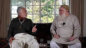

# A Guide For Listening

This page presents a selection of audio recordings from Shaykh Fadhlalla's talks and conversations over the years. You will find the most universalist, insightful and educational talks given by the Shaykh here. This is a page to be returned to often, sipped, and enjoyed at your leisure. Whenever you are lost, come back here to reflect, repose and return to the path.

**We release audios on a number of platforms. Please find your preferred one below. All the indivdual links on pages in this section of the archive go to Anchor FM, from which you can easily access Apple, Spotify, Breaker, Google Podcast, Overcast, Pocket Casts, and RadioPublic.**

**You can listen on these platforms:**

[Anchor](https://anchor.fm/shaykh-fadhlalla-haeri-foundation/)

[Apple](https://podcasts.apple.com/us/podcast/shaykh-fadhlalla-haeri-foundation/id1454931525)

[Spotify](https://open.spotify.com/show/2BEc8M3oNLH12KyWYFDT9N) 

[Google](https://podcasts.google.com/?feed=aHR0cHM6Ly9hbmNob3IuZm0vcy85ODQ1YTQwL3BvZGNhc3QvcnNz)

[Breaker](https://www.breaker.audio/shaykh-fadhlalla-haeri-foundation)

[Overcast](https://overcast.fm/itunes1454931525/shaykh-fadhlalla-haeri-foundation)

[Pocket Casts](https://pca.st/n80x)

[RadioPublic](https://radiopublic.com/shaykh-fadhlalla-haeri-foundation-6pw4ma)

## Selected Single Talks

**The Perpetual Now**

[Listen](https://anchor.fm/shaykh-fadhlalla-haeri-foundation/episodes/The-Perpetual-Now-by-Shaykh-Fadhlalla-Haeri-e3vl3a)

**Islam and Tawhid**

[Listen](https://anchor.fm/shaykh-fadhlalla-haeri-foundation/episodes/Islam-and-Tawhid-ea69oq)

**Enlightenment**

[Listen](https://anchor.fm/shaykh-fadhlalla-haeri-foundation/episodes/Enlightenment-ea69vi)

**Qur'an Direct: The 4 Quls**

[Listen](https://anchor.fm/shaykh-fadhlalla-haeri-foundation/episodes/Quran-Direct-Episode-3--The-4-Quls-ecg79k)

**Human Consciousness**

[Listen](https://anchor.fm/shaykh-fadhlalla-haeri-foundation/episodes/Human-Consciousness-eb0e9n)

**Muslim Awakening**

[Listen](https://anchor.fm/shaykh-fadhlalla-haeri-foundation/episodes/Muslim-Awakening-eak5bc)

**Die Before You Die**

[Listen](https://anchor.fm/shaykh-fadhlalla-haeri-foundation/episodes/Die-before-you-die-eak57i)

**What Does It Mean To Be A Sufi In The 21st Century?**

[Listen](https://anchor.fm/shaykh-fadhlalla-haeri-foundation/episodes/What-Does-It-Mean-To-Be-A-Sufi-In-The-XXI-Century-eag95e)

## Selected Series

**Enlightenment**

[Learn More](./series/enlightenment)

**Refinement of Character**

[Learn More](./series/refinement-character)

**Descriptive, Prescriptive Qur'an**

[Learn More](./series/descriptive-prescriptive-quran)

**Practices That Enhance Human Experience**

[Learn More](./series/practice-enhance-experience)

**Islam and the Environment**

[Learn More](./series/islam-environment)

**Qur'an Direct**

[Learn More](./series/quran-direct)

