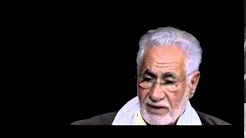
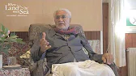

title: Audios Overview

description: An overview of all the audios made available by the Shaykh Fadhlalla Haeri Foundation.

# Audios

> “O Allah, make a light in my heart, a light in my hearing, a light in my vision, a light in my flesh, a light in my blood, a light in my bones, a light before me, a light after me, a light on my right, a light on my left, a light above me, and a light below me, a light in my heart. O Allah, increase me in light and make me a light (I beseech You) by what is Your due, O most Merciful of the Merciful.”

This page collects all of the various audio recordings of Shaykh Fadhlalla's talks and conversations over the years. There is, to euphemise, a lot of content. You will find not only our most recent uploads, but also once-off talks, as well as educational series given by the Shaykh. This is a page to be returned to often, sipped, and enjoyed at your leisure. Whenever you are lost, come back here to reflect, repose and return to the path.

## Most Recent

**Qur'an Direct: Surat Al-Fattāh**

[Listen](https://open.spotify.com/episode/2xs3XWrZeCOKPhsXzo61ee)

**Qur'an Direct: Ultimate Exposures**

[Listen](https://open.spotify.com/episode/2HaQdmxpOZ94itrmJFPkTR)

**Human Consciousness**

[Listen](https://open.spotify.com/episode/3o5Y23UG37nfHqfUT2ALbz)

**Muslim Awakening**

[Listen](https://open.spotify.com/episode/42hRANeb27PiwTXouInBMv)

## Selected Single Talks

**The Perpetual Now**

[Listen](https://open.spotify.com/episode/1x0zI9yHg57VHlcQRUR04b)

**Islam and Tawhid**

[Listen](https://open.spotify.com/episode/3pODeRD8idf5vJUpmRJJWx)

**Enlightenment**

[Listen](https://open.spotify.com/episode/4sr6wUzJJ7caRUXf1NZDCy)

**What Does It Mean To Be A Sufi In The 21st Century?**

[Listen](https://open.spotify.com/episode/1mt5YvKhqt4IGt7DcSHY58)

## Selected Series

**Enlightenment**

[Learn More](./series/enlightenment)

**Refinement of Character**

[Learn More](./series/refinement-character)

**Descriptive, Prescriptive Qur'an**

[Learn More](./series/descriptive-prescriptive-quran)

**Practices That Enhance Human Experience**

[Learn More](./series/practice-enhance-experience)

**Islam and the Environment**

[Learn More](./series/islam-environment)

**Qur'an Direct**

[Learn More](./series/quran-direct)

