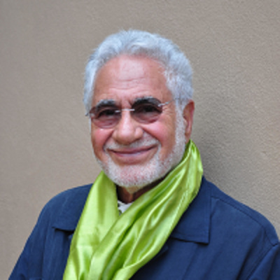

# Audios

> “O Allah, make a light in my heart, a light in my hearing, a light in my vision, a light in my flesh, a light in my blood, a light in my bones, a light before me, a light after me, a light on my right, a light on my left, a light above me, and a light below me, a light in my heart. O Allah, increase me in light and make me a light (I beseech You) by what is Your due, O most Merciful of the Merciful.” - Prophet Muhammad, _ṣallā -llāhu ʿalayhī wa-ʾālihī wa-sallam_

If you'd like to listen to more audios and hear some of the older, less universal presentations, please make sure to visit our legacy website by clicking below:

[Shaykh Fadhlalla Haeri](http://shaykhfadhlallahaeri.com)

## Most Recent

