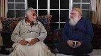

title: Abstention, Fasting and Better Conduct

description:

# Abstention, Fasting and Better Conduct

If you prefer reading to listening, you can find a full [text guide on fasting here](../../../guides/fasting).

**Remember, you can listen on all these platforms:**

[Anchor](https://anchor.fm/shaykh-fadhlalla-haeri-foundation/)

[Apple](https://podcasts.apple.com/us/podcast/shaykh-fadhlalla-haeri-foundation/id1454931525)

[Spotify](https://open.spotify.com/show/2BEc8M3oNLH12KyWYFDT9N) 

[Google](https://podcasts.google.com/?feed=aHR0cHM6Ly9hbmNob3IuZm0vcy85ODQ1YTQwL3BvZGNhc3QvcnNz)

[Breaker](https://www.breaker.audio/shaykh-fadhlalla-haeri-foundation)

[Overcast](https://overcast.fm/itunes1454931525/shaykh-fadhlalla-haeri-foundation)

[Pocket Casts](https://pca.st/n80x)

[RadioPublic](https://radiopublic.com/shaykh-fadhlalla-haeri-foundation-6pw4ma)

## Abstention

This talk is a distilled presentation on the meanings of abstention and restriction as a process for awakening to truth and higher consciousness, with special focus on the Islamic path. 

It is an accompaniment to another discourse in this series on Fasting, which is listed below. Shaykh Fadhlalla reflects on the dynamics of abstraction from the senses and the material world as a means of enhancing sensitivity of mind, body and ultimately as a purification of the heart. 

The layers of fasting are explored as per the prophetic injunctions as the basis required for recognizing and turning away from the impermanent in order to recognize and experience the presence and perfection of the real. The relation between restriction and worship is presented with further explanations provided on the nature of the path as a means of aligning with the various fundamental laws and patterns of life. Special focus is given to the complimentary opposites of abstention and expansion and the courtesies of moving along this arc experientially as per the Qur’anic indications and key prophetic traditions. All is this is discussed with an eye to using abstention and restriction as means to experience, worship and live by the essence.

**Abstention**

[Listen](https://anchor.fm/shaykh-fadhlalla-haeri-foundation/episodes/Abstention-ea6a2a)

## Fasting as a Means of Improving Conduct

In this talk, Shaykh Fadhlallah reflects upon the phenomena of abstention and fasting prevalent in world cultures and spiritual teaching as fundamental principles in the refinement of conduct and the drive towards higher consciousness. 

The talk begins with an overview of the origin of spiritual systems and religious pursuits globally. The historical, archeological, and sociological evidence is used to show that seeking truth, reality or the origin has been at the heart of the human story for thousands of years. The desire and drive to live optimally ultimately reflects the desire to move beyond limitations and enter Sacred Consciousness or higher consciousness. 

The Shaykh then presents the basis and purpose of restriction and expansion as a means of purification of the heart, with reference to the Muhammadi traditions and Qur’anic transmissions. He continues with a deeper exposition on various essential meanings of the Islamic path with reference to multiple Qur’anic root words, verses and meanings and their interplay with key issues:

1. The fundamental patterns of life
2. Worship and the drive for transcendence
3. The dynamics of experience and accountability trust
4. Self-Soul interplay
5. The basis of personal responsibility in the purification of heart and 
6. The refinement of conduct and living the fullness of the path. 

Key excerpts include:

> “In order to achieve personal transformative worship, restrict all these things, restriction of all five senses; restriction of the tongue and restriction of the mind. Then enter into _sajda_ - prostration - and experience the _mi’ raj_ - take off - to another zone of consciousness by acknowledging your limited, restricted consciousness. Every now and then, you will have access, by experience, to limitless consciousness. And that is the _dīn_! The _dīn_ as it was in the early days”

> “That is the purpose of our restriction of the outer: to have expansion, and to have a horizon, in the inner. Otherwise it remains sets of rituals without transformation. That transformation is only up to you, if you improve your intention. If you come with the right courtesy to the Presence of the sacred Light.”

**Fasting as a Means of Improving Conduct**

[Listen](https://anchor.fm/shaykh-fadhlalla-haeri-foundation/episodes/Fasting-as-a-means-to-Improve-Conduct-ea6a0o)

