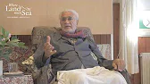
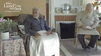
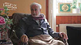
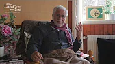

title: Descriptive and Prescriptive Qur'an

description:

# Descriptive and Prescriptive Qur'an

## Die Before You Die

This talk presents an exposition on death as a key issue in the conundrum of existence. The phenomena of birth and death are one of several key pairs in the map of existence. This talk serves to reflect upon what is the appropriate response to these key modulations. The ground of the inquisition revolves around three questions: Who am I, who is God or the essence, what is death? 

Shaykh Fadhlalla presents both the interrelation and particularity of these three issues, broadening the field of inquiry into the meaning of death. Various references are made to contemporary areas of interest such as Near Death Experiences and the multifaceted implications for human consciousness these exposures may engender. The core dimension of the talk is explored in the timeless injunction of ‘inner death’ or ‘death before death’.

The Original Prophetic teachings, allegory and the prescriptive and descriptive nature of selected Qur’anic revelations are interspersed with select Sufi insights, presenting a rich tapestry of keys and sign posts that reflect the inherent design of human interaction with life, its connection to the ethical and cosmic possibilities available to human consciousness in being enlivened & aligned with the inner dimension by the prophetic model of, "Die before you die."

**Die Before You Die**

[Listen](https://open.spotify.com/episode/45q5gFLHZR4qkaIpbzRrO4)

## Fear & Hope

This discussion is a detailed exposition of two of life’s fundamental forces: Fear & Hope.

These two forces are critical complementary dynamics that frame the basket of human life. Shaykh Fadhlalla presents human interaction and experience of fear as a pivotal force in the evolutionary drive within human consciousness and indicates the context in which ancient cultures framed their vision of the world by virtue of the lens of this phenomena, hence the cultural and linguistic dynamics of those peoples reflect this relation. This is contrasted to the model of life encountered by modern man in which hope and good expectation are the primary forces that filter perception. 

An understanding of the parallels of this evolutionary dimension is critical in approaching revealed knowledges and ancient tradition in the drive to appropriately connect with the timeless meaning beneath the relative filter of these emergences. This episode presents the existential sketch of the categories of fear before introducing the Qur’anic model expounding upon the degrees of fear in relation to Higher consciousness. The Prescriptive and descriptive nature of selected Qur’anic expressions coupled with the Prophetic teaching is presented in the frame of expanding knowledge and modification of the self in tandem with the states and stages of attunement to the absolute.

**Fear & Hope**

[Listen](https://open.spotify.com/episode/6bjGjP5LXwetALFPtI4isw)

## Good News & Warning

In the third part of this series, Shaykh Fadhlalla reflects upon the interplay between what is referred to as "the good news" and "warning" as contained in the Qur’anic revelation. The talk expand upon the varying dimensions of these two forces, presenting the multitudes of expressions of which these two issues relate as a fundamental paradox of life. 

A complex and detailed exposition on both issues is presented, via the references of the Linguistic dynamics of various Qur’anic terms, prophetic teachings and injunctions towards the true meaning of the good life by referring to the complementarity of these forces, reflecting upon the directives that are presented in referencing life’s events within this intrinsic design. Shaykh Fadhlalla explores the aspects of the meaning of suffering and the appropriate manner of interaction that is available to human beings that align with the drive towards higher consciousness.

The appropriate prescriptive steps and descriptive qualifications in, adequately navigating through the interplay of these dynamics are presented through Qur’anic expressions. The faculty of the heart is presented as the central locus of experience in these processes. The talk presents the modes in which inner awareness and interaction with the state of the heart connect with the way we relate to events. Fundamentally, this serves as the transformative ladder that enables the sensitivity of witnessing, experiencing and resonating with perpetual presence of the essence.

**Good News & Warning**

[Listen](https://open.spotify.com/episode/7diSI0z2KWXgGHef7PNH9g)

## Human Misery

For the final talk of the series, Shaykh Fadhlalla emphasises the nature and meaning of suffering. Regarding the Qur’anic expression and prophetic indications the talks navigate from the Creational Metaphor of the Garden to the arise of discernment and perception of otherness and dualities. 

This talk traces the evolutionary arc of human consciousness and its relation to the phenomena of suffering. Interlacing these descriptions with reflections of the meaning and purpose of the emergence of these events and ultimately the purpose of life. The drive for permanency in the face of ever changing nature of experiences and events and experiences is discussed as the pivot around which the experience of suffering and the intrinsic design towards constancy coalesce.

Various important descriptive elements are echoed in the Qur’anic revelations: accountability, the illusory nature of the changing self, the innate capacity of the divine qualities is coupled with the prescriptive elements in reflecting the modes of interaction with levels of suffering that belong to the plane of the self. The necessity of sensitivity to the interconnections and collapses on the various levels of life, and the issue of collective responsibility is given emphasis.

**Human Misery**

[Listen](https://open.spotify.com/episode/05z7fNp0v75UfRlSqMdMwm)

