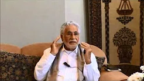
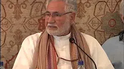
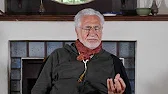

# Qur'an Direct

**Remember, you can listen on all these platforms:**

[Anchor](https://anchor.fm/shaykh-fadhlalla-haeri-foundation/)

[Apple](https://podcasts.apple.com/us/podcast/shaykh-fadhlalla-haeri-foundation/id1454931525)

[Spotify](https://open.spotify.com/show/2BEc8M3oNLH12KyWYFDT9N) 

[Google](https://podcasts.google.com/?feed=aHR0cHM6Ly9hbmNob3IuZm0vcy85ODQ1YTQwL3BvZGNhc3QvcnNz)

[Breaker](https://www.breaker.audio/shaykh-fadhlalla-haeri-foundation)

[Overcast](https://overcast.fm/itunes1454931525/shaykh-fadhlalla-haeri-foundation)

[Pocket Casts](https://pca.st/n80x)

[RadioPublic](https://radiopublic.com/shaykh-fadhlalla-haeri-foundation-6pw4ma)

## Part 1

This talk is a distillation of the essential foundation and message of the Qur’an. Several brief descriptions are explored in presenting the multifaceted nature of the Qur’anic unveilings. Shaykh Fadhlalla presents four primary themes in this fundamental disclosure of Qur’anic lights: 

1. The centrality and core of Oneness
2. The ineffability of the cosmic nature and essence. This is really a synthesis on the nature of duality and the varieties and combinations of dualities that emerge from source consciousness. Several aspects of the nature of complementarity and opposition which occur in dual cycles and pairs are further explored. 
3. Human nature and design, and the prescriptions and connections between the Qur’anic models of life, reality, and the prophetic way of living. Various injunctions and modes of the essential Islamic path are discussed, including reflections on the meaning of worship, ritual and the essential drive towards truth, amidst an array of Qur’anic verse references and commentary. 
4. The concluding axis of the presentation relates to the completion of the human journey, the fruition of self-knowledge and the arc leading to the discovery of the cosmic soul present in every heart. 

It is necessary to take reference from the living model that is the prophetic way and conduct yourself as an exemplar of total commitment to living in unison with the essence of life while being appropriately engaged in the changing world. This is a corner stone for adherents to the path of knowledge and truth.

**Qur'an Direct: Surat Al-Fattāh**

[Listen](https://podcasts.apple.com/us/podcast/quran-direct-episode-2-surah-fatiha/id1454931525?i=1000469716419)

## Part 2

In this more intimate discourse, Shaykh Fadhlalla weaves a wide range of narratives and reflections together, providing multifaceted insights into the opening chapter of the Qur’an: Al Fatiha. The talk begins by looking at the arc of social history and developments in humanity, framed by the context surrounding the pre-settlement nomadic peoples of the Mediterranean, Middle Eastern basin with a special focus on the nature of prophecy and its relatability to the rise of human consciousness and the Qur’anic unveilings. 

The Shaykh presents some key Qur’anic maps, such as: Oneness and Duality, symmetries and mirror images, shadows and lights. Thereafter, the subtler linguistic elements of the Fatiha are elaborated with references to a multitude of other Qur’anic segments and chapters. Various key injunctions of the way of Muhammad and latter masters of this path are referenced and tied together so as to present appropriate keys for exploring and enjoying inspirations from the Qur’an. 

Some of these themes include: the etiquette and courtesy in appropriately approaching the Qur’an; the cosmic nature of _bismillah_; and the seamlessness between the scene and unseen reflected in the Qur’anic disclosures. The talk concludes with a description of the essential elements of the prophetic path, the appropriate attitude and prescriptions that go along with constant awareness, a wholesome heart and the living dynamics of accepting limitations and boundaries whilst constantly seeking and connecting to higher consciousness.

**Qur'an Direct: Ultimate Exposures**

[Listen](https://anchor.fm/shaykh-fadhlalla-haeri-foundation/episodes/Quran-Direct-Episode-1---Qurans-Ultimate-Disclosures-ebk3o3)

## Part 3

This discourse is a Qur’anic commentary overviewing four key Surahs in the last section of the Qur’an commonly referred to as the _Qul’s_. The Qur’anic disclosures repeatedly reflect the link between the seen and unseen, relative and absolute. These four-short surahs considered to be foundational and fundamental in the Muhammadi path focus on the nature of Reality and Truth. Shaykh Fadhlalla highlights the Arabic key words in these short surahs and the dimensions and meanings surrounding them and their linguistic roots. Various reflections relating to practice on the essential Islamic path are interweaved with insights around the self, its nature and the keys that increase awareness, watchfulness and access to the light of soul.

**Qur'an Direct: The 4 Quls**

[Listen](https://anchor.fm/shaykh-fadhlalla-haeri-foundation/episodes/Quran-Direct-Episode-3--The-4-Quls-ecg79k)

## Part 4

This discourse is a combination of reflection and commentary on three Surahs from the final section of the Qur’an: 

1. _Al Zilzal_ (The earthquake) 
2. _Al Adiyat_ (The Chargers) 
3. _Al Qar’iah_ (The Calamity)

Shaykh Fadhlallah begins by introducing and exploring the nature of Authority and its dynamics from both a cosmic and local perspective as reflected in the Qur’an, which is regarded as ‘the Authority’ on the Muhammadi path. The appropriate historical, sociological and linguistic modes of approaching the Qur’an are explored in relation to its spectrum of meanings. The Shaykh demonstrates this authoritative approach in a distilled presentation of these Surahs. He highlights the various windows of meaning woven into these verses and connects a range of topics to them which include the temporality of earthly life, the next phase, the singularity of truth, birth and death of the cosmos, freedom and decree in tandem with various key indications regarding the nature of the self and living the path of Qur’an.

**Qur'an Direct: Surah Zilzal and Qariah**

[Listen](https://anchor.fm/shaykh-fadhlalla-haeri-foundation/episodes/Quran-Direct-Episode-4--Commentary-on-Surah-Zilzal-and-Qariah-ecqdlb)

## Part 5

This two part commentary explores the layers and meanings of the short, early Meccan Surah Inshirah. Shaykh Fadhlalla presents the web of connections that reveal the key Qur’anic indications of the path of the heart. Several important, classical Arabic terms and roots coupled with the concordances in from parts of the Qur’an are highlighted. In the natural thread of the Meccan verses, the themes prevalent relate to reality, the human condition and the purpose of life. As per its title: ‘The Expansion’ this surah focuses on the facets of this essential dynamic of life in contrast with its opposite quality ‘contraction’. Various of the Abrahamic and Muhammadi teachings and narratives are related in presenting the centrality of the heart as the vehicle between dual and unitive experience, the subtleties of the heart's condition, remembrance and awareness as the basis of transformation and the essential modes of purification that may aid human beings to live through and in the presence of heart and thereby appropriately engage with the changing dynamics of life on earth whilst constantly referring to the light of higher consciousness.

**Qur'an Direct: Surah Inshirah ‘The Expansion’**

[Listen](https://anchor.fm/shaykh-fadhlalla-haeri-foundation/episodes/Quran-Direct-Episode-5Commentary-and-reflections-on-Surah-Inshirah-The-Expansion-ed55ls)

## Part 6

In this discourse Shaykh Fadhlalla elaborates on the fundamentals and basis of transformative worship as the essence of living the Muhammadi Path. The talk begins with an overview of Language and culture, highlighting the contrast between modernity and the age of prophecy. Shaykh Fadhlalla further elaborates on the fundamentals of the path. The difference between information and transformation is stressed along with the unique way in which the Islamic path must be relayed and taught in accordance with the contemporary age. The talks spans across a series of relevant keys to transformative practice Including: the essence and meanings of ‘Salaat’ Prayer and worship; The courtesies and etiquette that serve appropriate engagement with the facets of transformative worship; abstention and constriction and the purification of heart as the key to accessing the light of the soul. ‘Tawhid’ oneness, and the unitive dimensions of the path are emphasized. Various prophetic traditions, Qur’anic verses,  Sufi lore and history are woven into this presentation prescriptively and as indications of perfected worship.

**Qur'an Direct: Transformative Worship**

[Listen](https://anchor.fm/shaykh-fadhlalla-haeri-foundation/episodes/Quran-Direct-Episode-6Transformative-Worship-edcipa)

## Part 7

In the setting of a Friday Jum’ah lecture, Shaykh Fadhlalla presents the two of fundamental elements of the Muhammdi path: _Tawhid_ (Oneness) and Transformation.

The discourse begins by emphasizing the responsibility that accompanies inheriting the vast well of illumined knowledge borne from the prophetic teaching, Qur’an and continuum of Muhammadi masters. Further moving into essential descriptions of the Adamic nature and multidimensionality of human reality and the nature of the Qur’an as the clear mirror and guide book reflecting cosmic patterns and realities throughout existence and within man. The interplay between the human being and the Qur’an is discussed. Focus is then drawn to the micro level and the basis of transformation built into the Qur’anic and prophetic way of being relevant to the arc of the human journey. The key issues relevant to living the path of transformation are then elaborated regarding several Qur’anic verses. These themes include: servanthood; appropriate awareness; courtesy toward different aspects of consciousness; the purpose of the message and the nature of warning; sincerity and accountability; and the means and meaning of witnessing the ever-present perfection of truth. A host of prophetic traditions and guidelines to help refine your conduct are related in tandem with the Qur’anic commentary. This final talk in the series culminates in a fluid yet expansive presentation on the way of Muhammad.

**Qur'an Direct: Tawhid & Transformation**

[Listen](https://anchor.fm/shaykh-fadhlalla-haeri-foundation/episodes/Quran-Direct-Episode-7Tawhid--Transformation-ef0b5v)

