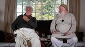

title: Refinement of Character

description:

# Refinement of Character

In this ground-breaking series of talks, Shaykh Fadhlallah Haeri presents a map for refinement of character in the Prophetic tradition as an essential step to Enlightenment and Connection with the One, unhindered by reflections of the lower self. Shaykh Fadhlallah unravels the mystery of such Prophetic refinement and presents a path which can be followed with clarity and ease, should the student of Enlightenment wish to discover the Bliss it presents.

The Discourses on Refinement of Character reflect a wide-ranging array of interpersonal, multidimensional, and psycho-spiritual frameworks, methods and models. Presented in the arena of the Original Muhammadi Prophetic architecture, the discourses give emphasis to the transformative essence behind the timeless approach to grooming of the self, embodied in character and conduct of the Prophetic being. Parallels are drawn in wider evolution of notions and cosmological maps from antiquity arising into the modern and postmodern psycho-analytical approaches. 

The key dimensions, tenets and purpose of character reformation in the face of a dynamic changing self and its relational nature are presented on a multitude of levels via references to an array of the original prophetic teachings, Qur’anic revelations and the vast contribution Sufi insights on the topic of self-knowledge. Emphasis on a living transformative processes are presented while encouraging analytical, contemplative dimensions in living by the prophetic code of transformation.

Fundamentally, the evolution and refinement of character is presented as both essential, necessary and progressive. The wide stream of knowledge provided by the Shaykh in these talks will help anyone in the pursuit and drive towards abiding by, awakening to and living in, the constancy of essential nature and truth.

**Introduction 1**

[Listen](https://open.spotify.com/episode/3Iav1uWAgmcocU8H8yGPh0)

**Introduction 2**

[Listen](https://open.spotify.com/episode/7ElYE0quMVYokKLuVbmPwv)

**Human Nature and Composition 1**

[Listen](https://open.spotify.com/episode/31ti5Oisj6tVChxhyQt60t)

**Human Nature and Composition 2**

[Listen](https://open.spotify.com/episode/2F6tfF80gA91Lm0g3HbAsC)

**Grooming and Evolvement of the Lower Self**

[Listen](https://open.spotify.com/episode/2LwLzT4k16st63Csg4L2CO)

**Personality and Character 1**

[Listen](https://open.spotify.com/episode/4KLOyKv2SJZu5dP4AACLJY)

**Personality and Character 2**

[Listen](https://open.spotify.com/episode/2Vssune47ZxW6TzPVoA43X)

**Relationships**

[Listen](https://open.spotify.com/episode/6KOgsyl7gDqC1tkRCPtg81)

