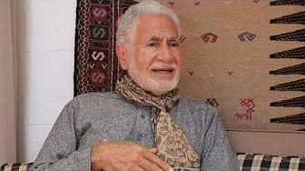
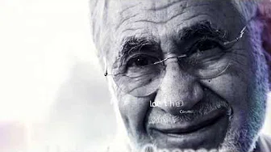
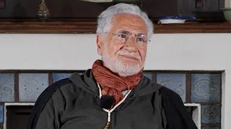
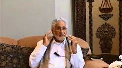

# Single Talks

On this page, you will find all the stand-alone talks Shaykh Fadhlalla has given over the years, as opposed to ones organised and grouped together under a common theme. Each of these talks is unique, containing an array of insights and threads presenting the amazing connections between the absolute and the relative.

**Remember, you can listen on these platforms:**

[Anchor](https://anchor.fm/shaykh-fadhlalla-haeri-foundation/)

[Apple](https://podcasts.apple.com/us/podcast/shaykh-fadhlalla-haeri-foundation/id1454931525)

[Spotify](https://open.spotify.com/show/2BEc8M3oNLH12KyWYFDT9N) 

[Google](https://podcasts.google.com/?feed=aHR0cHM6Ly9hbmNob3IuZm0vcy85ODQ1YTQwL3BvZGNhc3QvcnNz)

[Breaker](https://www.breaker.audio/shaykh-fadhlalla-haeri-foundation)

[Overcast](https://overcast.fm/itunes1454931525/shaykh-fadhlalla-haeri-foundation)

[Pocket Casts](https://pca.st/n80x)

[RadioPublic](https://radiopublic.com/shaykh-fadhlalla-haeri-foundation-6pw4ma)

## Enlightenment

This talk is a recording from an intimate setting hosted at Enlightenext centre in London. Shaykh Fadhlallah presents a personal account of his experience and understanding of the Sufi Path, reflecting on several fundamental questions and paradoxes surrounding human life. 

He begins by examining whether there is an optimum way to live, utilizing this question to present a map of creation which can be used to live a life of fulfilment, equanimity and ease. The Shaykh uses this description as a point of departure to connect his application of this map with the evolutionary process in which any traveler must undergo. We all want to rise in consciousness and this presents various challenges in both the social and experiential dynamics of living the fullness of human reality. Shaykh Fadhlalla draws from the Abrahamic, Sufi, and Muhammad traditions in presenting the various levels and arenas in which the traveler might discover and arrive in their navigation of the path. 

The emphasis is placed on the need for a lived experience of truth. Moreover, it is not only about walking along the road, but arriving at ‘The City’. This and several other key metaphors are regularly referenced as indications to the nature of the path and warnings of the multitudes of pitfalls the seeker encounters. The nature of harmony and balance; the interplay between the relative and the absolute; the Sufi sketch of higher and lower self and the nature of the authentic self; all this and more is presented in this talk. 

Shaykh Fadhlalla summarises the talk perfectly in this excerpt: 

> "If you are to give a talk on this issue of Oneness, I think you can sum it up by repeating “one, two; one, two; One!” From the One comes the two, and two seek to reproduce one; and that one is looking for its origin in duality, only to realize that the entire thing emanated from ‘The One’. lā ʾilāha ʾillā llāh: there is none other than One.’ ‘Without denying relative existence, you must come to understand your authentic self through honesty, good conduct, trust, love, and faith. ‘Authenticity’ can variously be imagined as the Soul, the higher self, or God’s light within you. Once you grasp that such a sacred reference point exists within you, then talk of a map is no longer necessary. In fact, the map is no longer necessary, because it becomes just another kind of false security. The key question remains, 'Are you in The City?' And then, 'Have you discovered that there is actually neither you nor City?' The entire Light, which is beyond both known and unknown, is in you already. That is truly awesome. That is why one has to move with good conduct, with authenticity and genuine honesty, according to who you are. Here is the basis of arrival."

Further talks on this topic can be found in [another audio series](./series/enlightenment) entirely devoted to it.

**Enlightenment**

[Listen](https://anchor.fm/shaykh-fadhlalla-haeri-foundation/episodes/Enlightenment-ea69vi)

## Human Consciousness

This talk is taken from an informal gathering hosted under the umbrella of [The Academy of Self Knowledge](../../a-s-k). Shaykh Fadhlallah provides a brushstroke overview of the major topics to be covered in an extended retreat in Britain. The talk begins by reflecting on several contemporary issues, such as the modern world; the economic system and its social reality; humans in the history of both the evolution of life on earth and the cosmos; and the nature of consciousness.

Shaykh Fadhlalla then narrows in on several key derivative issues The first takes the form of some foundational questions: 

1. Who are we? 
2. What is sentiency? 
3. What is the human journey?
4. What is the 'spectrum of consciousness’?
5. How can we understand decree and destiny? 

The Shaykh then unpacks the Academy of Self Knowledge basic presentation of human cosmology, titled "Self – Soul" and disucsses the arrow of time and evolution of consciousness. From this, he moves into an examination of human heritage through cultures, history, religion and the underlying drive at the core of our experience and behaviour. 

Finally, he considers the developmental stages of consciousness as is emergent in the human being from infancy to full consciousness, outlined in five phases. The whole talk is interspersed with various Islamic and Qur’anic references and concludes with a short Q&A at its closure.

**Human Consciousness**

[Listen](https://open.spotify.com/episode/3o5Y23UG37nfHqfUT2ALbz)

## The Perpetual Now

A tree is a good metaphor for indicating the dynamic manifestation of Reality in every moment. From the 'Root of Oneness', creation occurs as dispersion. This occurs over time as well as in every moment. Ordinarily, we don't experience the amazing inseparability in our consciousness of how Oneness becomes sunlight and water and how these become the flower and how the flower the beautiful fragrance. They are seamlessly connected. There are many different strands that we can follow to explain this Unitive Totality. The most universally understandable is through the description of the experience of the Now.

In this audio recording Shaykh Fadhlalla Haeri takes the listener on an incredible journey through an enlightened experience of the Now.

**The Perpetual Now**

[Listen](https://anchor.fm/shaykh-fadhlalla-haeri-foundation/episodes/The-Perpetual-Now-by-Shaykh-Fadhlalla-Haeri-e3vl3a)

## Islam and Tawhid

This talk reflects upon a core aspect of the Islamic unveilings and path. Shaykh Fadhlalla seeks to elaborate and emphasize a living experience of the varying dimensions and modes for the traveler on the path of Oneness. 

_Tawhid_ is the unequivocal statement of the oneness of reality. The Shaykh explores the Qur’anic declaration of a total, single and absolute truth that transcends the world; a unique and indivisible reality, entirely independent of creation, out of which complexity and multiplicity emanate and return. The Qur’anic cosmology is introduced as a model of understanding the unitive nature of reality at its various levels, or the various levels of _Tawhid_. 

In this talk, Shaykh Fadhlallah examines each of these:

1. _Tawhid Af’al_ - the unity of actions
2. _Tawhid al Sifat_ - the unity of attributes
3. _Tawhid ad Dhat_ - the unity of essence. 

The Shaykh presents the appropriate way in which one should relate to and understand this model and, critically, how to integrate it into a living process. He continues with an elaboration on key elements around this integral work. He also discusses the necessity of various virtues for the traveler on the path: honesty; authenticity in reflection; the meaning of worship; the reality of _Salat_ and the fulfillment of its inner dynamics; sincerity; and the practice of remembrance, or _dhikr_. 

The entire talk is well summarised in the following key excerpt: 

> “You can do it quietly, you don’t have to tell people, you don’t have to show off. Nothing changes! Be as you are, just do the _salaat_! And then _dhikr_: remember it is **lā ʾilāha ʾillā llāh**. No need to change and say, ‘I am now a different person!’ You are not. You are the same idiot you have been all along, it’s just that your channel to Allah is clearly open, and you recognize that higher Reality. Prostrate yourself and you will come to see that there is nowhere where Allah is not.”

**Islam and Tawhid**

[Listen](https://anchor.fm/shaykh-fadhlalla-haeri-foundation/episodes/Islam-and-Tawhid-ea69oq)

## Muslim Awakening

In this intimate and reflective discourse, Shaykh Fadhlallah engages several of the cores issues relevant to living the spiritual path. He elaborates on the basic nature of the mind in human cosmology as an interspace between the seen and unseen, exploring the necessity and foundation of practicing reason and rationality whilst exploring the key driving force in human life. That is to go beyond the boundaries of mental movements and projections into stillness. The basis of moving into the transcendent is explored.

The Skaykh then examines the heart as the spiritual center of the human being, and the means of purifying the heart so that we may rise to the higher. Shaykh Fadhlalla then examines the life forces programmed within us that aid the surge in consciousness towards the boundless origin, with the introduction of the unified cosmology of the Muhammadan map of existence. 

Several key representations of life’s paradoxes are engaged: the critical dichotomy between otherness and oneness; the basis of generosity; the levels of meaning; and cause and effect - all accompanied by a distilled presentation of the various outstanding contributors to the science of the self. The essential indications relevant to grooming of the lower self are presented so as to assist you in working with the driving forces that make up the self and universal attributes. Grooming and containing the lower self is a means of attaining a balanced inner ecology that is the foundation of inner harmony and justice and the basis of liberation from the shadows of the past and concerns for the future. Once balanced, you may knock at the doorway of presence.

**Muslim Awakening**

[Listen](https://open.spotify.com/episode/42hRANeb27PiwTXouInBMv)

## Die Before You Die

The title of this talk is a translation of a famous tradition from the Prophet Muhammad (pbuh), relating to the process of inner death. Shaykh Fadhlalla elaborates on several of life’s fundamental questions - who are we?, what is death?, and how should we relate to it? - as a prelude to delving into the spiritual dimensions of this famous axiom of the prophetic, original Islamic path. 

Reflections on various contemporary recorded experiences of near death are presented as a further window into a fundamental understanding of reality. As always, the Shaykh contrasts the changing nature of limited transitory experience with the boundless, unseen, unknown. Shaykh Fadhlalla explores some key indications from amongst various Islamic and Sufi contributors all of whom elaborate on the internal mechanisms and meanings of death as a key to awakening to truth. 

An understanding of the complimentary nature in which the forces of life and death relate is offered, interspersed with reflections on Qur’anic verses, terms, prescriptions and descriptions of the world, the next life, and the process of inner death as the purification of your heart's clutter. This decreases one's attachment to this transient life, allowing for the amplified resonance with the soul within. Various allusions to the classical cosmology of the self are made, and death is modelled as the transcendence of limited consciousness into the zone of higher consciousness.

**Die Before You Die**

[Listen](https://anchor.fm/shaykh-fadhlalla-haeri-foundation/episodes/Die-before-you-die-eak57i)

## What Does It Mean To Be A Sufi In The 21st Century?

This is a recording of a webinar on 25 January 2020 with Shaykh Fadhlalla Haeri (South Africa), Issa Baba (Turkey) and Shaykh Saadi (Neil Douglas-Klotz, Scotland). Organized by the Beyond Initiative of the Dances of Universal Peace. Interviewers: Arjun Calero (Columbia) and Aziz Dixon (England).

**What Does It Mean To Be A Sufi In The 21st Century?**

[Listen](https://anchor.fm/shaykh-fadhlalla-haeri-foundation/episodes/What-Does-It-Mean-To-Be-A-Sufi-In-The-XXI-Century-eag95e)

## Inner Striving and Joy Are Inseparable

In this discourse, Shaykh Fadhlalla begins by reflecting upon several of the major paradoxes and challenges facing human beings today. In a precise yet overarching manner, the challenges of modernity, history and the evolution of Islamic civilization in contrast to western society is considered. The wider elements of a materialistic world culture and the dominant social forces in the modern arena are contrasted with a framework for discerning and accessing the meanings of the current status quo on the variety of collective and individual issues facing human beings today. 

This framework is built around the application and relatability of essential Islam; the revealed and distilled knowledges regarding natural patterns and the cycles of life; the purpose of human life and the pathways and indications in moving along the intended arc of human evolvement. Some key paradoxes on the path of abandonment are relayed: reduction and expansion; trust and responsibility; generosity and confinement with reference to various Qur’anic verse and prophetic teachings. The discourse elaborates upon the interplay of various forces in applying and relating knowledge appropriately so that we may witness and taste divine mercy in all circumstances, whilst persistently yearning and striving along the path of reality.

**Inner Striving and Joy Are Inseparable**

[Listen](https://anchor.fm/shaykh-fadhlalla-haeri-foundation/episodes/Inner-Striving-and-Joy-Are-Inseparable-efi9gh)

