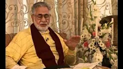
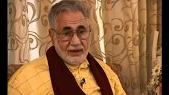
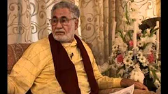
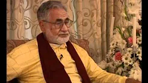

# Son of Karbala: The Spiritual Journey of an Iraqi Muslim

## Summary

Shaykh Fadhlalla Haeri was born in the Iraqi holy city of Karbala, sacred to Shi’a Muslims around the world as the place where Imam Hussein, the grandson of the Prophet Muhammad, was martyred in CE 680, leading to the split between the Shia and Sunni. It is better known in the West today as both a centre of resistance to the American occupation and the home of many who have supported the overthrow of Saddam Hussein. For anyone interested in how Iraq got to where it is now, in how Muslims regard their own history, and in how the message of Islam meets both individual needs and that of the world today, this is a timely and thought-provoking book.

## Purchase

### Amazon

[Buy Now](https://www.amazon.com/gp/product/B01JEJCIIY/ref=as_li_qf_asin_il_tl?ie=UTF8&tag=zahrapublicat-20&creative=9325&linkCode=as2&creativeASIN=B01JEJCIIY&linkId=7527707af0fefcca8c4ee3737ea0f624)

### Other Formats

[Zahra Publications](http://www.zahrapublications.pub/book-SonOfKarbala.php#bookTitle)

## Book Launch

**Clip 1**

[Watch](https://www.youtube.com/watch?v=vvENn7biigE)

**Clip 2**

[Watch](https://www.youtube.com/watch?v=3q1_Zo-zNxg)

**Clip 3**

[Watch](https://www.youtube.com/watch?v=jpQ2pCRkpA8)

**Clip 4**

[Watch](https://www.youtube.com/watch?v=aOp64KD5Fkg)

