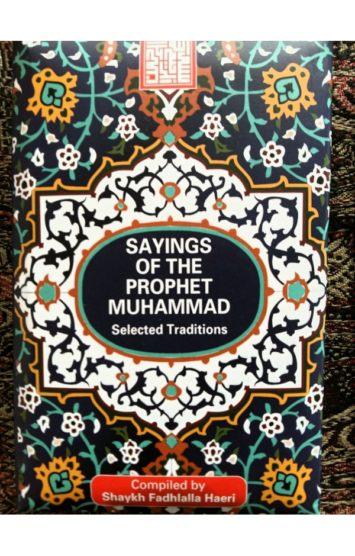

title: General Islam

description: General on Islam Book Category

# General on Islam

This collection of writings by Shaykh Fadhlalla Haeri offers the contemporary reader an introduction into Islam, the Qur’an, and Sufism. The sincere reader can use these accessible texts to expand, deepen and strengthen their working knowledge and understanding of the beliefs practices, and philosophy of Islam.

Topics covered are Islamic practices and theology, such as the cosmology and purpose of creation, the Attributes of the Creator, the nature of human beings, the decrees governing the laws of the universe, life and death, rules of conduct and spiritual practices. These books provide an overview as well as deep spiritual insights into the given topic, allowing the reader to develop a deeper and broader understanding of the elements of a life inspired by Islam.

## Titles

**Transformative Worship in Islam**

[Read It](./transformative-worship)

**Elements of Islam**

[Read It](./elements-islam)

**The Thoughtful Guide to Islam**

[Read It](./thoughtful-guide-islam)

**Sayings of the Prophet Muhammad**

[Read It](./sayings-muhammad)

**Prophetic Traditions**

[Read It](./prophetic-traditions)

**Living Islam**

[Read It](./living-islam)

