title: Overview - Books

description: An overview of all the books written by Shaykh Fadlalla Haeri

# Books

Zahra Publications has been publishing books on Islam and Sufism since 1981. Dedicated to disseminating the original teachings of Islam through contemporary and classical works alike, Zahra Publications titles lay particular emphasis on spiritual and transformative teachings.

Islam reflects the constant compassion and presence of the Divine Light. In these crucial times, more than ever before, Muslims and seekers of a life lived with integrity and harmony need to renew their knowledge and awaken to the original Prophetic path.

If you'd like to see all the e-book options we provide and get further information about all the books we have available, please make sure to visit the full Zahra Publications website by clicking below:

[Zahra Publications](http://www.zahrapublications.pub/)

If you'd like to subscribe to our dedicated mailing list and receive updates directly to your inbox (only about new and revised ZP publications), please follow the link below:

[Books](http://connect.sfhfoundation.com/bf.php?fid=1174)

## Categories

**Please Note:** If you'd like to purchase physical books, follow the Amazon links on each page. If there are hardcopies in stock, they are available there. Otherwise, we offer all our titles in Kindle, iBookStore, and Kobo versions (all of which are e-books). Kindle versions are also accessible through the same Amazon links.

**Sufism and Self-Knowledge**

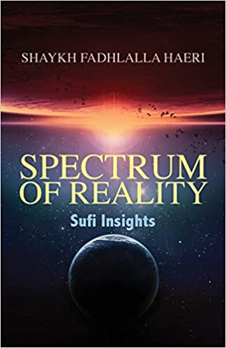

Known as _Tasawwuf_ by its practitioners, Sufism is often characterized as the ‘heart of Islam’. The Sufi engages in the conscious search for spiritual truths within the tradition of Islam, rooted in the Qur’an, and embodied in the example of the Prophetic Muhammad (S), who said: **"Whoever knows himself, knows his Lord."**

[Learn More](./sufism)

**The Qur’an**

The new millennium has dawned as an age of great complexity, chaos and constant change, challenging human values and ways of life. This category guides readers through the abundance of knowledge within the Qur’an, providing direction and inspiration for safe conduct in this life, preparation for the next, and humility in awe of the source of all manifest and hidden creation, Allah.

[Learn More](./quran)

**Practices and Teachings**

The practice of Islam encompasses multiple layers of outer and inner knowledge that are encapsulated within the terms of _shari‘ah_ (the boundaries of conduct) and _haqiqah_ (inner reality). Through cautious awareness and other practices, the sincere seeker has the opportunity to align their behaviour with that intended by the Creator.

[Learn More](./practices-teachings)

**General on Islam**

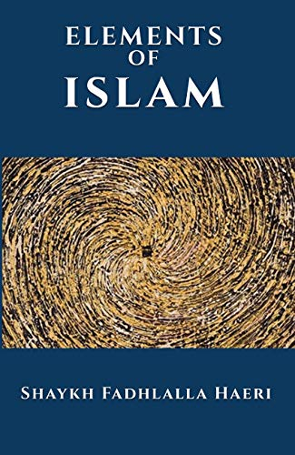

This collection of writings by Shaykh Fadhlalla Haeri offers the contemporary reader an introduction into Islam and the Qur’an. The sincere reader can use these accessible texts to expand, deepen and strengthen their working knowledge and understanding of the beliefs practices, and philosophy of Islam.

[Learn More](./general-islam)

## All Titles

**Spectrum of Reality: Sufi Insights**

[Read It](./sufism/spectrum-reality)

**The Garden of Meaning**

[Read It](./poetry-aphorisms/garden-meaning)

**Keys to the Qur’an**

[Read It](./quran/keys/)

**Pointers to Reality**

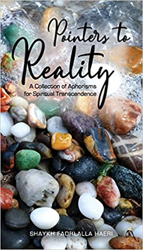

[Read It](./poetry-aphorisms/pointers-to-reality)

**Qur’an: 50 Vital Verses**

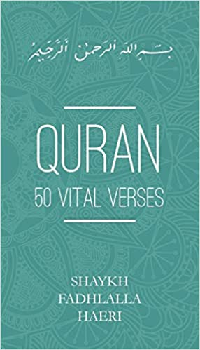

[Read It](./quran/50-vital-verses)

**The Essential Message Of the Qur'an**

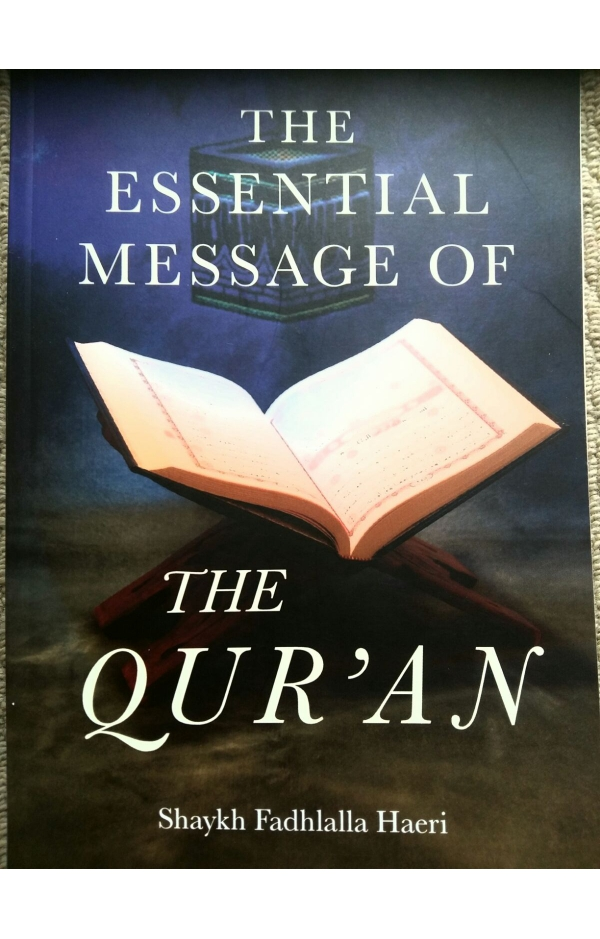

[Read It](./quran/essential-quran)

**Sufi Encounters**

[Read It](./biography/sufi-encounters)

**Elements of Sufism**

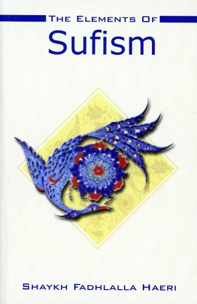

[Read It](./sufism/elements-sufism)

**Witnessing Perfection**

[Read It](./sufism/witnessing-perfection)

**Decree and Destiny**

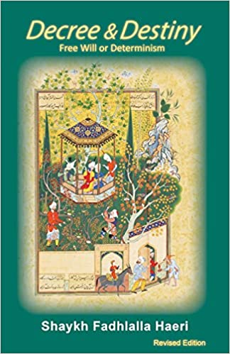

[Read It](./practices-teachings/decree-destiny)

**Transformative Worship in Islam**

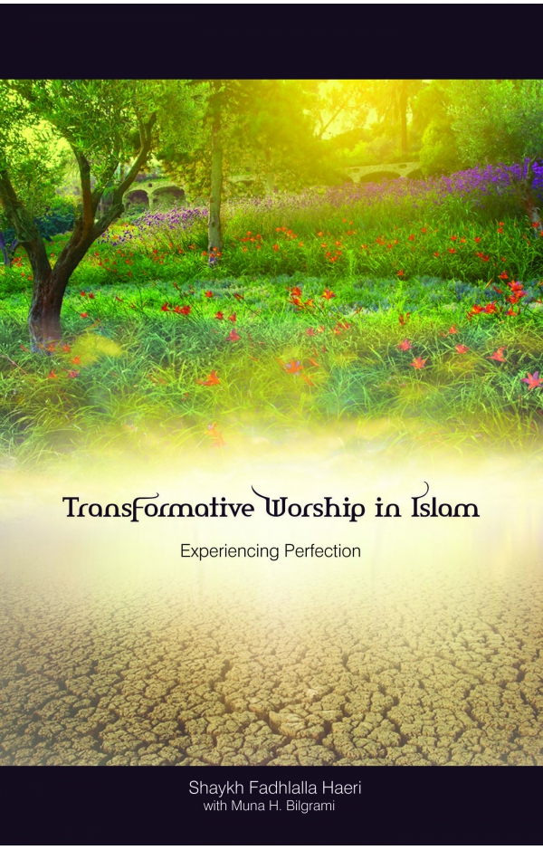

[Read It](./general-islam/transformative-worship)

**Elements of Islam**

[Read It](./general-islam/elements-islam)

**Ripples of Light**

[Read It](./poetry-aphorisms/ripples-light)

**Pointers to Presence**

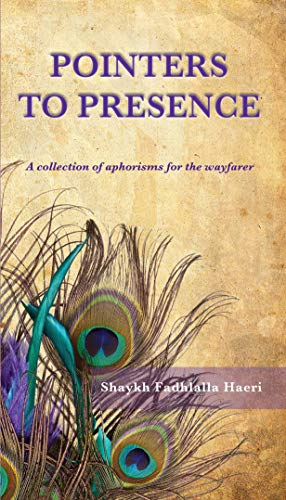

[Read It](./poetry-aphorisms/pointers-presence)

**Sacred Alchemy: Qur’anic Verses**

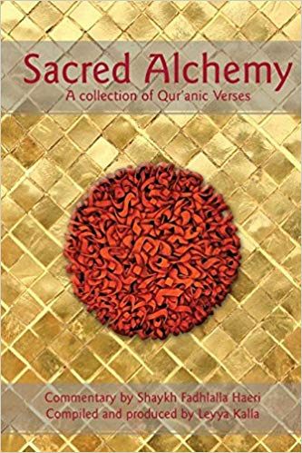

[Read It](./quran/sacred-alchemy)

**Journey of the Self**

[Read It](./practices-teachings/journey-self)

**The Thoughtful Guide to Islam**

[Read It](./general-islam/thoughtful-guide-islam)

**The Story of Creation in the Qur’an**

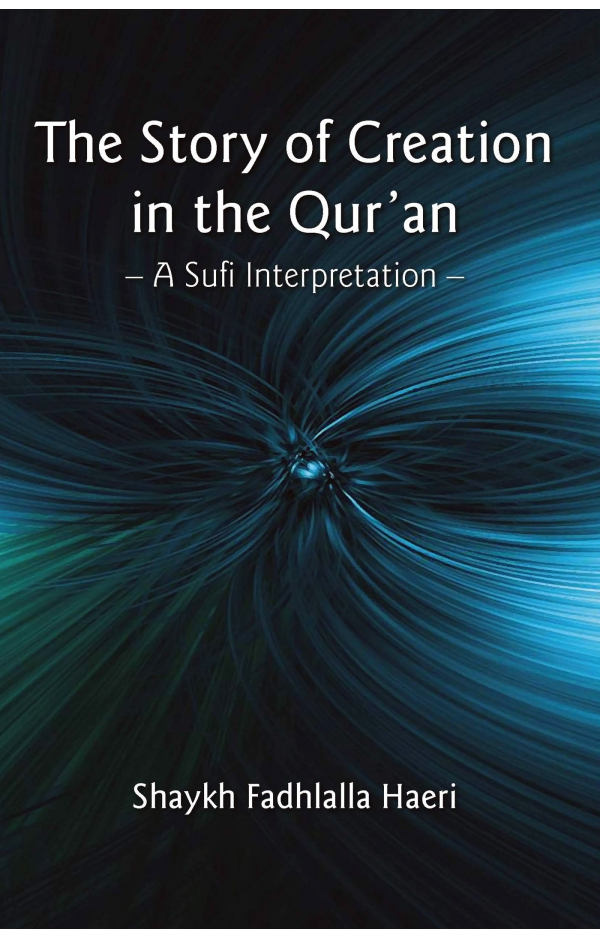

[Read It](./quran/story-creation-quran)

**Refinement of Character**

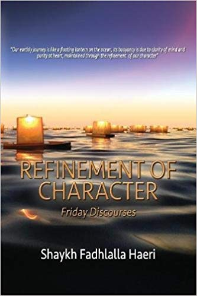

[Read It](./talks-interviews-courses/refinement-character)

**The Sufi Way of Self-Enfoldment**

[Read It](./sufism/sufi-self-enfoldment)

**Happiness in Life and After Death**

[Read It](./practices-teachings/happiness-life-death)

**The Sayings & Wisdom of Imam ’Ali**

[Read It](./practices-teachings/sayings-imam-ali)

**The Hikam**

[Read It](./practices-teachings/hikam)

**Calling Allah By His Most Beautiful Names**

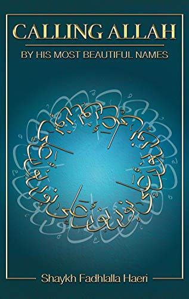

[Read It](./practices-teachings/calling-allah-beautiful-names)

**Son of Karbala**

[Read It](./biography/son-karbala)

**Qur’an's Prescriptions for Life**

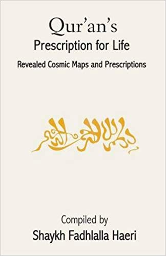

[Read It](./quran/quran-prescriptions)

**Prophetic Traditions**

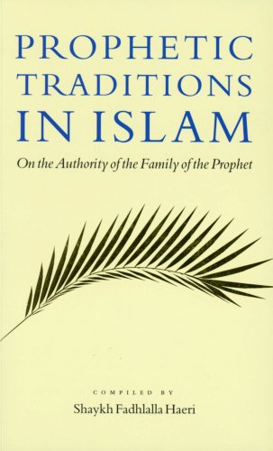

[Read It](./general-islam/prophetic-traditions)

**101 Helpful Illusions**

[Read It](./practices-teachings/101-helpful-illusions)

**The Lantern of the Path**

[Read It](./practices-teachings/lantern-path)

**Look Again**

[Read It](./poetry-aphorisms/look-again)

**Sound Waves**

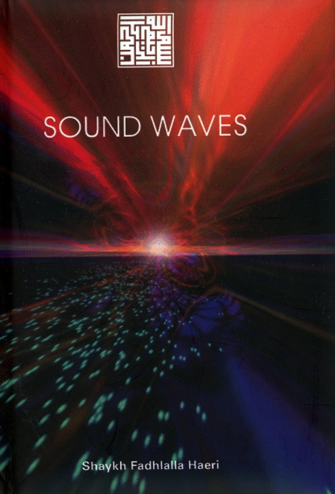

[Read It](./poetry-aphorisms/sound-waves)

**Bursts of Silence**

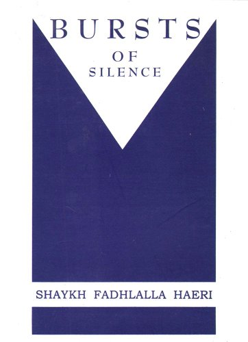

[Read It](./poetry-aphorisms/bursts-of-silence)

**Beginning's End**

[Read It](./sufism/beginnings-end)

**Beyond Windows**

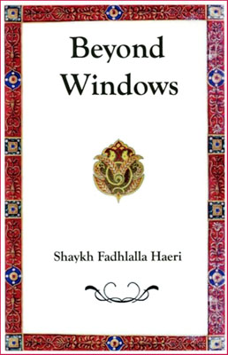

[Read It](./poetry-aphorisms/beyond-windows)

**The Spiritual Path**

[Read It](./talks-interviews-courses/spiritual-path)

**Friday Discourses**

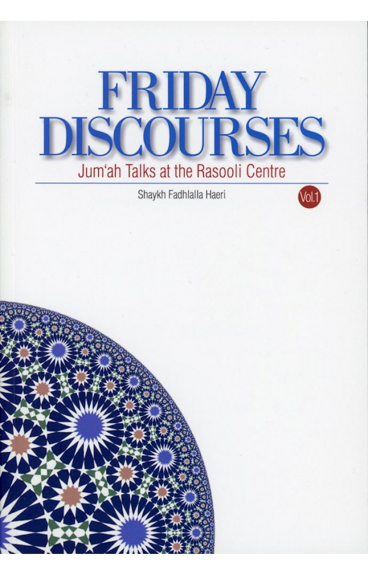

[Read It](./talks-interviews-courses/friday-discourses)

**Living Islam - East and West**

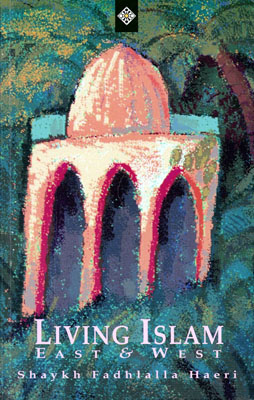

[Read It](./general-islam/living-islam)

**The Connection Between the Absolute and the Relative**

[Read It](./talks-interviews-courses/connection-absolute-relative)

**Cosmology Of The Self**

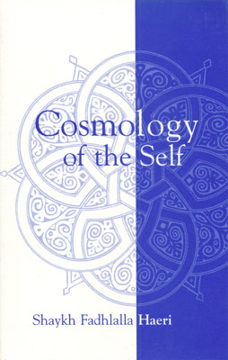

[Read It](./practices-teachings/cosmology-self)

**Leaves From A Sufi Journal**

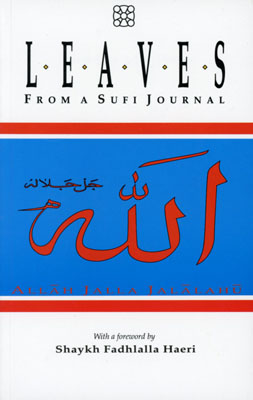

[Read It](./sufism/leaves-sufi-journal)

**ASK Course 1 - A Sufi Map of Self**

[Read It](./talks-interviews-courses/ask-1-sufi-map-self)

**ASK Course 2 - A Prophetic Way of Life**

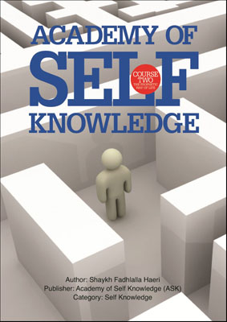

[Read It](./talks-interviews-courses/ask-2-prophetic-way-life)

**Health Sciences in Early Islam - Volume 1**

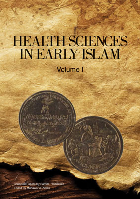

[Read It](./general-islam/health-sciences/)

**Health Sciences in Early Islam - Volume 2**

[Read It](./general-islam/health-sciences/volume-2)

