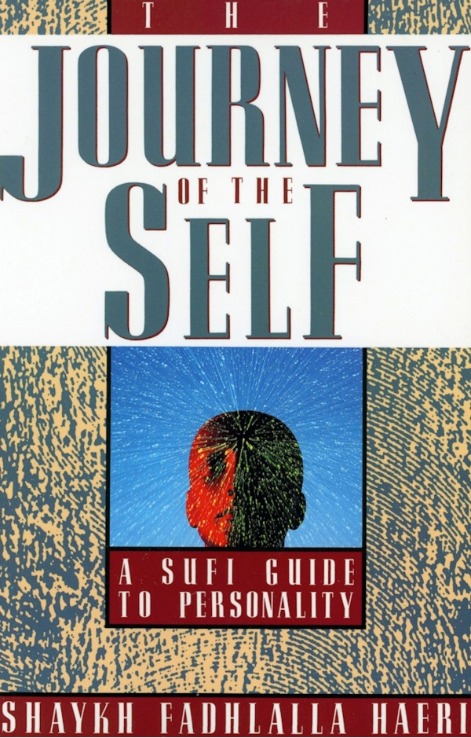
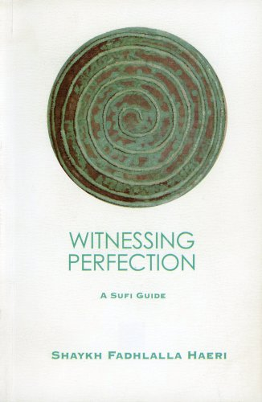

title: Overview - Books

description: An overview of all the books written by Shaykh Fadlalla Haeri

# Books

**Transformative Worship in Islam**

[Read It](./islam-sufism/transformative-worship)

**The Thoughtful Guide to Islam**

[Read It](./islam-sufism/thoughtful-guide-islam)

**The Thoughtful Guide to Sufism**

[Read It](./islam-sufism/thoughtful-guide-sufism)

**The Story of Creation in the Qur’an**

[Read It](./quran/story-creation-quran)

**The Mercy of Qur’an and The Advent of Zaman**

[Read It](./quran/mercy-quran-advent-zaman)

**The Essential Message Of the Qur'an**

[Read It](./quran/essential-quran)

**Elements of Islam**

[Read It](./islam-sufism/elements-islam)

**Ripples of Light**

[Read It](./spirituality-philosophy/ripples-light)

**Pointers to Presence**

[Read It](./spirituality-philosophy/pointers-presence)

**The Heart of the Qur’an - Surat Yā Sīn**

[Read It](./quran/heart-quran-perfect-mizan)

**Sayings of the Prophet Muhammad**

[Read It](./spirituality-philosophy/sayings-muhammad)

**Sacred Alchemy: Qur’anic Verses**

[Read It](./quran/sacred-alchemy)

**Journey of the Self**

[Read It](./spirituality-philosophy/journey-self)

**Friday Discourses**

[Read It](./spirituality-philosophy/friday-discourses)

**Refinement of Character**

[Read It](./spirituality-philosophy/refinement-character)

**Sufi Encounters**

[Read It](./islam-sufism/sufi-encounters)

**Elements of Sufism**

[Read It](./islam-sufism/elements-sufism)

**Witnessing Perfection**

[Read It](./islam-sufism/witnessing-perfection)

**The Sufi Way of Self-Enfoldment**

[Read It](./islam-sufism/sufi-self-enfoldment)

**Happiness in Life and After Death**

[Read It](./spirituality-philosophy/happiness-life-death)

**The Sayings & Wisdom of Imam ’Ali**

[Read It](./spirituality-philosophy/sayings-imam-ali)

**The Hikam**

[Read It](./spirituality-philosophy/hikam)

**Calling Allah By His Most Beautiful Names**

[Read It](./spirituality-philosophy/calling-allah-beautiful-names)

**Son of Karbala**

[Read It](./spirituality-philosophy/son-karbala)

**Keys to the Qur’an: The Juz Amma**

[Read It](./quran/keys-quran)

**Qur’an's Prescriptions for Life**

[Read It](./quran/quran-prescriptions)

**Prophetic Traditions**

[Read It](./islam-sufism/prophetic-traditions)

**101 Helpful Illusions**

[Read It](./spirituality-philosophy/101-helpful-illusions)

**The Lantern of the Path**

[Read It](./spirituality-philosophy/lantern-path)

**Look Again**

[Read It](./spirituality-philosophy/look-again)

