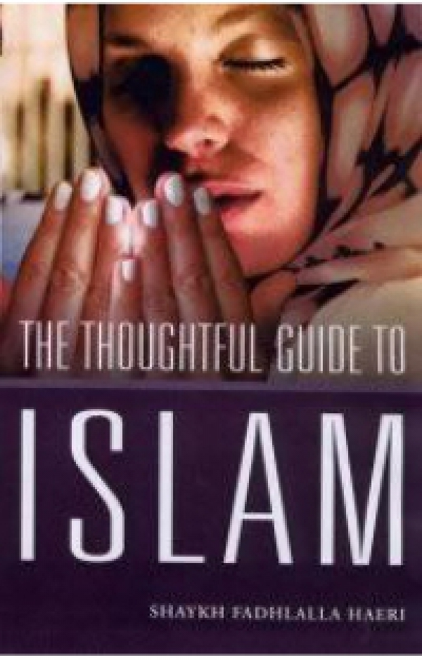

title: The Thoughtful Guide to Islam

description: At a time when communities increasingly tend to view each other with suspicion, The Elements of Islam cuts through the morass of misunderstanding and misinformation to give a true and timely overview of the universality and light of the prophetic message of Islam.

# The Thoughtful Guide to Islam

## Summary

At a time when communities increasingly tend to view each other with suspicion, The Elements of Islam cuts through the morass of misunderstanding and misinformation to give a true and timely overview of the universality and light of the prophetic message of Islam.

[Purchase Book](https://www.amazon.com/Thoughtful-Guide-Islam-Shaykh-Fadhlalla/dp/8186505806/ref=sr_1_fkmrnull_2?keywords=The+Thoughtful+Guide+to+Islam&qid=1552384731&s=books&sr=1-2-fkmrnull)

