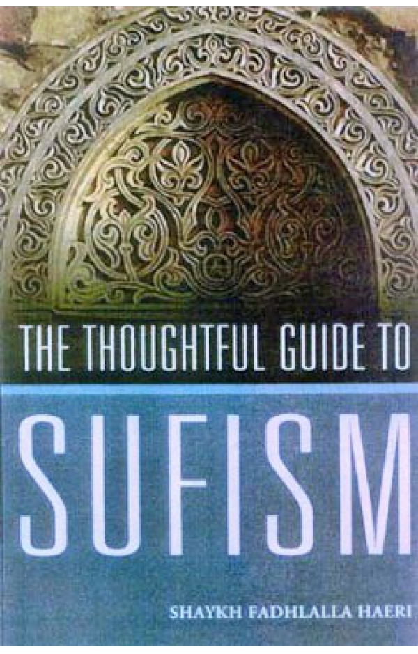

title: The Thoughtful Guide to Sufism

description: Sufism is the heart of Islam. This introduction to Sufism describes its origins and practices, its historical background and its spread throughout the world.

# The Thoughtful Guide to Sufism

## Summary

Sufism is the heart of Islam. This introduction to Sufism describes its origins and practices, its historical background and its spread throughout the world.

[Purchase Book](https://www.amazon.com/Thoughtful-Sufism-Shaykh-Fadhlalla-2004-05-28/dp/B01FKUW87M/ref=sr_1_fkmrnull_2?keywords=The+Thoughtful+Guide+to+Sufism&qid=1552384902&s=books&sr=1-2-fkmrnull)

