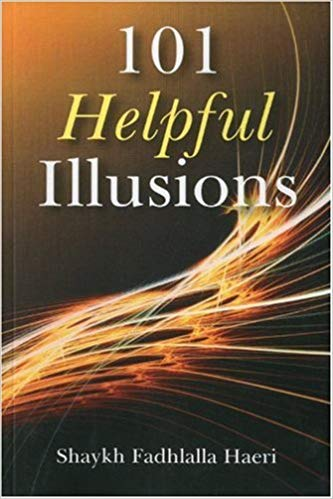

# 101 Helpful Illusions

## Summary

101 Helpful Illusions highlights natural veils waiting to be transcended by disciplined courage, wisdom and insight. Everything in creation has a purpose relevant to a specific situation that could lead the seeker of higher knowledge towards the ultimate spiritual truth of oneness. Thus our egotistic vices can indeed be stepping stones towards acting selflessly, spontaneously, and cheerfully with heightened awareness and good expectations in all situations. Indeed, all our mistakes can lead us towards the desired spiritual awakening – the ultimate purpose in life: experiencing and knowing the universal oneness.

## Purchase

### Printed Book

[Amazon](https://www.amazon.com/gp/product/B01ITGN544/ref=as_li_qf_asin_il_tl?ie=UTF8&tag=zahrapublicat-20&creative=9325&linkCode=as2&creativeASIN=B01ITGN544&linkId=0c6ca204e2eac3e0507648bccf0aa800)

### E-Book

[Zahra Publications](http://www.zahrapublications.pub/book-101-Helpful-Illusions.php#bookTitle)

