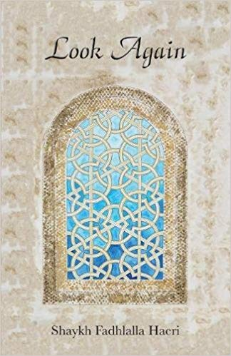

title: Practices and Teachings

description: Practices and Teachings Book Category

# Practices and Teachings

The practice of Islam encompasses multiple layers of outer and inner knowledge that are encapsulated within the terms of _shari‘ah_ (the boundaries of conduct) and _haqiqah_ (inner reality). While Shari’ah is the body of legislative principles revealed by the Creator and transmitted through the Noble Qur’an and the life pattern of the Prophet Muhammad (S), _Fiqh_ is the study of gaining knowledge through applying the principles of Islamic jurisprudence.

This section of writings are primarily rooted in the _Ja’fari_ school which represents the patterns of legal reasoning in the earliest phase of the history of Islam, covering both the origins of jurisprudence in Islam and its application and relevance in every aspect of our lives today. Through _taqwa_ and the conscious incorporation of fiqh-based conduct the sincere Muslim has the opportunity to align human behaviour with that intended by the Creator.

## Titles

**Ripples of Light**

[Read It](./ripples-light)

**Pointers to Presence**

[Read It](./pointers-presence)

**Journey of the Self**

[Read It](./journey-self)

**Happiness in Life and After Death**

[Read It](./happiness-life-death)

**The Hikam**

[Read It](./hikam)

**The Lantern of the Path**

[Read It](./lantern-path)

**101 Helpful Illusions**

[Read It](./101-helpful-illusions)

**Look Again**

[Read It](./look-again)

**Calling Allah By His Most Beautiful Names**

[Read It](./calling-allah-beautiful-names)

