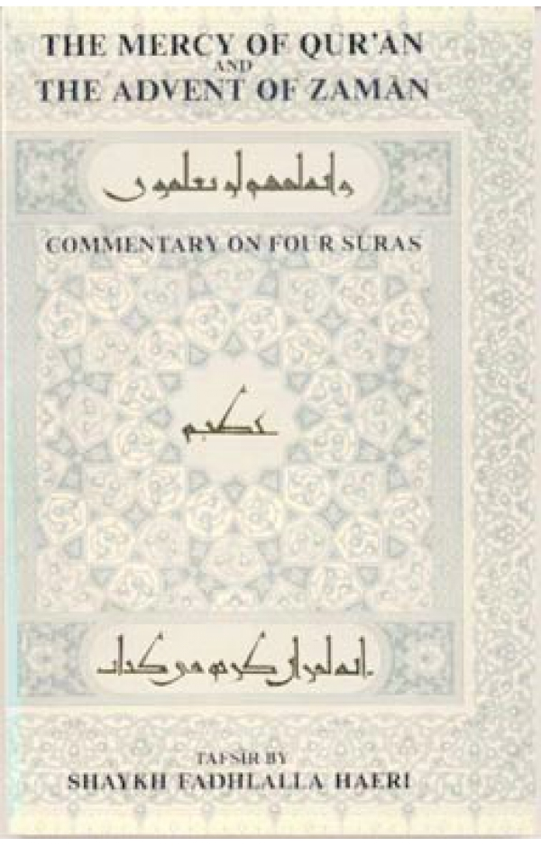
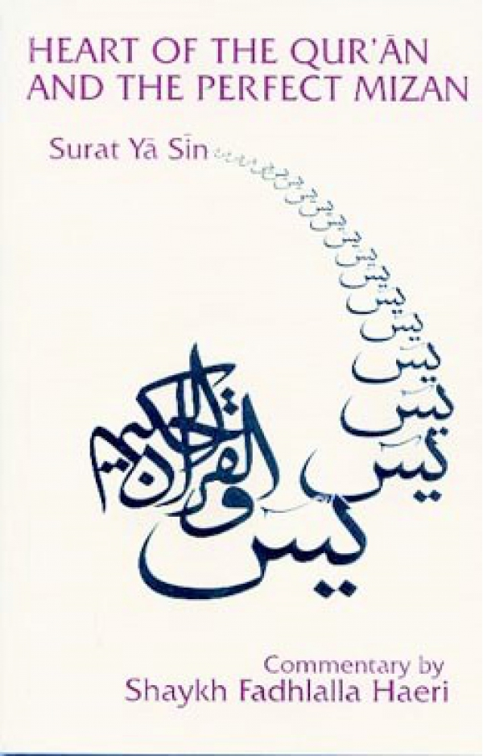

title: The Qur’an

description: The Qur’an Book Category

# The Qur’an

The new millennium has dawned as an age of great complexity, chaos and constant change, challenging human values and ways of life. This collection is presented in the belief that what is needed is the re-discovery of original patterns that relate to humankind, as revealed in the Qur’anic message. Presented in a way that deciphers the abundance of knowledge within the Qur’an from an existential angle, the reader will gain guidance, direction and inspiration for safe conduct in this life, and in preparation for the next, humbled in awe of the source of all manifest and hidden creation, Allah. Subjects addressed include the cosmology and purpose of creation, the Attributes of the Creator, the nature of human being, the decrees governing the laws of the universe, life and death, rules of conduct and spiritual practices.

Shaykh Fadhlalla Haeri’s unique approach unwraps deep spiritual truths of the Qur’an in a manner that integrates the inner landscape as well as the outer manifestations of the journey towards realizing the fullness of human consciousness, and emphasises practical actionable guidance. His commentaries use as a springboard the interconnected webs of meaning of root words to invoke a tawhidi (unitive) understanding of created phenomena and existence. Within this clear exposition, Shaykh Fadhlalla lays out humankind’s purpose and role. An essential foundation of learning for seekers of transformative knowledge.

## Titles

**Qur’an: 50 Vital Verses**

[Read It](./50-vital-verses)

**The Story of Creation in the Qur’an**

[Read It](./story-creation-quran)

**The Mercy of Qur’an and The Advent of Zaman**

[Read It](./mercy-quran-advent-zaman)

**The Essential Message Of the Qur'an**

[Read It](./essential-quran)

**The Heart of the Qur’an - Surat Yā Sīn**

[Read It](./heart-quran-perfect-mizan)

**Keys to the Qur’an: Five Volume Collection**

[Read It](./keys-quran)

**Qur’an's Prescriptions for Life**

[Read It](./quran-prescriptions)

**Sacred Alchemy: Qur’anic Verses**

[Read It](./sacred-alchemy)

