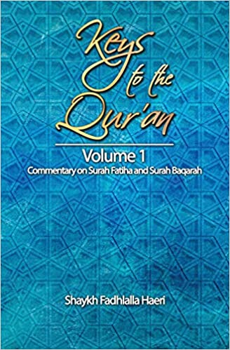

# Volume 1: Surah Fatiha and Baqarah

## Summary

**_Surat al-Fatiha_** is placed at the beginning of the Qur'an because it signifies the opening of knowledge and so the victory over ignorance. If, in the direction we are taking, there is no door, then we have reached our target - we have won. Fatiha means to open, reveal, imbue, and conquer. This surah is so named because if you follow it in your heart, you will be victorious. You will conquer and an opening will come to you.

**_Surat al-Baqarah_** scans the history of humankind from Adam to the time of the Prophet Muhammad. It contains a blueprint of how a community can live, how its members should behave as individuals, within their families, and in economic and social terms. It also gives guidance and prescriptions regarding inner and outer struggle and development.

[Amazon](https://www.amazon.com/Keys-Quran-Commentary-Fatiha-Baqarah/dp/1928329004/)

[Apple iBookStore](http://itunes.apple.com/us/book/id1144700040)

[Kobo Store](http://store.kobobooks.com/en-CA/ebook/commentaries-on-chapters-one-and-two-of-the-qur-an)

