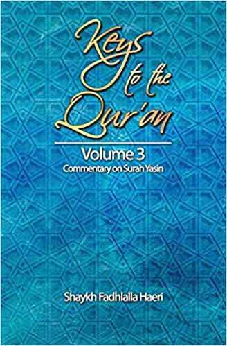

# Volume 3: Commentary on Surat Yasin

## Summary

**_Surat Ya Sin_** is the heart of the Qur'an (_qalb al-Qur'an_). It is the chapter (surah) of the Qur'an which is read over the dead; therefore it is a chapter of great importance to the living. Should one seek to know the meaning of life, one must experience death, for man has come from the non-physical realm and he is swiftly proceeding towards it again. Knowledge is based on opposites. Man's apprehension of knowledge depends upon the condition of his heart. If the condition of his heart is pure and receptive, he sees perfection in every aspect of every situation he finds himself in. The Qur'an allows one to fathom the unfathomable.

## Purchase

### Amazon

[Buy Now](https://www.amazon.com/gp/product/1928329020/ref=as_li_qf_asin_il_tl?ie=UTF8&tag=zahrapublicat-20&creative=9325&linkCode=as2&creativeASIN=1928329020&linkId=d4ff85a5754ee0835a43b3c2880f5978)

### Other Formats

[Zahra Publications](http://www.zahrapublications.pub/book-TheHeartOfTheQuran.php#bookTitle)

