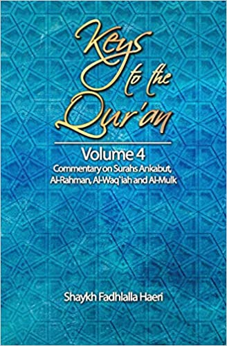

# Volume 4: Commentary on Surah Ankabut, Al-Rahman, Al-Waqi`ah and Al-Mulk

## Summary

These four chapters from the Meccan period are thematically interconnected, covering the subjects of affliction, direct signs of the Creator, the Next Life and the nature of the One Supreme Deity. Through allegorical interpretation of Qur'anic language, the reader is shown the safe path of conduct in this world and the Hereafter. Its message of balance and mercy, and of Divine Unity, compels the reader to reflect on the interconnectedness of all facets of life.

[Amazon](https://www.amazon.com/Keys-Quran-Commentary-Al-Rahman-Al-Waqi`ah/dp/1928329039/)

[Apple iBookStore](http://itunes.apple.com/us/book/id1144703533)

[Kobo Store](http://store.kobobooks.com/en-CA/ebook/commentaries-on-four-selected-chapters-of-the-qur-an)

