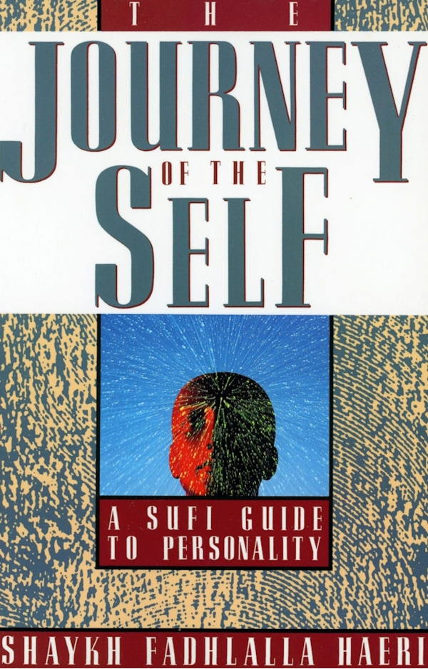

title: Journey of The Self

description: This unique guide to spiritual psychology presents Western readers with an Islamic concept of ‘personality’, the wellspring of the Enneagram and other Sufi theories of personality.

# Journey of The Self

## Summary

This unique guide to spiritual psychology presents Western readers with an Islamic concept of ‘personality’, the wellspring of the Enneagram and other Sufi theories of personality. After introducing the basic model of the self, Shaykh Haeri describes a simple yet complete outline of the self’s emergence, development, sustenance, and growth toward its highest potential.

[Purchase Book](https://www.amazon.com/Journey-Self-Sufi-Guide-Personality/dp/0062503766/ref=sr_1_195?keywords=Journey+of+The+Self&qid=1552378031&s=books&sr=1-195)

