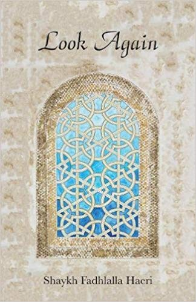

title: Look Again

description: Look Again invites us to cast our sight beyond things as they appear to be. Insight. The most consistent need of every human being is to know the Truth or Reality and its permanency, hidden behind infinite varieties of appearances and existences.

# Look Again

## Summary

_Look Again_ invites us to cast our sight beyond things as they appear to be. Insight. The most consistent need of every human being is to know the Truth or Reality and its permanency, hidden behind infinite varieties of appearances and existences. Truth reveals itself when we transcend identity with body and mind. In truth there is only Truth, and to resonate with that and experience, we need to block out all other distractions. ‘Look Again’ reflects the most wonderful light and delight of being at one with the One. There is only One but we are veiled by the illusion of otherness.

[Purchase Book](https://www.amazon.com/Look-Again-Shaykh-Fadhlalla-Haeri/dp/191982698X/)

