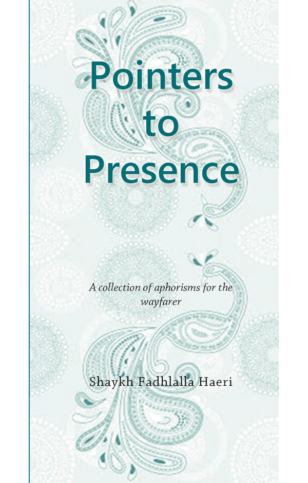

title: Pointers to Presence

description: Shaykh Fadhlalla Haeri emphasizes inner transformation and the refinement of conduct, as preludes to the realization of the prevalence of Divine Grace.

# Pointers to Presence

## Summary

Shaykh Fadhlalla Haeri emphasizes inner transformation and the refinement of conduct, as preludes to the realization of the prevalence of Divine Grace. He considers that the purpose of life is to know and resonate with the eternal essence of the one and only Life giver – Allah.

[Purchase Book](https://www.amazon.com/Pointers-Presence-Shaykh-Fadhlalla-Haeri-ebook/dp/B01IKZ5QIW/ref=sr_1_fkmrnull_2?keywords=Pointers+to+Presence&qid=1552379485&s=books&sr=1-2-fkmrnull)

