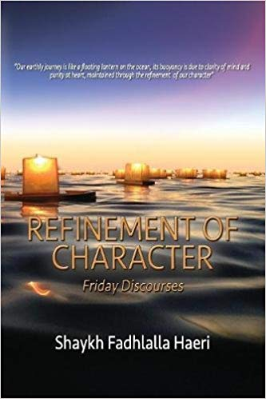

title: Refinement of Character: Friday Discourses

description:

# Refinement of Character: Friday Discourses

## Summary

“How do we transform ourselves using the spiritual map from our Din? How do we move through the four stages of inner awakening from Ilma Al Yaqin (the Total Reality of Certainty) to Ayn Al-Yaqin (the Eye of certainty) to Haqq Al-Yaqin (the Total Reality of Certainty) and its final stage, Haqq Al-Haqq (the Truth of Truth). What is the Quranic prescription of life, which allows the refinement of character from base to sublime?”

The ‘Refinement of Character’ discourses offered by Shaykh Fadhlalla Haeri in South Africa present a comprehensive and complete package of essentials regarding the self and its emergence, of the interplay between the ego and the soul (behaviour and personality dynamics). This book presents these discourses allowing one to become closer to discovering the true answers for these questions.

>“Become emotional and you are disturbing the heart, which represents the access to your soul. Through the soul you perceive the appropriateness of knowledge.”

[Purchase Book](https://www.amazon.com/Refinement-Character-Shaykh-Fadhlalla-Haeri/dp/1928329055/)

