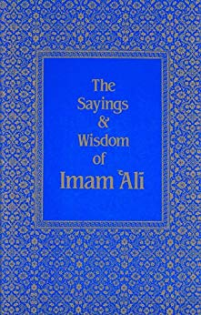

title: The Sayings and Wisdom of Imam ’Ali

description:

# The Sayings and Wisdom of Imam ’Ali

## Summary

Imam ’Ali, who was a cousin of the Prophet Muhammad, was the first man to accept Islam, when he was still a young boy, and for the next twenty-three years he was one of the Prophet’s closest companions. Imam ’Ali was constantly at the side of the Prophet, learnt from him, and also married his daughter Fatima. The Prophet said of Imam ’Ali: ‘I am the city of knowledge, and ’Ali is the gate’.

Although a great many of Imam ’Ali’s sayings and letters were accurately remembered and recorded during his lifetime, they have until now remained virtually inaccessible to the English-speaking world. “The Sayings and Wisdom of Imam ’Ali” is a selection of this great man’s recorded sayings – gathered together from authentic and reliable sources and arranged in easily accessible sections in Arabic by Shaykh Fadhlalla Haeri. These have been carefully translated into modern English, a great effort having been made to remain true to the intended meaning of the original Arabic text.

Imam ’Ali possessed not only a profound understanding of the nature of existence, but also a deep and penetrating insight into the changeless condition of human nature. The clarity and relevance of Imam ’Ali’s words remain; therefore, as true today as when he first uttered them.

The sayings and wisdom of Imam ’Ali transcend superficial differences, to reveal everlasting truths that can only serve to guide and illuminate the seeker and traveler on his or her journey through life, as clearly, constantly, and unerringly as the Pole Star.

[Purchase Book](https://www.amazon.com/Sayings-Wisdom-Imam-%60Ali-ebook/dp/B01JCZY6OE/)

