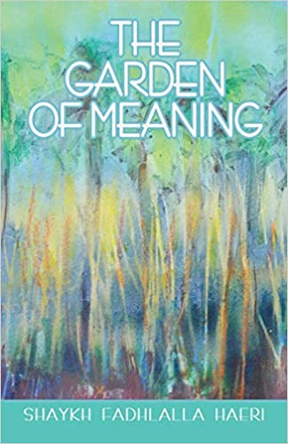

# Sufism and Self-Knowledge

Known as _Tasawwuf_ by its practitioners, Sufism is often characterized as the ‘heart of Islam’. The Sufi engages in the conscious search for spiritual truths within the tradition of Islam, rooted in the Qur’an, and embodied in the example of the Prophetic being (S). The fruit of this path is transcendent knowledge and transformed life experience, summarized in this beautiful saying of the Prophet Muhammad (S): **"Whoever knows himself, knows his Lord."**

Coming to know the inner landscape of the human self is one of the essential foundations for progress on the path of knowledge. When the seeker begins to ask questions about their identity, origin, destination, and life purpose, they embark on a journey that takes them from the realms of the lower self (Ego/_Nafs_) towards the subtler domains of the higher self (Soul/_Ruh_). 

This collection offers a practical and accessible distillation of the _tawhidi_ (unitive) Islamic teachings and insights into the map of the human self through the lens of someone who has attained mastery in it. Shaykh Fadhlalla Haeri has sought to furnish the reader with the fundamental elements and insights into the make-up of the individual self and how the various elements and dualistic interplay of spirituality and humanity interact within us.

## Titles

**The Garden of Meaning**

[Read It](./garden-meaning)

**Spectrum of Reality: Sufi Insights**

[Read It](./spectrum-reality)

**Sufi Encounters**

[Read It](./sufi-encounters)

**Journey of the Self**

[Read It](./journey-self)

**Elements of Sufism**

[Read It](./elements-sufism)

**Witnessing Perfection**

[Read It](./witnessing-perfection)

**Beginning's End**

[Read It](./beginnings-end)

**The Sufi Way of Self-Enfoldment**

[Read It](./sufi-self-enfoldment)

**Leaves From A Sufi Journal**

[Read It](./leaves-sufi-journal)

