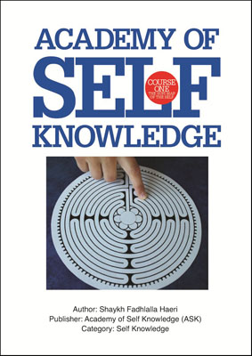

# ASK Course 1 - A Sufi Map of Self

## Summary

This book consists of all 14 lessons of the Academy of Self Knowledge's Course ONE -- Cosmology of the Self. It has been renamed to The Sufi Map of the Self.

The book explores the entire cosmology of the self through time and maps the evolution of the self from before birth through life, death and beyond.

The course is contextualized within the age we are living in and is aimed at anybody with a yearning for higher knowledge based on eternal truth. It shows us how to attain greater levels of inner stability in an unstable world so that we can deal with, and even appreciate the outer instability we find ourselves in, rather than constantly resisting it.

The course takes us a step at a time towards the realization that we are outwardly limited but inwardly far more than who we thought we were. It shows us how to prioritize everything that is sacred and enduring in our lives and to discard all that casts us far from the One. The book gives us the means by which we can nurture this higher aspect within ourselves in a wholesome way, making it an invaluable guide to life. 

## Purchase

### Amazon

[Buy Now](https://www.amazon.com/gp/product/B01JD6CO82/ref=as_li_qf_asin_il_tl?ie=UTF8&tag=zahrapublicat-20&creative=9325&linkCode=as2&creativeASIN=B01JD6CO82&linkId=24de1a7659546a50ca1087ebebdccc22)

## Other Formats

[Zahra Publications](http://www.zahrapublications.pub/book-ASKCourseONE-TheSufiMapOfTheSelf.php#bookTitle)

## Reader Review

I have always honoured the religion of Islam through the writings and teachings of the great Sufi masters. But, although I revered these teachings, I could not fully understand them. It was after I had been introduced to the writings of Shaykh Fadhlalla Haeri (ASK's founder), that I began to connect with the Sufi traditions not only with my mind, but through my heart. I began to recognise its universality beyond tradition-bound culture. The teachings of the Academy of Self Knowledge connect the timeless teachings of the Sufis and the Prophets with the ethos and language of modern contemporary society. 