# Latest Events

When the sun of truth appears in your sky all the millions of stars fade away. When cosmic reality shines all other values and ideas vanish.

Here, you can keep up to date with all our latest events. Make sure to subscribe to our mailing list to get these updates delivered straight to your inbox.

[Gatherings](https://secure.majesticinteractive.co.za/agency3/bf.php?fid=1173)

## Uncommon Dialogues

This series of virtual talks has been extended due to their warm reception. The discussions have included speakers like Dr. Ali Alawi, Shaykh Saadi Shakur Chisti Neil Douglas Klotz, Richard Eskow, Matthew Green, Syed Haider Mehdi and a number of other friends. Uncommon Dialogues cover a wide range of subjects during this pandemic, providing a message of hope, compassion and light.

Join us from the comfort of your own home for the next talks, which you can find scheduled below. Follow the link provided to set a reminder for yourself when each talk premieres. 

**Experience of Death Confirms Eternal Life**

**Streaming Live on Sunday 21st March 2021  11AM Central African Time**   

We are pleased to announce an important conversation between Shaykh Fadhlalla Haeri, Shaykh
Saadi Shakur and Dr. Adnan AlAdnani on some critical verses from the Noble Quran that will help the believer remember and prepare for death and the hereafter.

<a href="https://www.youtube.com/watch?v=MdTchFnJ-FI" target="_blank" rel="noopener noreferrer">Set Reminder</a>

## Preparation

The Quran is the constant companion of Muslims in the journey of life. Its verses are the first sounds recited into the ear of the newborn child. It is recited during the marriage ceremony, and its verses are usually the last words that a Muslim hears upon the approach of death. The Quran also deals fully with the nature of human beings. It teaches us who we are, why we were created and placed here on earth, what our goal in life is, what our responsibilities and rights are according to the Divine Law, what we need to know about the immortality of the human soul and its posthumous states, and the consequences of how we live in this world for our state of being after death.  

Many are aware that the Quran is concerned with religious life as well as matters related to both individual salvation and the social order, but fewer realize that the Quran is also a guide for the inner spiritual life. Paying attention to the inner meaning of the Quran results in the realization that not only does it contain teachings about creating a just social order and leading a virtuous life that results in a return to God after death in a felicitous state; it also provides the means of returning to God here and now while still in this world. The Quran is therefore also a spiritual guide for the attainment of the truth, a guide for the attainment of grace even in this world.  

Numerous passages throughout the Sacred Text speak about death, Resurrection, Divine Judgment, Paradise, Hell, and by implication Purgatory as well as the final end of a human beings. The Quran expresses these realities in a most powerful, concrete, and at the same time highly symbolic language. The Hereafter is presented in such a manner that it remains a constant reality in the consciousness of Muslims throughout their lives here in this world.  

Given the importance and finality of this accounting, when asked, “Who is the most intelligent of believers?” the Prophet replied, “The most frequent in recalling death, and the best prepared for what follows it, they are the most intelligent.” 

You may find some important books related to this conversation below:

- <a href="https://www.amazon.com/Keys-Quran-Commentary-Juz-Amma/dp/1928329047" target="_blank">Keys to the Quran</a>
- <a href="https://zahrapublications.pub/#theQuranAndItsTeachings" target="_blank">The Quran and Its Teachings</a>

## Relevant Ayat

<a href="https://quran.com/6/122" target="_blank" rel="noopener noreferrer">6:122</a>

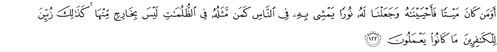

Is he who was dead then We raised him to life and made for him a light by which he walks among
the people, like him whose likeness is that of one in utter darkness whence he cannot come forth? Thus what they did was made fair seeming to the deniers.

<a href="https://quran.com/43/11" target="_blank" rel="noopener noreferrer">43:11</a>

And who sent down out of heaven water in measure; and We revived thereby a land that was dead;
even so you shall be brought forth;

<a href="https://quran.com/41/39" target="_blank" rel="noopener noreferrer">41:39</a>

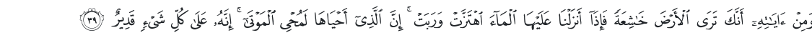

And among His signs is this, that you see the earth still, but when We send down on it the water, it stirs and swells: most surely He Who gives it life is the Giver of life to the dead; surely He has power over all things.

<a href="https://quran.com/7/158" target="_blank" rel="noopener noreferrer">7:158</a>

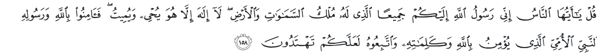

Say: O people! surely I am the Messenger of Allah to you all, of Him Whose is the kingdom of the
heavens and the earth there is no god but He; He brings to life and causes to die therefore believe in Allah and His messenger, the Ummi Prophet who believes in Allah and His words, and follow him so that you may walk in the right way.

<a href="https://quran.com/2/28" target="_blank" rel="noopener noreferrer">2:28</a>

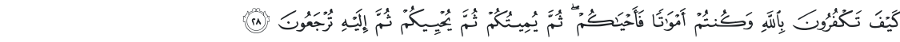

How do you deny Allah and you were dead and He gave you life? Again He will cause you to die and
again bring you to life, then you shall be brought back to Him.

<a href="https://quran.com/3/185" target="_blank" rel="noopener noreferrer">3:185</a>

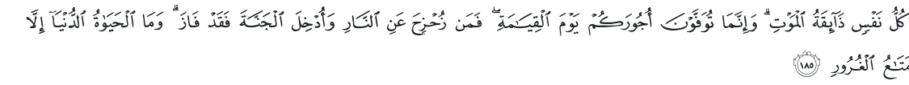

Every self will taste death, and you will only be given your compensation on the Day of Resurrection. So he who is drawn away from the Fire and admitted to Paradise has attained. And what is the life of this world except the enjoyment of delusion.

<a href="https://quran.com/20/74" target="_blank" rel="noopener noreferrer">20:74</a>

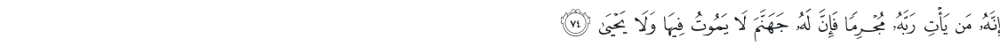

Indeed, whoever comes to his Lord as a criminal - indeed, for him is Hell; he will neither die therein nor live.

<a href="https://quran.com/18/99" target="_blank" rel="noopener noreferrer">18:99</a>

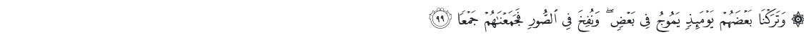

Upon that day We shall leave them surging on one another, and the Trumpet shall he blown, and We
shall gather them together.

<a href="https://quran.com/25/15" target="_blank" rel="noopener noreferrer">25:15</a>

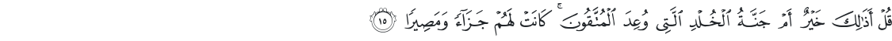

Say, &quot;Is that better or the Garden of Eternity which is promised to the reverent. It will be for them a reward and destination.

<a href="https://quran.com/31/28" target="_blank" rel="noopener noreferrer">31:28</a>

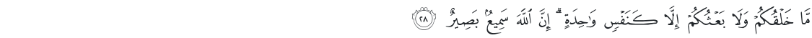

Your creation and your resurrection will not be but as that of a single soul. Indeed, Allah is Hearing and Seeing.

<a href="https://quran.com/55/26-27" target="_blank" rel="noopener noreferrer">55:26-27</a>

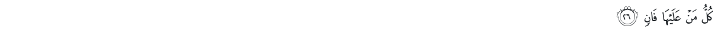

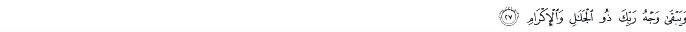

Everyone on it must pass away. 
And there will remain the Face of your Lord, Owner of Majesty and Glory.

<a href="https://quran.com/2/156" target="_blank" rel="noopener noreferrer">2:156</a>

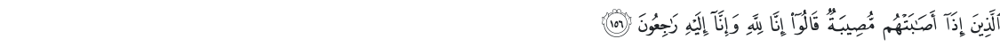

Who, when afflicted with calamity, say: &quot;Truly! To Allah we belong and truly, to Him we shall return.&quot;

<a href="https://quran.com/6/98" target="_blank" rel="noopener noreferrer">6:98</a>

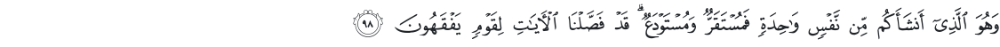

It is He Who hath produced you from a single soul: here is a place of dwelling and a place of
departure: We detail Our signs for people who understand.

<a href="https://quran.com/17/13" target="_blank" rel="noopener noreferrer">17:13</a>

And every person We have imposed his fate upon his neck, and We will produce for him on the Day
of Resurrection a record which he will encounter spread open.

<a href="https://quran.com/77/8-13" target="_blank" rel="noopener noreferrer">77:8-13</a>

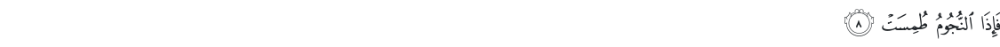

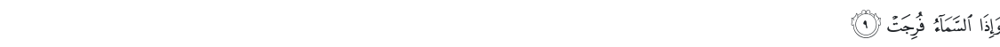

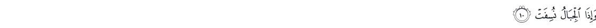

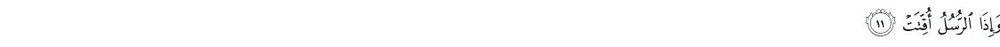

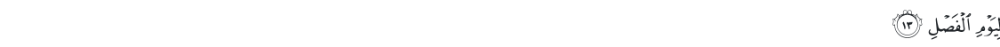

So when the stars are obliterated. And when the heaven is split. And when the mountains are blown away. And when the messengers&#39; time has come. For what Day was it postponed? To the Day of Decision.

<a href="https://quran.com/14/48" target="_blank" rel="noopener noreferrer">14:48</a>

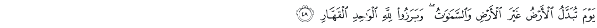

On the Day the earth will be replaced by another earth, and the heavens, and all creatures will come out before Allah, the One, the Prevailing.

<a href="https://quran.com/28/77" target="_blank" rel="noopener noreferrer">28:77</a>

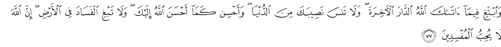

Seek, through that which Allah has given you, the home of the Hereafter; and do not forget your
share of the world. And do good as Allah has done good to you. And desire not corruption in the
land. Indeed, Allah does not like corrupters.

<a href="https://quran.com/29/64" target="_blank" rel="noopener noreferrer">29:64</a>

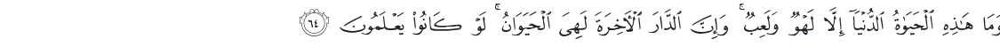

And this worldly life is not but diversion and amusement. And indeed, the home of the Hereafter - that is the eternal life, if only they knew.

<a href="https://quran.com/50/19-21" target="_blank" rel="noopener noreferrer">50:19-21</a>

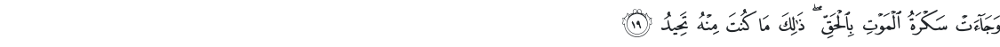

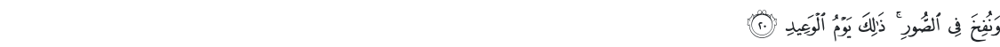

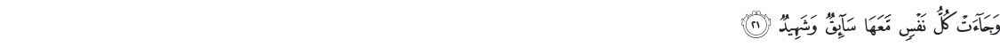

And the intoxication of death will bring the truth; that is what you were trying to avoid. And the Horn will be blown. That is the Day appointed day. And every self will come, with it a driver and a witness.

<a href="https://quran.com/2/25" target="_blank" rel="noopener noreferrer">2:25</a>

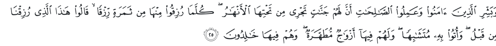

And give good tidings to those who believe and do righteous deeds that they will have gardens
beneath which rivers flow. Whenever they are provided with a provision of fruit therefrom, they will say, &quot;This is what we were provided with before.&quot; And it is given to them in likeness. And they will have therein purified spouses, and they will abide therein eternally.

You may read the situation more clearly after you lose all of your ambitions and other fictions.

