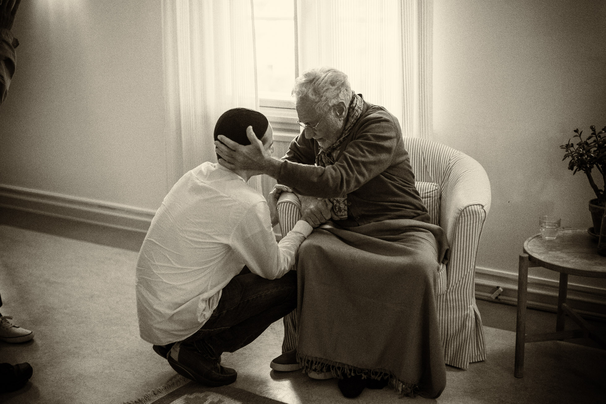

title: The 7 Statiosn of Self and The 4 Journeys

description: A basic mapping of the modern self, it's different levels, and the journeys it can undergo in this life as it progresses through various layers or rungs of consciousness.

# The 7 Stations of Self and The 4 Journeys

**Note 1**: _The map is not the territory, and these overviews are provided for committed seekers who have already walked at least some way along the path. No-one can tell you who you are. It is important that you read the article [Less is More](../../articles/less-is-more) and reflect fully on it before you go through these guides._

**Note 2**: _This article is an extract from the book ["Journey of the Self"](../../books/practices-teachings/journey-self). If it piques your interest, you should buy the book, as these particular maps of the self and its journeys falls into the 4th of 5 stages of development in both microcosm (human self) and macrocosm (the cosmos). These stages are: Absolute Unitive Reality, Inner Dependence, Outer Dependence, Interdependence, and Inner Reliance. The guide provided below is but a small part of a larger story, as is always the case._

## The Seven Kinds of Self

The models below are only meant as examples to guide. The stages within a given model naturally overlap, and the entire spectrum within the model remains active to varying degrees of intensity within the human throughout one's life. In the first model, for example, the saint is not exempt from recognising a glimpse of the commanding self within.

The self is like the layers of an onion. We remove one layer, and then another, and so on for our whole life. With each removal, the next layer becomes slightly easier to peel away. The outer layers are the hard ones. The more we unpeel, i.e. the more we undress ourselves of our own superimposed layers of personality, the freer and happier we become and the greater the chance of real fulfillment. Ultimately, when we reach a high state of inner awareness and when we have been truly and totally immersed in that state, that inner equilibrium, we have little or no clutter left in us and that is like reaching the last, inner layer of the onion. If we now take off that layer, what is there? Space!

### 1 - The Commanding Self

The first and lowest station is that of the commanding self (_al-nafs al-ammara_). This is the station of one who is not sufficiently developed inwardly, who is crude and childish, base, egoistic and selfish, with little concern or connection with other than self-gratification.

This is the self that is dominated by the physical body, and follows mainly the gratification of sensual pleasure and fleeting desires. This state draws the heart towards its lower and negative extreme. This facet of the self is the abode of most vices and the source of all bad characters.

The characteristics of the commanding self encompass meanness, greed, envy, jealousy, ignorance, self-importance, pride, glory, presumption, arrogance, sensuality, anger, violence, insensitivity, lack of insight, and vile manners, interference in what does not concern one, making fun and mocking others, avarice, hatred, qualities of rigidity and dogma, opacity, and the inability to be reached or to form stable relationships. The colour related to the commanding self is blue. It is the blue of intense heat in the middle of the flame.

### 2 - The Reproachful Self

The second station is the reproachful self (_al-nafs al-lawwama_). In this station, the self develops some sense of right and wrong. It begins to have glimpses into its own conduct and occasionally even blames itself for wrong behaviour. The reproachful self does have some measure of awareness and discrimination, but that reproach usually occurs after the event. It is like a crack, so to speak, in the solid frame of the commanding self, that gives rise to the reproachful self with a slight degree of flexibility and awareness.

Its characteristics are acting upon whims of the moment, conceit, having to do with self-image, vanity, injustice, bias, backbiting, slander, lying, and excessive love of leadership. Its colour is yellow. This colour is located on the edge of the flame and represents descending and decaying energy.

### 3 - The Inspired Self

The third station is the inspired self (_al-nafs al-mulhamma_). This condition of the self is supple and dynamic, and therefore leads to vulnerability. It is an interspace between good and bad. The keeping of good company and right guidance is necessary at this stage for the self to evolve. This is also the station of love, and of being in love. We generally find this type of self attractive because it reminds us of a free spirit, as it is less attached and more willing to change course, and is freer of inhibition and attachments.

The inspired self is considered easy to treat, for it is not tethered. It has no firm anchorage or rigid boundaries. It is inspired and mobile like quicksilver. One may think of it as mercury - flexible and mobile, but elusive and difficult to steady and grasp. This type of self may begin to be developed and groomed once it has been contained, stabilised and nurtured within a stable base. In this state is the danger of excessive love and wonderment of nature, even worship. This state can be found in scientists, painters, musicians and artists, because of the preponderance of wonderment and marvels that are experienced in their areas.

The characteristics of the inspired self are generosity, forgiveness, tolerance, endurance, good opinion, acknolwedging faults, an open-faced smiling countenance, love of peace and meditation, contentment with the decree, and having the ability to weep easily, which is the opposite of the commanding self. Its colour is read, which is lively and vivid and at the centre of the flame.

### 4 - The Certain Self

The fourth station is the certain self (_al-nafs al-mutma'ina_). Here, the self attains confidence and security by knowledge and experience. The self can journey back to its origins, to recall and become inwardly awakened to the reality that everything, including itself, is from reality and to that reality is its return, by the grace and mercy of the same reality.

It is that self whose light has been ignited by the spark of the heart, and has overcome the lower characteristics and taken on the higher qualities. It is content, not out of ignorance, but with knowledge. Its contentment is a result of the knowledge that it has done its best within its limits, and therefore all is well. The heart is clear and it is tranquil, content, and steady with faith and trust.

Amongst the characteristics of the certain self are unsolicited generosity, dependence on the Creator, freedom from fear of need or attachment, spontaneous awareness of the rule of opposites in the world, sincerity, contentment, freedom in action, contentment with the decree, absence of agitation, gratitude for the perfection of creation and one's place in it, fear and dread of trespassing the bounds (for fear at the beginning of the path is knowledge, fear in the middle is ignorance, fear at the end is delight), being on a clear path, acting only out of certainity, a heart full of trust, faith, certainity, knowledge, right action and security. Its colour is white, reflecting all the colours (and holding or absorbing none).

### 5 - The Contented Self

The fifth station is the contented self (_al-nafs al-radhiya_). It is the station of the one who sees the truth always, in every situation and everything.

Its characteristics are sincerity, innocent genuineness, continuing caution and fear of trespassing the bounds, scrupulousness, total inner courtesy, and avoiding any desire except that of knowledge and the pleasure of reality. The contented self is childlike in its simplicity. It is spontaneous, always living in the moment. Its colour is green, the colour of growth and life on earth - the pleasant and "middle" colour.

### 6 - The Self That Everything Is Contented With

The sixth station is the self that pleases and satisfies the rest of creation (_al-nafs al-mardhiya_). If one is knowingly content with one's Creator, then everything in creation is content and in harmony with oneself. This is the station where the world of the macrocosm is in equilibrium with the microcosm.

This self overflows with mercy and love towards all creation, is devoted to the service of others, and is in complete balance in that interspace between the outer world and the inner reality. This self's responsibilities in the outer world do not veil it from the joy and bliss of inner realities, nor do the inner delights blind it from outer obligations. Here, the self does not know anger, greed, revenge or hatred. Its colour is black, which absorbs all the other colours. All shades and colours stop here.

### 7 - The Perfected Self

The ultimate station is the perfected self (_al-nafs al-kamila_), or the station of pure beingness. Of this station, the Prophet Muhammad (pbuh) said:

> "He who knows himself knows his Lord."

He is the one who knows himself to be an interspace, combined of a physical vehicle (or body), and a spirit of divine origin that rides upon the vehicle as a means of witnessing and arriving back to its blissful abode - the eternal Garden. It also means that he is where the beautiful names of God (the divine attributes of Reality) are gathered and known.

The perfected self is in the state of unific knowledge, oneness in divine unity, the state of pure consciousness and pure beingness.

## The Four Journeys

Another model of the journey of the self is given by the great Sufi master, Mulla Sadra. He uses the analogy of the wayfarer to describe any human's journey from the state of ignorant darkness to one of illuminated awareness. In this model he describes the four stages of unveilings along the journey. It begins when a human reaches a point where s/he realises there is no lasting fulfillment in the existential, changing world.

We all experience at different times in our life the desire for tranquility and seclusion. When worldly difficulties and failures mount, we may wish to leave it all. Many of us go through a period when the monastic life seems an appropriate refuge and it is during these times that we want to turn our backs on creation. It is often at times of the greatest difficulty and confusion that we turn towards the path of discovery of the source in order to understand the position we have landed in. It is when the actors in the play begin to question the plot that we seek to know the author and ask for an explanation.

When we reach this point and realise that there can be no lasting fulfillment in the existential, changing world, we take flight to the edge of the known, which is the unknown dimension. Here the first stage of unveiling begins.

The four stages which follow illustrate the main stations that the successful wayfarer attains in his/her journey. Throughout life, s/he will continue to experience the entire spectrum of states to varying degress of intensity. What Mulla Sadra wishes to emphasise here is the established station that the wayfarer attains, rather than simply the passing, temporary state which s/he will continue to experience from time to time in life.

### The First Journey: From Creation to Creator

The first barrier to cross, or the first unveiling, is from the creation to the Creator. The wayfarer flees from the confusing, physical and material universe of opposites to another dimension - the dependable, real and reassuring world of the unified field of reality. The silence within is the knock on the inner door.

The unveiling of the first barrier involves tearing away veils both of darkness and light that exist between the seeker and the spiritual reality within. Then the ascent can begin from the station of the lower self to the station of the intellect, and from the station of the intellect to the the station of the spirit, and from the station of the spirit to the farthest goal of supreme splendour. If the wayfarer succeeds in reaching this goal, the final veils are lifted and s/he is annihilated by the death of the transitory, dissolved and submerged in the divine source.

### The Second Journey: With the Creator by the Courtesy of the Creator

The second unveiling is the journey across the barrier to knowledge of the Creator. The wayfarer is now exposed to Reality by the courtesy of Reality. S/he moves totally in the inner realm. S/he attains gnosis. His/her essence, attributes and actions become annihilated in the divine essence. In this journey, s/he sees through His seeing, hears through His hearing and knows through His knowing.

When the inner journey and discoveries are taking place, the wayfarer looks for greater confirmation of these openings. S/he is like someone who discovers that s/he is truly a guest, and that the Host is most generous and understanding. The wayfarer then hopes for this condition to last and to remain in this refuge. As though s/he sees his/her image in a mirror for the first time. s/he seeks confirmation and establishment of what s/he has seen.

### The Third Journey: From the Creator to Creation by the Permission of the Creator

The completion of the second unveiling marks the start of the third journey. In this, the wayfarer returns from the Creator back to creation by the permission of the Creator. In this journey, s/he is armed with the knowledge of truth.

The wayfarer's state of self-annihilation is complete and s/he now attaines full sobriety and balance. S/he subsists through the subsistence of the Creator. S/he returns to creation by the authority of the Creator with the knowledge of the unveiling.

The nature of life does not change and it carries on with its ups and downs. There is no avoidance by anyone of experiencing these outer waves which occur at the surface above the still depths of the ocean. So when the wayfarer is established in his station, s/he returns to creation with all its turmoil. However, the wayfarer, because of his/her knowledge of the nature of the ocean, is now far more able to deal with its changing surface. The waves are of little signficance and the storms are relative puffs of wind compared to the stable mass of the deep.

### The Fourth Journey: With Creation by the Authority of the Creator

The wayfarer then embarks upon the fourth stage, which is to be among creation by the autority of the Creator, when nothing else remains but service in the bliss of knowledge. the seeker observes and recognises creation and humanity, their behaviour and needs. S/he knows the good that they bring about and the evil that they cause, and what causes them happiness and what brings misery.

In all this, s/he is with the truth, for his/her entire being has been submerged in reality, and the service rendered by him/her to other beings does not distract from the inner divine bliss, steadfastness and certainty. The fully realised being is now in the ultimate unitive state. S/he is completely in outer service of humanity and in inner abandonment, freedom and joy.

When reality in all its various aspects is unveiled to the wayfarer and s/he is established in the knowledge of truth within, a new outlook towards creation emerges. The awakened being sees the divine thread through all existence and therefore is qualified to serve with selflessness, with no danger to creation or to themself. When the individual self has aligned itself with original unified reality, the flowering of the spiritual being has occurred. It is this unveiling that is referred to as "with creation by the authority of the Creator." Wherever the enlightened being looks, he sees the trace and the mark of the Creator. S/he is now an agent of transformation, a loyal slave to the Divine Master and a freed being with no choice but to reflect what comes to his/her pure heart. This is the state of a prophet with the people - outwardly the same as any of them, inwardly turned to the eternal origin.

