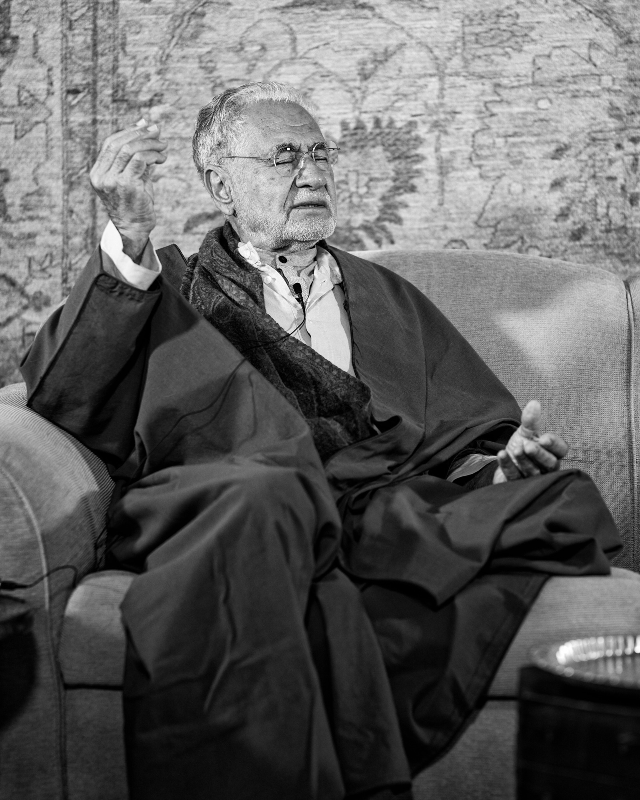

title: Fasting

description: Everything you could ever want to know about fasting, it's history, its benefits, and its particular application in Islam.

# Fasting

_By Shaykh Fadhlalla Haeri, from the book "[Transformative Worship in Islam](../../books/general-islam/transformative-worship-islam)"_.

_If you prefer listening to reading, you can find a full [audio series on fasting and abstention here](../../audios/series/abstention-fasting)_.

Human interest in fasting is deeply rooted in our consciousness. Fasting has long been resorted to for maintaining physical and mental health as much as for cultural or political reasons. More specifically, fasting has been a devotional practice in most religious and spiritual movements throughout the ages.

Islam has prescribed the practice of abstinence and fasting as a means of self-purification and worship. The act of restraining the self from fulfilling its desires purifies and enhances awareness at physical, mental and spiritual levels and sensitizes human consciousness. The seeker realizes the weakness of the self and is gratified by the discipline, restriction and prohibitions, for these limitations are windows to Allah’s limitlessness.

## Fasting in History

In many cultures, such as the Indians of North America, tribes of Brazil, the people of the Pacific Islands and numerous Asian, African and European peoples, fasting has been used as a rite of initiation, marking puberty, prior to hunting and as part of the rites of marriage. In some cultures such as those in the Andaman Islands, Fiji, Samoa, China, Korea and others fasting is observed as a rite of mourning. In general, we find whenever human beings are in need, suppressed, or in fear, they seek God or higher powers through abstinence or penance. When our limited state of knowledge and consciousness is insufficient fasting guides us out of difficulties to find other means of inspiration and solutions.

Ancient Egyptians, Greek, Roman, and Chinese cultures practiced fasting to cure various illnesses. The Egyptians believed that fasting three days a month helped to preserve good mental and physical health. The Greeks learned the virtues of fasting from the Egyptians and fasted before battle and the Romans followed suit. Socrates and Plato are known to have regularly performed fasts of ten days duration. Today in the West, fasting is used by alternative and naturopathic systems of medicine and healing for curing a host of acute and chronic diseases and as a useful catalyst in helping the body mobilize its own natural immune system.

The Old Testament often refers to fasting: David chastened his soul with fasting, while Moses fasted for forty days when he ascended the mount to receive the tablets of the covenant. Daniel fasted for three weeks, supplicating and praying all the while. Jews observe six obligatory fasts during the year, one such being Yom Kippur.

The institution of fasting and abstinence from certain foods in Christianity has its origin in the New Testament as it relates to the fasting of Jesus’ disciples for several days during Lent, the forty-day period before Easter. The duration of the fast during Lent varied throughout the ages, until forty days accompanied by strict rules became the norm. Additional fasts were introduced later in different parts of the Church, such as the fast of Rogation Days, the Ember Weeks, the Whitsun Week, and fasts were also ordained by the Roman Catholic Church. Considerable variations in the practice of fasting are noticed between the Orthodox Church, the Eastern Orthodox Church and the Reformed Churches of Europe.

Over time there has been a gradual mitigation in the frequency and rigor of the fasts and abstinences prescribed by Church laws due to extenuating circumstances such as age, health, poverty, hard or continued labor and changing social conditions. Today few are obliged to fast strictly, while some are excused even from abstinence. Roman Catholic legislation further provides for dispensations to be granted by the Church authorities. The overall result is that the practice of fasting has declined and is almost forgotten as a religious exercise.

During the twentieth century fasting has sometimes been used as a tool of political and social protest by individuals as well as groups. During the national struggles for independence from colonial rule, several leaders of the third world in Asia and Africa resorted to fasting to highlight their plight and struggle, often with some success.

## The Islamic Fast

For Muslims fasting, or _sawm_ in Arabic, was commanded in the Qur’an as a major obligatory spiritual discipline for the duration of the month of Ramadan. The Arabic word for fasting is derived from the root, ‘sama’, meaning to abstain from food, drink, smoking, sensual gratifications, wrong actions, harmful intentions, thoughts, words and deeds.

Islamic fasting is obligatory for one month in every lunar year, that is, Ramadan, the ninth month in the Islamic calendar. All healthy adults are expected to adhere to the proper rules of fasting. In addition to this obligatory fast, there are many optional fasts, some of which occur regularly every week or month, and some that are scattered throughout the year. These fasts are Sunnah, or the practice of the Prophet. Fasting is also used as a penance for breaking an oath and as a compensation for some other religious obligation.

The fast of Ramadan begins with the physical sighting of the new moon. Throughout the month a Muslim may not eat or drink from daybreak (when a fine strip of light may be seen on the horizon) until the sun has set. Before dawn a small meal (_suhur_) is usually recommended to be taken, although not obligatory, and the fast is broken just before the sunset (_maghrib_) prayer traditionally with dates and water, to be immediately followed by the prayer. Later on a larger meal is partaken by the entire family, often shared with relatives, friends and guests.

The daily fast is begun by formulating the intention to perform the fast as a rite by making a clear intention (niyyah) to observe the fast. No one should fast if their health cannot sustain it or if a fast should threaten one’s health. Pregnant and nursing women whose health may be harmed are exempted, as are those who are travelling away from home. When health is restored or other conditions for not fasting are removed (such as menstruation) then the person is expected to make up the fast later during the course of the year.

Ramadan offers the believer an opportunity to mark an end to daily indulgences, or at least to impose clear limits on a daily basis for the duration of a month. This daily restraint breaks the habitual patterns of the self and constitutes a purification both of body and spirit, which brings about renewal of strength and greater spiritual awareness. Each and every ritualistic practice of Islam disciplines the individual and strengthens Muslim society if applied thoroughly.

Every year the month of Ramadan falls at different times because the lunar calendar is shorter than the solar by approximately ten days. This means that as the period of the fast is brought forward annually, Ramadan will fall during all seasons of the year in a gradual progression. Despite the strict rules and restraint induced by the fast, Ramadan is usually a joyful time for Muslims everywhere. The last ten nights of the month, particularly the odd nights, are the spiritual highlights of Ramadan, for one of these nights is Laylat al-Qadr, the Night of Determination, in which the Qur’an was first revealed to the Prophet. During these nights Muslims spend their nights in supplication and prayer, hoping to favorably influence the course of events that will unfold subsequently.

Ramadan comes to a close with the celebrations and prayers of _Eid al-Fitr_. On this day a Muslim will give appropriate alms to the poor, and families gather for a light morning repast after the congregational prayer. The Eid prayer, usually performed outdoors is accompanied by a discourse delivered by the prayer leader after which people exchange good wishes and celebrate their success in performing a most important act of worship and attaining a heightened awareness and purposefulness in life.

The Prophet of Allah said:

> "The root of Islam is prayer, its branches are the obligatory tax, its height is the fast, and its expanse is striving in the way of Allah."

He also said:

> "The tax of the body is fasting."

A Jew who was one of the most learned of his people asked the Messenger of Allah: "Why did Allah make it obligatory upon your people to fast throughout the day for thirty days?" The Prophet replied:

> "When Adam ate from the tree it remained within his stomach for thirty days, so Allah made it obligatory upon his offspring to experience thirty days of hunger and thirst. Whatever they eat at night is a grace from Allah. Thus it was with Adam, so Allah made the same obligatory for my people."

Then he recited the verse:

> "The fast is prescribed for you as it was prescribed for those before you." Qur'an, 2:183

Imam al‑Rida wrote the following concerning the obligation to fast:

> "It is so that one may know the feeling of hunger and thirst, so that he will be humble and helpless, in order to be an indication of the difficulties of the Hereafter. Within it is contained the breaking of desires so that one will experience the deprivations caused by withholding from the poor and the needy."

Imam al‑Sadiq relates that the Prophet said:

> "The fast is a shield, that is, a veil protecting one from the afflictions of the world and from the punishment of the Hereafter. Thus, when you fast, make the intention to restrain your self from its desires and cut off the thoughts inspired by Shaytan. Bring yourself to the place where you are content without the desire for food or drink."

The purpose of the fast is to deaden the desires of the self; it is a cleansing for the heart and the body and a revival of both the inner and the outer. It also includes given by those who stand in need before Allah gratitude for the grace and goodness bestowed. It increases humility, meekness, and tears, and causes one to seek refuge with Allah.

The reason food is permitted during the night is because Allah does not make one responsible for more than one can endure. Allah has made it easy for us, which is the main characteristic of the _shari`ah_. Previously it has been said that Adam performed his fast in the daytime, that his repentance (_tawbah_) was accepted at the time of the afternoon prayer, and that he was freed of transgression at the time of the sunset prayer. This tradition is observed every day during one month so that during this time one may rid oneself of wrong actions and then be joyous in one’s liberation from them by eating after sunset.

The degrees of fasting can be arranged in the following manner: 

1. The first and lowest of them is that the person fasting limits himself to refraining from those things which would render his fast null and void but not from doing those things which are considered reprehensible. This is the fast of the general masses. 

2. The second is to restrain the body from whatever is considered reprehensible. Consequently, one guards his tongue against slander, his eyes against desire, and so on with the rest of his body. This represents the fast of the people of _tariqah_. 

3. The third, in addition to the above, is to protect the heart from going astray and from the whisperings of Shaytan, limiting it to the Remembrance of Allah and the witnessing of Him in all His manifestations. This represents the fast of the Chosen Few and is perfection itself.

## Meaning and Benefits of Fasting

The fast is to refrain from specific things during certain specified intervals of time. Among its stipulations is the soundness of the intention covering a specific time period, for example, the month of Ramadan, or for the purpose of fulfilling an oath (_nadhar_). The intention which specifies the type of fast must also be made at the time when it is begun.

There are various categories of fasts and each has its particular regulations: obligatory fasts, recommended fasts, fasts for specific oaths, and fasts for non‑specific oaths. Those actions which require a fast to be made up (_qada’_) or expiated (_kaffārah_) are nine in number and are as follows (as per the teachings of Ahl ul-Bayt):

1. Eating.
2. Drinking.
3. Sexual intercourse.
4. Intentional ejaculation.
5. Intentionally telling a lie concerning Allah, His Messenger, or the Imams.
6. Complete submersion in water.
7. Intentionally taking in thick dust in the throat (e.g. flour or anything similar).
8. Intentionally remaining in a state of janābah (ritual impurity) until after fajr.
9. Going back to sleep after having already awakened before fajr.

The _kaffārah_ or expiation consists of fasting for two consecutive months, or feeding sixty people in need, or freeing a slave (this ruling remains even though slavery is no longer practiced, while the more likely practice will be the two former). One may choose one of the above.

There are eight actions which will break the fast and will require the Muslim to make up a fast without expiation:

1. Eating, drinking, or engaging in sexual intercourse before confirming whether or not it is actually sunrise.
2. Not accepting it when someone (reliable) says that it is sunrise.
3. Following someone else who says that it is not yet sunrise when one is able to observe it oneself that it is indeed already sunrise.
4. Following someone else who says it is night when one is able to ascertain it oneself.
5. Breaking the fast (iftār) before its time has arrived; e.g. when in the presence of some obstruction (such as clouds) in the sky which makes it appear to be dark, and then it becomes clear that it is not yet the time of iftār.
6. Returning to sleep after having already awakened once before taking a ritual bath from janābah and not awakening again until after the sun has risen.
7. Water entering the throat for those seeking to cool themselves (but this does not include the rinsing of the mouth in preparation for prayer)8. Finally, taking an enema.

For the more mature Muslim, fasting means to abstain from anything which would be displeasing to their Lord and contrary to His commandment and prohibition, either in word or deed. The Messenger of Allah said:

> "Everything has a door and the door to acts of devotion is fasting."

The more advanced seeker abstains from whatever is forbidden and restrains the self. Fasting is a deep link between the seeker and his Lord which no one observes but Allah, in contrast to prayer, the obligatory tax, and the various other actions which are possible for others to notice (and therefore possibly motivated by the desire for acclaim or out of pride).

> "Whoever wants to meet his Lord, then let him perform good actions and not see anything other than Allah in the worship of his Lord." [18:110]

Seeing other than Allah (shirk) in this context refers to performing an act of worship for the eyes of someone other than Allah. The Prophet said:

> "The infiltration of shirk within my people is more hidden than the creeping of a black ant on a black stone on a dark night."

Islamic scholars say that this type of shirk refers to the performance of an act of worship for one’s own reputation of piety or other worldly position. The men of inner knowledge say that it means ‘to see anything other than the One’, as Imam `Ali has said:

> "The lowest form of riyā’ (worship performed to be seen by other than Allah) is shirk."

There is no question of riyā’ if one sees no one but Allah. Open or hidden shirk will inevitably be weakened by cutting back desires and appetites, as Imam `Ali said:

> "Shaytan flows through man like blood so constrict his passageways by hunger."

The Messenger of Allah said:

> "The gates of the garden are opened when Ramadan begins and the gates of the Fire are closed."

## Outward Abstentions

**1. Abstention of the Tongue**

This concerns useless, foolish, or discourteous speech, as well as anything which would be contrary to what pleases Allah. The Prophet said:

> "Whoever is silent is saved."

> "When the discussion reaches Allah, then be silent."

> "Whoever knows his Lord, his tongue becomes still."

That is to say, one is incapable of speaking about the absolute Source and Essence. Divine knowledge is to be tasted and witnessed personally and the tongue is incapable of expressing what is beyond the senses and the mind. The Messenger of Allah said:

> "Whoever speaks too much speaks frivolously. Whoever speaks frivolously has little modesty. Whoever has little modesty has little restraint, and whoever has little restraint enters the Fire."

**2. Abstention of the Eyes** 

This involves restraining them from seeing whatever is forbidden according to the _shari`ah_ of Islam.

> "Tell the people of faith to avert their eyes and to guard their private parts." Qur'an, 24:30

Lowering the gaze is expected from the serious seeker. Desires that arise from seeing can cause distractions that can be subtle and subconscious as well as gross and action-oriented. A blind person may be spared these distractions (unless he or she regains his/her sight).

**3. Abstention of the Ears** 

The ears must be restrained from hearing whatever is forbidden in shari`ah, like slander and gossip, music and songs that entice lower tendencies, and listening to the talk of the misguided and the corrupt.

**4. Abstention of the Sense of Smell** 

This refers to abstaining from both foul odours as well as exciting scents. Foul odours cause aversion and disgust, whereas sweet scent may excite desires and pleasures.

**5. Abstention of the Sense of Taste** 

The meaning here relates to avoidance of whatever may veil the faculty of reason, such as imbibing intoxicating beverages, or by acquiring a taste for usury and unfair profit, abuse of orphans, the poor and the weak, and various other ‘prohibitive’ tastes and habits which will hinder one’s spiritual progress.

> "And do not approach the property of the orphan except in the best manner." Qur'an, 6:152

> "But those who take usury will rise up on the Day of Resurrection like someone tormented by Satan’s touch." Qur'an, 2:275

**6. Abstention of the Sense of Touch** 

This relates to abstaining from touching whatever may lead to forbidden actions, or to excesses in permitted actions, or to go beyond the limits of balance.

> "They will say to their skins, “why have you testified against us?” They will reply: “Allah has caused us to speak, it is He who gives speech to everything and He created you in the first instance and to Him you will return." Qur'an, 41:21

> "Nor were you discreet lest your ears or your eyes or your skins testify against you." Qur'an, 41:22

The senses have been created to function in harmony and balance regarding worldly interactions. Anyone who uses the body and its various parts in a manner for which it was not created is considered to be a wrongdoer and out of balance, which is the opposite of harmony, and, therefore, of justice.

One explanation of the following verse:

> "And the places of prostration (masājid) are for Allah, so therefore do not call upon anyone with Allah" Qur'an, 72:18

is that the human points of prostration include the seven points where the physical body touches the ground. These include the forehead, the two hands, the two knees, and the two feet. These places of prostration are for Allah: they belong to Him and are His slaves, so do not use them in anything which is not pleasing to Him or in anything for which they were not created.

## Inner abstentions

There are five inner abstentions:

**1. Worldly Concerns**

The First Abstention refers to restraining the mind from being occupied with base or worldly concerns. The mind is where reasoning and intellect are developed for interaction with the world. When used properly they lead to rational and good understanding. The Prophet has taught that the contemplation of one hour is better than the actions of seventy years.

**2. Useful Knowledge**

The Second Abstention is to use the mind and intellect to learn about creation and appropriate boundaries and limitations.

> "…those who preserve Allah’s limits." Qur'an, 9:112

**3. The Imagination**

The Third Abstention involves restraining the imaginal power. In Arabic, this is called the _khayāl_ – the faculty which enables us to construct entities or ideas which do not physically exist, such as a ‘flying cat’. During fasts, we must limit its activites to the purpose for which it was created, which is the perception of things in their true higher reality without being overcome by fantasy and foolish imagery. Allah did not create this power for any reason other than to deduce the meaning behind the world of matter. The power of imagination inspired the Pharaoh and his people to imagine that the transformation of the staff of Musa into a serpent was merely a result of magic.

**4. Illusions**

The Fourth Abstention is restraining the power of illusion (and values or meanings given to events or situations) which makes one hate someone one minute and love someone else the next. This _wahm_ prevents one from steadfastness and perseverance on the path of spiritual evolvement. It will cause one to fall prey to the delusion of love and hate and other confusions.

Whoever possesses a "Tranquil Soul" is free of all of this as he is in the station of witnessing his Beloved and His acts, and "anything the Beloved does is loved". Whoever is in this state of witnessing One Reality has no enmity for anyone nor concern. Allah addresses the one who has attained this station:

> "O soul that art at rest! Return to your Lord pleased [with Him] and well-pleasing [Him]". Qur'an, 89:27-28

Whoever truly fasts is the one who possesses a soul that is at rest or tranquil and is not possessed or controlled by his lower self.

**5. Combined Senses**

The Fifth Abstention deals with restraining the combined senses as they manifest themselves, both in subjective thoughts (_wahm_) and in the imagination, and as they constantly appear to the self in both form and meaning. This is naturally an obstacle to progress on the Path, because anyone who is occupied with the senses is veiled from the real significance that lies behind them.

Likewise, anyone who is preoccupied with their illusions and self-given values will be veiled from true meaning. The "One who is veiled, is veiled, regardless of whether it is by one veil or a thousand." Consequently, the one who fasts must abstain from the likes of these so that he may be free of all veils and witness his Beloved in the manner we have discussed.

### There is Only Allah

The People of Allah consider the self to be like a tree with ten branches. Each branch naturally takes its share of nutrients which the tree imbibes from the earth. If, however, we suppose that nine of these branches are cut off then the power of those branches and the nutrients which originally went to them would now go to the one remaining branch; it would grow larger and its fruit would be sweeter and bigger. So it is with the self of man. If man ceases to be attached to the world which surrounds him and his attachment is to the trunk then no doubt the fruits of his thought will be loftier, greater, more powerful, and more honorable.

The fast of the Gnostic consists of abstaining from witnessing anything other than Allah. Consequently, anyone fasting at this level abstains from anything other than their Beloved, for they assert that there is nothing in existence other than Allah (the Exalted), Allah’s Names, Attributes and Actions; thus, everything relates to Allah, by Allah, and from Allah. This is because anybody who does not restrain his self from witnessing other than Allah is a mushrik, and the fast of the mushrik is not accepted, nor is his prayer, because praying and fasting cleanse the inner from the impurity of seeing another with Allah, and from the illusion of the grossness and the filth of ‘otherness’ with the water of Unity and the light of faith based on knowledge. It is obvious in prayer and other acts of worship that one cannot cleanse the inner unless the outer is cleansed by way of _wudu_ or _ghusl_. Likewise, the fast is not valid for the mushrik, whether his shirk be open or concealed, because every _mushrik_ rejects Reality (i.e. a _kāfir_) and every _kāfir_ is a _mushrik_, as Allah has stated:

> "And whoever associates (others) with Allah has indeed gone far astray." Qur'an, 4:116

The following verse elucidates the meaning of concealed shirk:

> "Thus whoever seeks to meet his Lord then let him do good actions and not associate anyone in the worship of his Lord." Qur'an, 18:110

If this is an allusion to one who was openly associating others with Allah, Allah would have said: ‘…and not associate anyone with his Lord.’ But when He says ‘in the worship of his Lord’ we know that this is an allusion to one who secretly or inadvertently associates others with Allah, who are referred to as being ‘believers’ and ‘Muslims’, as Allah has said:

> "And most of them do not believe in Allah without associating (others with Him)." Qur'an, 12:106

And recall what the Prophet said:

> "The infiltration of shirk into my people is more hidden than the creeping of a black ant upon a black stone on a dark night."

## The Awakend Seeker

The awakened seeker must give up the illusion of seeing actions as coming from other than Allah so that by this realization he may arrive at the station of the Unity of Action. Then he must go past the illusion of seeing Attributes other than those of Allah. That is the station of the Unity of Attributes. Finally, he must go past the veil of ‘independent’ entities or events – in Truth, there is no Reality except the One Reality, Allah. That is the station of the Unity of Essence, which is the goal of the Path, and indeed, the goal of existence itself.

Shaykh Ahmad al‑`Alawi said that whoever has arrived at this station cannot see anything other than Allah even if he intends to do so. He also said that when it is established within one’s self that it is an obligation to abstain from anything other than Allah, the self will begin to long for the knowledge of Allah, and this is like what occurs with the rising of the crescent moon of Ramadan:

> "Whoever among you witnesses the month, let him fast…" Qur'an, 2:185

This station is that of witnessing or seeing, first outwardly and then in the subtle spiritual realms, and whoever does not raise his head will not witness the spiritual realms of the heavens and the earth. The determination and concern of the seeker should not be concentrated in the senses as this will cause the heart to turn away from witnessing the Lord. It is for this reason that he abandons everything which reaches him by way of the senses. The seeker will not be able to concentrate his will and direction until he is detached from his senses. The senses may dominate the outward, as one of the Masters has said that the senses will obliterate meaning unless the senses become the essence of meaning themselves.

Shaykh al‑`Alawi says that the self of the seeker is afflicted by separation which is often expressed as being in a state of _janābah_; absorption in Allah, then, is forbidden to him and the veil will descend upon him because of the existence of this obstacle. When the barrier is removed, then the seeker is obliged to make up whatever he missed. Allah has warned those who are not patient with "one food (Qur'an, 2:61), that is, with the Unity of Essence, and who long for anything other than that from among the realms of creation, when He said:

> "Would you exchange that which is good for that which is low and base? Then go down to a city and your wish will be granted…" Qur'an, 2:61

The significance of ‘city’ here is that it represents the consuming self with all that it contains of desires and expectations both open and hidden. This is alluded to in:

> "…from whatever the earth causes to grow of greens, cucumbers, garlic, lentils and onions." Qur'an, 2:61

Here Allah alludes to the desires of the self which lead to degradation:

> "…and they were afflicted with degradation and helplessness and were forced to endure anger from Allah." Qur'an, 2:61

This is the state when the lower self is in command and the way out is to take strength by way of the friendship of Allah. For this reason it is said that if you want strength which will not vanish, then do not take pride in strength which will vanish.

Whoever fasts the fast of _haqiqah_, and consequently abstains from anything other than Allah, is fasting according to the following _hadith qudsi_:

> "For every good action there is the recompense of ten to seven hundred times its worth except fasting, for, indeed, it is solely for Me and I shall surely be the reward."

At the earlier phases of spiritual evolvement, the fast is rewarded by the Garden, joy, houris and palaces, or by nearness, attainment, unveiling, and witnessing. At the advanced level the fast has its reward in Allah Himself, the Granter of rewards.

The difference between the fast of the people of _tariqah_ and that of the people of _haqiqah_ is that the former is a means for refining the behavior and taking on the Attributes of Allah, as the Prophet said:

> "Mould your character with Allah’s Attributes."

The fast of the people of _haqiqah_, on the other hand, is a means of attaining annihilation and of cleansing oneself by Allah in the station of Pure Unity, which is referred to as annihilation in Unity; as Allah has said in a _hadith qudsi_:

> "Whoever has sought Me has found Me. Whoever has found Me has come to know Me. Whoever has known Me has loved Me. Whoever has loved Me I have slain. Whomever I have slain the payment of the blood money is on Me, and I will Myself be the payment for the blood money that I owe."

One relevant example often given is that of a lump of charcoal and fire. Suppose that there is a strong fire which is described in terms of light, burning, and heat, and that next to it lays charcoal which may be described as dark and cold. As this charcoal is gradually moved closer to the fire, we see that it begins to take on the same characteristics as the fire as fire begins to glow from the charcoal itself. Thus, the charcoal becomes fire and no longer remains charcoal.

> "These parables We make for the people and they are not understood except by the wise." Qur'an, 29:43

## The Feast of Fast-Breaking

This feast that marks the end of the month of fasting alludes to the breaking of the fast which cannot be realized as long as the seeker’s senses are suppressed, for during the correct fast the senses are made redundant. If the senses return to him from his Lord that is indeed what is sought after; it is this which is referred to as the \`Id, "that which returns (from the word _`ada_, which means to return). The seeker abandons his senses because he abstains from sensual contact and worldly pleasures. But if the senses actually become conveyors of meaning rather than mere physical experiences, then he no longer needs to abandon them. When this occurs, the senses, the meaning, the uniqueness of Allah and His allegorical similarities become as one:

> "…thus wherever you turn, there is the Face of Allah." Qur'an, 2:115

It is with this same meaning that one Master has said:

> "I penetrated the outward and discovered the inward. I examined the inward and found it to be the outward. Thus, there is no inside to the inward and no outside to the outward and I found it to be in accordance with the meaning which is taken from Allah’s words: ‘He is the First, the Last, the Apparent and the Hidden’ (Qur'an, 57:3)."

We find that most of the great Masters in their later stages appreciate human companionship from which they were alienated earlier on. After spiritual solitude and meditation (_khalwah_), the entire existence for them becomes as if it were solitude in which they see only One Reality, and that is exactly what is sought after from the beginning.

If the seeker returns to creation and humankind before being immersed and absorbed in the witnessing of Allah, then he has broken his covenant and his fast is invalid.

