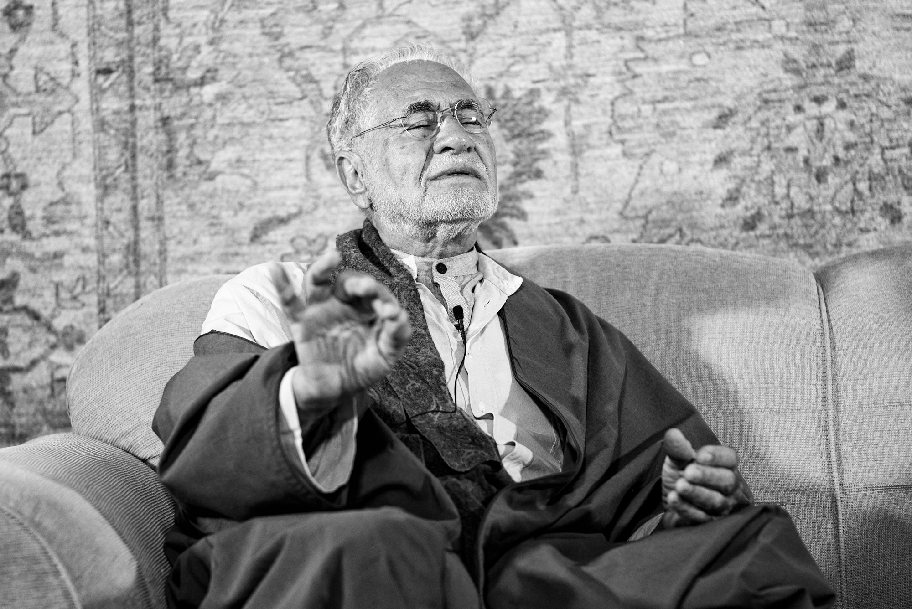

title: Outward Abstention

description: Part 4 of the text series on Fasting, which explores the outward actions we ought to refrain from when fasting.

# Outward Abstention

## 1. Abstention of the Tongue

This concerns useless, foolish, or discourteous speech, as well as anything which would be contrary to what pleases Allah. The Prophet said:

> "Whoever is silent is saved."

> "When the discussion reaches Allah, then be silent."

> "Whoever knows his Lord, his tongue becomes still."

That is to say, one is incapable of speaking about the absolute Source and Essence. Divine knowledge is to be tasted and witnessed personally and the tongue is incapable of expressing what is beyond the senses and the mind. The Messenger of Allah said:

> "Whoever speaks too much speaks frivolously. Whoever speaks frivolously has little modesty. Whoever has little modesty has little restraint, and whoever has little restraint enters the Fire."

## 2. Abstention of the Eyes 

This involves restraining them from seeing whatever is forbidden according to the _shari`ah_ of Islam.

> "Tell the people of faith to avert their eyes and to guard their private parts." Qur'an, 24:30

Lowering the gaze is expected from the serious seeker. Desires that arise from seeing can cause distractions that can be subtle and subconscious as well as gross and action-oriented. A blind person may be spared these distractions (unless he or she regains his/her sight).

## 3. Abstention of the Ears

The ears must be restrained from hearing whatever is forbidden in shari`ah, like slander and gossip, music and songs that entice lower tendencies, and listening to the talk of the misguided and the corrupt.

## 4. Abstention of the Sense of Smell

This refers to abstaining from both foul odours as well as exciting scents. Foul odours cause aversion and disgust, whereas sweet scent may excite desires and pleasures.

## 5. Abstention of the Sense of Taste

The meaning here relates to avoidance of whatever may veil the faculty of reason, such as imbibing intoxicating beverages, or by acquiring a taste for usury and unfair profit, abuse of orphans, the poor and the weak, and various other ‘prohibitive’ tastes and habits which will hinder one’s spiritual progress.

> "And do not approach the property of the orphan except in the best manner." Qur'an, 6:152

> "But those who take usury will rise up on the Day of Resurrection like someone tormented by Satan’s touch." Qur'an, 2:275

## 6. Abstention of the Sense of Touch 

This relates to abstaining from touching whatever may lead to forbidden actions, or to excesses in permitted actions, or to go beyond the limits of balance.

> "They will say to their skins, “why have you testified against us?” They will reply: “Allah has caused us to speak, it is He who gives speech to everything and He created you in the first instance and to Him you will return." Qur'an, 41:21

> "Nor were you discreet lest your ears or your eyes or your skins testify against you." Qur'an, 41:22

The senses have been created to function in harmony and balance regarding worldly interactions. Anyone who uses the body and its various parts in a manner for which it was not created is considered to be a wrongdoer and out of balance, which is the opposite of harmony, and, therefore, of justice.

One explanation of the following verse:

> "And the places of prostration (masājid) are for Allah, so therefore do not call upon anyone with Allah" Qur'an, 72:18

is that the human points of prostration include the seven points where the physical body touches the ground. These include the forehead, the two hands, the two knees, and the two feet. These places of prostration are for Allah: they belong to Him and are His slaves, so do not use them in anything which is not pleasing to Him or in anything for which they were not created.

