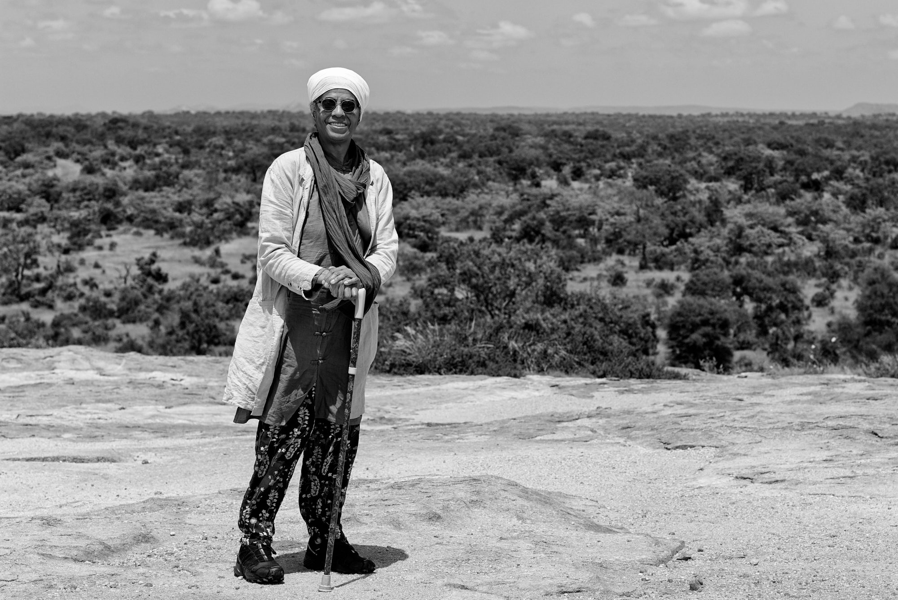

title: Guides to the Optimum Life

description: Overview of the various guides and maps provided by Shaykh Fadhlalla Haeri

# Guides to the Optimum Life

**Specific Practices**

A description of the three stages in the practice of stillness in body, mind, and heart.

We begin with proper preparation and intention, move into the ocean, and then transcend space and time. Various techniques from visualisation and _dhikr_, to recitation of the Qur'an are described briefly in this piece.

[Read More](./practice/meditation)

**Self Knowledge and Unfolding Into Presence**

A collection of excerpts from various books written by Shaykh Fadhlalla over the years on the theme of Self Knowledge, Presence, and how to deepen one's practice of both.

[Read More](./self-knowledge-presence)

**The Self and its Journeys**

A basic mapping of the modern self, it's different levels, and the journeys it can undergo in this life as it progresses through various layers or rungs of consciousness.

[Read More](./7-stations-4-journeys)

**Fasting**

Everything you could ever want to know about fasting, it's history, its benefits, and its particular application in Islam.

[Read More](./fasting/history.md)

**Pilgrimage**

An overview of the different kinds of pilgrimage it is possible to undertake in Islam.

[Read More](./pilgrimage)

